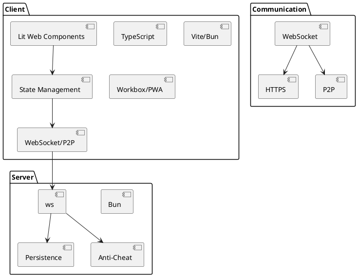

# UpDown Technology Stack & Libraries

**Date:** 2025-07-22

## Client
- Framework: Lit (Web Components) for declarative UI, including custom elements like web4-router and web4-route that reflect model attributes as tag attributes.
- Language: TypeScript (ES2020+), sharing class definitions with backend for consistent state handling.
- State Management: Custom or lightweight (e.g., Redux, Zustand), with real-time sync to backend and peers using scenario-based API.
- Networking: Native WebSocket API, P2P (simple-peer or similar), exchanging scenario JSONs for state sync.
- Build Tools: Vite or Bun
- PWA Support: Workbox or native browser APIs

## Server
- Runtime: Bun (TypeScript/JavaScript)
- Framework: Minimal (custom or Koa/Express if needed)
- WebSocket: ws (or native Bun support)
- Persistence: SQLite, lowdb, or in-memory for MVP
- Anti-Cheat: Custom logic

## Communication
- WebSocket for real-time
- HTTPS for initial setup/fallback
- P2P: simple-peer or WebRTC

## Justification
- All choices prioritize modern, lightweight, and high-performance tech with strong TypeScript support and easy PWA/offline capabilities.
- Libraries are chosen for minimalism, speed, and compatibility with the scenario-based API.

## Technology Stack Diagram (PlantUML)

## Technology Stack Diagram (Draw.io)
- See `/docs/tech-stack.drawio` (to be created) for a visual diagram.

---

This file is the authoritative reference for the technology stack and libraries for each layer/component in UpDown. All future changes must be reflected here.
