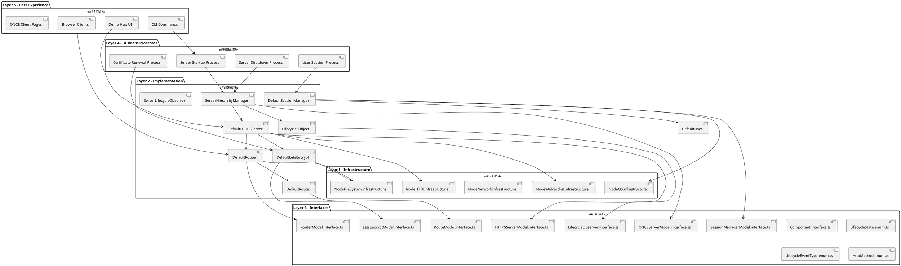
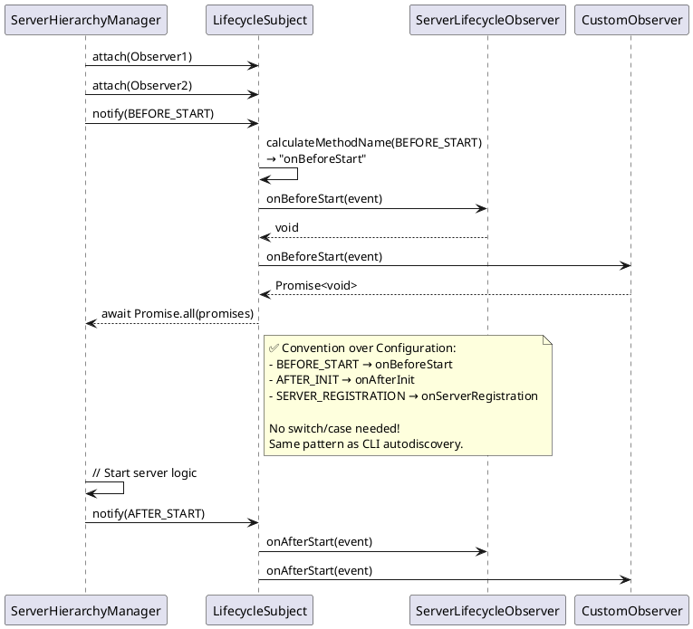
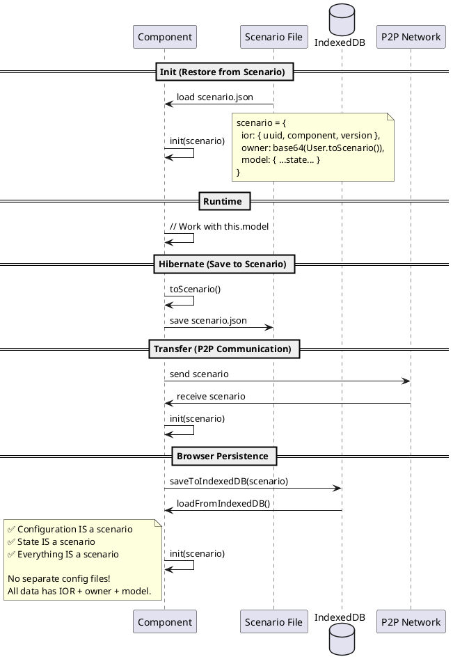

# CMM3 PDCA: ONCE v0.3.21.2 - Component Refactor with Path Authority & SessionManager

**Component**: ONCE v0.3.21.2  
**Date**: 2025-11-19 UTC 17:45  
**Author**: AI Assistant (Claude Sonnet 4.5)  
**PDCA Type**: Pragmatic Refactoring with TRUE Web4 Patterns  
**Parent Version**: 0.3.21.1  
**Supersedes**: 2025-11-19-UTC-1730.component-refactor-preserving-code.pdca.md (v1)

---

## **🔄 Implementation Strategy: Iterative CMM3 Approach**

This refactoring will be implemented through **strict iterative PDCA cycles**, where each iteration:

1. **PLAN** - Design component refactoring, identify tests needed
2. **DO** - Implement exactly the planned components
3. **CHECK** - Run regression tests + new functionality tests (Vitest + Playwright)
4. **ACT** - Fix issues until all tests pass
5. **REPEAT CHECK-ACT** until iteration is complete and stable
6. **NEXT ITERATION** - Only after current iteration is fully validated

### **Iteration Rules (CMM3 Compliance)**:
- ✅ Each iteration MUST compile
- ✅ Each iteration MUST start (no runtime errors)
- ✅ Each iteration MUST pass all regression tests
- ✅ Each iteration MUST pass new functionality tests
- ✅ Test-first approach: Write tests BEFORE implementation
- ✅ Blackbox tests with Vitest (NO JEST EVER!)
- ✅ End-to-end tests with Playwright (browser automation)
- ✅ Each iteration documented in separate PDCA
- ✅ Git commit after each successful iteration
- ✅ NO moving to next iteration until current is stable

### **Test Strategy**:
- **Vitest** - Unit tests, integration tests (blackbox)
- **Playwright** - E2E tests for browser clients and demo hub
- **Test Coverage** - All Web4 principles validated
- **Regression Suite** - All existing tests must pass
- **New Tests** - Each iteration adds tests for new functionality

---

## **✅ Web4 Principles Checklist**

This refactoring adheres to the following Web4 architecture principles:

### **Core Principles**
- [ ] **Everything is a Scenario** - Configuration, state, all data must be scenarios with IOR + owner + model
- [ ] **Model is Runtime, Scenario is Persistent** - Never construct scenarios from models; load scenarios, restore from scenarios
- [ ] **User Lifecycle Pattern** - Users are INITIALLY constructed from system environment → stored as scenarios → ALWAYS recreated by loading that scenario
- [ ] **Storage Pattern** - IndexedDB/FileSystem/Any storage ONLY holds scenarios (complete JSON with IOR + owner + model), identified ONLY by UUIDv4
- [ ] **Convention over Configuration** - Direct mapping (enum → method name), no switch/case statements
- [ ] **Empty Constructor + Init Pattern** - `constructor() {}`, `init(scenario?: T): this`, `toScenario(): Scenario<T>`
- [ ] **No Factory Pattern Needed** - Empty constructor means objects can be created without prior knowledge; factories are obsolete
- [ ] **One Type Per File** - Every interface, enum, class in its own file (`.interface.ts`, `.enum.ts`, `.ts`)
- [ ] **State in Model, Instances in Class** - All data in `this.model`, all references as IORs (not instances)
- [ ] **Path Authority** - Components derive their own paths and provide them to sub-components (use CLIModel)
- [ ] **TRUE Radical OOP Discipline** - Explicit over cryptic; async/await over callbacks; typed instances over naked JSON
- [ ] **Reference<T> for Nullable** - Use `Reference<T>` (T | null) instead of `T | undefined` or optional types
- [ ] **Separation of Concerns** - Don't mix concerns (statistics, behavior, etc.); use separate classes with enums everywhere

### **Layer Structure** (Web4 EAM 5-Layer Architecture)
- [ ] **Layer 1 (Infrastructure)** - ONLY layer with `os`, `fs`, `http`, `ws` imports; provides system access
- [ ] **Layer 2 (Implementation)** - Concrete classes; uses Layer 1; NO direct system imports
- [ ] **Layer 3 (Interface/Service Contracts)** - ONLY `.interface.ts` files; pure TypeScript; zero implementation
- [ ] **Layer 4 (Business Processes)** - Orchestration workflows with Git-based rollback; ONLY ASYNC layer
- [ ] **Layer 5 (User Experience)** - CLI, UI, browser clients; all user/agent interaction points

### **Naming Conventions**
- [ ] **Interface Naming** - No `I` prefix; just the name (e.g., `ServerLifecycle`, not `IServerLifecycle`)
- [ ] **Implementation Naming** - Specific context prefix (e.g., `HTTPSServerLifecycle`, `WSServerLifecycle`)
- [ ] **Default Prefix** - ONLY used when interface and implementation would have same name (fallback only)
- [ ] **Abstract Classes** - If using `Default*` prefix, implementation MUST be abstract for extension
- [ ] **Concrete Implementations** - Use specific context names, not generic `Default*`

### **Component Patterns**
- [ ] **Observer Pattern** - For event handling (not functional callbacks); `LifecycleSubject` + `LifecycleObserver`
- [ ] **Component Interface** - All components implement `Component<TModel>` with `model`, `ior`, `init()`, `toScenario()`
- [ ] **Digital Assets** - Every scenario has IOR (component identification) + owner (asset ownership)
- [ ] **Scenario Migration** - Support legacy format, export Web4 standard format (IOR + owner + model)
- [ ] **CLI Autodiscovery** - Method discovery via `hasMethod()`, `getMethodSignature()`, `listMethods()`

### **Anti-Patterns to Eliminate**
- [ ] ❌ Configuration constants (`ONCE_DEFAULT_CONFIG`) → ✅ Scenario defaults in `init()`
- [ ] ❌ Switch/case for dispatch → ✅ Dynamic method name calculation
- [ ] ❌ Inline HTML in code → ✅ External HTML files with template variables
- [ ] ❌ CommonJS `__dirname` → ✅ PathAuthority component (from CLIModel)
- [ ] ❌ Direct system imports in Layer 2+ → ✅ Layer 1 infrastructure classes
- [ ] ❌ Multiple types per file → ✅ One type per file (split `LifecycleEvents.ts`, etc.)
- [ ] ❌ Functional event handlers → ✅ Observer Pattern (OOP)
- [ ] ❌ Reinventing existing code → ✅ Reuse enums, models, logic
- [ ] ❌ Promise-based callbacks (`new Promise((resolve, reject) => {...})`) → ✅ Async/await methods
- [ ] ❌ Naked JSON objects (`init({uuid: '...', ...})`) → ✅ Typed scenario instances
- [ ] ❌ Constructing scenarios from models (`restoreUserFromModel()`) → ✅ Load scenarios directly, restore from scenarios
- [ ] ❌ String literal types (`'node' | 'browser' | ...`) → ✅ Enums (`ONCEEnvironment.NODE`)
- [ ] ❌ Mixed concerns in interfaces (statistics, timestamps, etc.) → ✅ Separate classes (`RouteStatistics`)
- [ ] ❌ Cryptic one-liners → ✅ Explicit, readable OOP with proper discipline
- [ ] ❌ `T | undefined` or `T?` for nullable → ✅ `Reference<T>` (T | null) for explicit nullability
- [ ] ❌ Factory pattern boilerplate → ✅ Empty constructor + init() pattern (factories obsolete!)

---

## **🏗️ NEW ONCE v0.3.21.2 Architecture**

### **Architecture Overview**



### **Component Hierarchy**

```plantuml
@startuml Component Hierarchy
skinparam component {
  BackgroundColor<<interface>> LightBlue
  BackgroundColor<<implementation>> LightGreen
  BackgroundColor<<infrastructure>> LightYellow
}

component "Component<T>" <<interface>> {
  + model: T
  + ior: IOR
  + init(scenario?: Scenario<T>): this
  + toScenario(): Scenario<T>
}

component "DefaultHTTPSServer" <<implementation>> {
  - model: HTTPSServerModel
  - router: DefaultRouter
  - lifecycleSubject: LifecycleSubject
  + init(scenario?: Scenario<HTTPSServerModel>): this
  + start(): Promise<void>
  + stop(): Promise<void>
}

component "DefaultRouter" <<implementation>> {
  - model: RouterModel
  - routes: DefaultRoute[]
  + addRoute(route: DefaultRoute): void
  + handleRequest(req, res): void
}

component "DefaultRoute" <<implementation>> {
  - model: RouteModel
  + matches(pathname: string): boolean
  + handle(req, res): void
}

component "DefaultSessionManager" <<implementation>> {
  - model: SessionManagerModel
  - users: Map<string, DefaultUser>
  + createUser(): DefaultUser
  + saveToIndexedDB(): Promise<void>
}

component "LifecycleSubject" <<implementation>> {
  - model: LifecycleSubjectModel
  - observers: LifecycleObserver[]
  + attach(observer): void
  + notify(event): Promise<void>
}

component "ServerLifecycleObserver" <<implementation>> {
  - serverModel: ONCEServerModel
  + onBeforeStart(event): void
  + onAfterStart(event): void
  + onBeforeStop(event): void
}

"Component<T>" <|.. "DefaultHTTPSServer"
"Component<T>" <|.. "DefaultRouter"
"Component<T>" <|.. "DefaultRoute"
"Component<T>" <|.. "DefaultSessionManager"
"Component<T>" <|.. "LifecycleSubject"

"DefaultHTTPSServer" *-- "DefaultRouter"
"DefaultHTTPSServer" *-- "LifecycleSubject"
"DefaultRouter" o-- "DefaultRoute"
"DefaultSessionManager" o-- "DefaultUser"
"LifecycleSubject" o-- "ServerLifecycleObserver"

@enduml
```

### **Lifecycle Event Flow (Observer Pattern)**



### **Scenario Flow (Everything is a Scenario)**



---

## **🎯 OBJECTIVE**

**Goal**: Create TRUE Web4 component architecture while preserving working ServerHierarchyManager methods

**Pragmatic Approach**:
- ✅ Extract proven methods from ServerHierarchyManager
- ✅ Distribute methods to proper component classes
- ✅ Keep all working logic unchanged
- ✅ Add proper models (HTTPSServerModel, RouterModel, etc.)
- ✅ Get rid of functional patterns → Radical OOP
- ✅ Each class as own component (splinter-ready)
- ✅ **NO inline HTML** - HTML must be in external files
- ✅ **NO CommonJS `__dirname`** - Use PathAuthority component
- ✅ **SessionManager** - User creation + IndexedDB storage

---

## **🔍 TRON Feedback (User Prompts)**

```quote
as the ServerHierarchyManager is very functuional you went here too far. abandon this pdca and write a new one based on the previous one, where you just focus on keeping the mehtods of the ServerHierarchyManager that make sense that work on the main server scenario and the client server scenario, that you keep as much as untuched as possible. but we want a dedicated https server and all the previous seperation of concern and responsible component classes. just do not reinvent the model wherel... but get rid of functional as much as possible and do radical OOP web4 style.
```

```quote
no inline separation of concern violations lik

  /**
   * ✅ Handle 404 (from ServerHierarchyManager)
   */
  private handle404(res: ServerResponse, pathname: string): void {
    res.writeHead(404, { 'Content-Type': 'text/html' });
    res.end(`
      <!DOCTYPE html>
      <html>
      <head><title>404 Not Found</title></head>
      <body>
        <h1>404 Not Found</h1>
        <p>Path: ${pathname}</p>
      </body>
      </html>
    `);
  }

needs to be a file.

no shitty commonjs style code
    const __filename = fileURLToPath(import.meta.url);
    const __dirname = path.dirname(__filename);

add a SessioManager that leverages User creation and store the users in the browsers indexdb
```

```quote
File: src/ts/layer3/PathAuthorityModel.interface.ts (NEW) should already exsit..its the cli.. READ before you reinvent... do a dilligent analysis of the existing files!!!! not only the first 100 lines!!!.  mahr files which still violate ONE TYPE ONE FILE fro splitting. lile components/ONCE/0.3.21.2/src/ts/layer3/LifecycleEvents.ts
```

```quote
how would lifecycle events look if it was radical oop that can be implemented or extended by a server and not a bunch of functional shit types
```

```quote
chamnge the pdca to reflect this. do it for all functional shit you come accross but keep as much of the working implementation code... jusr refreame the OOP hulls!
```

```quote
update the pdca with the component mess you created

/Users/Shared/Workspaces/2cuGitHub/UpDown/components/ONCE/0.3.21.2/src/ts/layer3/Component.ts is outdated snd should be deprecared and removed afterwards

components/ONCE/0.3.21.2/src/ts/layer3/Component.interface.ts is correct but lacking the IOR which we need.

consolidate this in the pdca
```

```quote
/**
 * Default configuration
 * ✅ ALREADY EXISTS - REUSE IT!
 */
export const ONCE_DEFAULT_CONFIG = {
  PRIMARY_PORT: 42777,
  FALLBACK_PORT_START: 8080,
  DEFAULT_DOMAIN: 'local.once',
  DEFAULT_IP: '127.0.0.1',
  MAX_PORT_SCAN: 100
} as const;

this is correct but architectual bad. there is NO difference between configurationand a scenario. senarios are the full state and the configuration with the IOR to know to which implementation it belongs and the owner of the digital asset. there is nothing like a seperate configuratuiin. JUST scenarios. 

update the pdca to follow this web4 principle
```

```quote
   // ✅ Call the appropriate observer method based on event type
        switch (event.type) {
          case LifecycleEventType.BEFORE_INIT:
            result = observer.onBeforeInit(event);
            break;
          case LifecycleEventType.AFTER_INIT:
            result = observer.onAfterInit(event);
            break;
          case LifecycleEventType.BEFORE_START:
            result = observer.onBeforeStart(event);
            break;

is unnessesarry if you calculate the method name from the lifecyleEvent name

from 

BEFORE_INIT to camel case and add an on in front.

so always work convention over switch cases with direct mapping. (like in the cli)

update the pdca

add this web4 principle
```

```quote
Layer 2 (Implementation) - Concrete classes (Default*); uses Layer 1; NO direct system imports

Default is just the fallbackPrfix if the Interface wyould be the same name as the implementation.

SO ServerLifecycle

may be

DefaultServerLifecycle but needs then to be abstract

but better

HTTPSServerLifecycle

or WSServerLifecycle ...

mention that web4 naming convention in the pdca
```

```quote
   return new Promise((resolve, reject) => {
      const transaction = this.db!.transaction([this.data.storeName], 'readonly');
      const objectStore = transaction.objectStore(this.data.storeName);
      const request = objectStore.getAll();
      
      request.onsuccess = () => {
        const userModels = request.result as UserModel[];
        
        for (const userModel of userModels) {
          const userScenario = new Scenario<UserModel>().init({
            ior: {
              uuid: userModel.uuid,
              component: 'User',
              version: '0.3.21.2'

this is total functional shit. never use it lke this. OOP is DICIPLIN not lazyness and cryptic.

refactor it...do not use such constructs
```

```quote
getUser(uuid: string): DefaultUser | undefined {

this is why 

/Users/Shared/Workspaces/2cuGitHub/UpDown/components/Web4TSComponent/0.3.20.3/src/ts/layer3/Reference.interface.ts

exists.... pull it into the once component and refactro these occurence in the pdca. add it to the OOP principles
```

```quote
❌ Inline creation: new Scenario<T>().init({...}) is cryptic

no THIS is totally ok. even good Web4 Style!!!

but the {...} parameter needs to be a scenario instance. TYPED...not just naked data JSON shit.

`→ ✅ Factory methods or builders` are just artificial boilerplate and add complexity. in web4 each object can be created without prior knowledge by empty construuctor... so factories become obsoloete. add it to the web4 principles
```

```quote
export interface ONCEModel {
  // ✅ Identity
  uuid: string;
  name: string;
  description: string;
  
  // ✅ Kernel State (NOT server state)
  state: 'booting' | 'ready' | 'loading' | 'error';  // Kernel states only
  environment: 'node' | 'browser' | 'worker' | 'pwa' | 'iframe';

use enums!!!! use the lifecycle state
```

```quote
  targetType: 'file' | 'directory' | 'handler' | 'proxy';  more enums...

DRY

  // ✅ Statistics
  hitCount: number;
  lastHit?: string;
  
  // ✅ Timestamps
  createdAt: string;
  updatedAt: string;

make a statistic class... do not polute interfaces with mixed concerns ...web4 seperate concerns clearly.
```

```quote
/**
 * Restore user from model
 * ✅ Separate method for user creation
 */
private async restoreUserFromModel(userModel: UserModel): Promise<void> {

user has a user scenario... the model is the runtime ...the scenatrio the persitant JSON....never derivate from this pattern>

so do not consturct complex userScenarios but let the user store it and load it... so 

restoreUserFromModel mis unnecessary. ista always configure drom scenario...

review thise boilerplate patterns and remove them
```

```quote
users are initally constructed from the systems environment and stored as scenarios. then they are recreated bey laoding that scenario
```

```quote
indexdb or any other storeage ONLY holds scenarios and identifies them ONLY by uuid
```

```quote
UUIDv4
```

### **My Analysis**

**Key Requirements**:
1. ✅ Keep ServerHierarchyManager methods that work
2. ✅ Separate concerns into dedicated component classes
3. ✅ Don't reinvent the wheel (reuse proven logic)
4. ✅ Dedicated HTTPS server component
5. ✅ Radical OOP Web4 style
6. ✅ Each class as own component (splinter-ready)
7. ✅ **REUSE existing enums** - `LifecycleState`, `LifecycleEventType` are PERFECT
8. ✅ **REUSE existing models** - `ONCEServerModel` has everything we need
9. ✅ **NO inline HTML** - HTML must be in files (separation of concerns)
10. ✅ **NO CommonJS patterns** - Pure ESM + PathAuthority component
11. ✅ **SessionManager** - User creation + IndexedDB storage
12. ✅ **Component.interface.ts** - Consolidate interfaces, add IOR property
13. ✅ **Configuration IS a scenario** - No separate config const
14. ✅ **Convention over Configuration** - Dynamic method dispatch (no switch/case)

---

### **🎯 Web4 Principles Applied**

#### **Principle 1: Everything is a Scenario**

> "There is NO difference between configuration and a scenario. Scenarios are the full state and the configuration with the IOR to know which implementation it belongs to and the owner of the digital asset. There is nothing like a separate configuration. JUST scenarios."

**Before (Violation)**:
```typescript
// ❌ Separate configuration const (no IOR, no owner, not a scenario)
export const ONCE_DEFAULT_CONFIG = {
  PRIMARY_PORT: 42777,
  FALLBACK_PORT_START: 8080,
  DEFAULT_DOMAIN: 'local.once',
  DEFAULT_IP: '127.0.0.1',
  MAX_PORT_SCAN: 100
} as const;
```

**After (Compliant)**:
```typescript
// ✅ NO separate "config" - just use ONCEServerModel with defaults!
export class HTTPSServer implements Component<ONCEServerModel> {
  model!: ONCEServerModel;
  
  constructor() { }
  
  init(scenario?: Scenario<ONCEServerModel>): this {
    if (scenario) {
      this.model = scenario.model;  // ✅ Restore
    } else {
      // ✅ Default values in init() - NO separate config!
      this.model = {
        uuid: crypto.randomUUID(),
        domain: 'local.once',  // ✅ Default, not "config"
        capabilities: [{ capability: 'httpPort', port: 42777 }],
        // ... other defaults
      };
    }
    return this;
  }
  
  async toScenario(): Promise<Scenario<ONCEServerModel>> {
    return {
      ior: this.ior,
      owner: await this.getOwnerData(),
      model: { ...this.model }  // ✅ Entire state
    };
  }
}
```

**Benefits**:
- ✅ No separate "config" concept (pure Web4!)
- ✅ Default values are just constructor logic
- ✅ Can be saved to disk (persistence)
- ✅ Can be loaded from disk (restoration)
- ✅ Can be sent via P2P (transfer)
- ✅ Has IOR (component identification)
- ✅ Has owner (digital asset ownership)
- ✅ Simpler (no extra model, no extra file)

---

#### **Principle 2: Convention over Configuration (Direct Mapping)**

> "Always work convention over switch cases with direct mapping (like in the CLI). Calculate the method name from the lifecycle event name. BEFORE_INIT to camelCase and add 'on' in front."

**Before (Violation)**:
```typescript
// ❌ Giant switch/case for event dispatch (22+ cases!)
switch (event.type) {
  case LifecycleEventType.BEFORE_INIT:
    result = observer.onBeforeInit(event);
    break;
  case LifecycleEventType.AFTER_INIT:
    result = observer.onAfterInit(event);
    break;
  // ... 20+ more cases ...
}
```

**After (Compliant)**:
```typescript
// ✅ Convention over configuration: Dynamic method dispatch
const methodName = this.calculateObserverMethodName(event.type);
const method = (observer as any)[methodName];
if (typeof method === 'function') {
  const result = method.call(observer, event);
}

// ✅ Helper: BEFORE_INIT → onBeforeInit
private calculateObserverMethodName(eventType: LifecycleEventType): string {
  const camelCase = eventType
    .toLowerCase()
    .split('_')
    .map((word, index) => 
      index === 0 ? word : word.charAt(0).toUpperCase() + word.slice(1)
    )
    .join('');
  
  return 'on' + camelCase.charAt(0).toUpperCase() + camelCase.slice(1);
}
```

**Benefits**:
- ✅ No manual maintenance (add new event? Just add to enum!)
- ✅ Same pattern as CLI autodiscovery (consistency)
- ✅ Less code (22+ cases → 1 function)
- ✅ Type-safe (enum ensures valid event types)
- ✅ Extensible (observers can override any method)

**Examples**:
| Event Type (Enum) | Method Name (Calculated) |
|------------------|--------------------------|
| `BEFORE_INIT` | `onBeforeInit` |
| `AFTER_START` | `onAfterStart` |
| `SERVER_REGISTRATION` | `onServerRegistration` |
| `PORT_CONFLICT` | `onPortConflict` |
| `PRIMARY_SERVER_ELECTION` | `onPrimaryServerElection` |

**Same Pattern as CLI**:
- CLI: `upgrade nextBuild` → `component.upgradeNextBuild()`
- Observer: `BEFORE_INIT` → `observer.onBeforeInit()`

---

#### **Principle 3: Web4 Naming Conventions**

> "Default is just the fallback prefix if the Interface would be the same name as the implementation. Better to use specific context names like HTTPSServerLifecycle or WSServerLifecycle."

**Interface Naming**:
```typescript
// ✅ CORRECT: No "I" prefix, just the name
export interface ServerLifecycle { }
export interface Router { }
export interface SessionManager { }
```

**Implementation Naming**:

```typescript
// ❌ BAD: Generic "Default" prefix for concrete implementation
export class DefaultServerLifecycle implements ServerLifecycle { }

// ✅ GOOD: Specific context name
export class HTTPSServerLifecycle implements ServerLifecycle { }
export class WSServerLifecycle implements ServerLifecycle { }

// ✅ ACCEPTABLE: "Default" prefix ONLY for abstract base class
export abstract class DefaultServerLifecycle implements ServerLifecycle {
  // Common implementation for extension
  abstract onBeforeStart(): void;
}

// ✅ GOOD: Specific implementations extend abstract
export class HTTPSServerLifecycle extends DefaultServerLifecycle {
  override onBeforeStart(): void { /* HTTPS-specific logic */ }
}
```

**Naming Convention Rules**:

| Pattern | When to Use | Example |
|---------|-------------|---------|
| **`HTTPSServerLifecycle`** | ✅ Concrete implementation with specific context | HTTPS server observer |
| **`WSServerLifecycle`** | ✅ Concrete implementation with specific context | WebSocket server observer |
| **`BrowserRouter`** | ✅ Concrete implementation with specific context | Browser-specific router |
| **`NodeRouter`** | ✅ Concrete implementation with specific context | Node.js router |
| **`DefaultRouter`** | ⚠️ ONLY if abstract base class | Abstract router for extension |
| **`DefaultServerLifecycle`** | ❌ Avoid for concrete classes | Too generic, lacks context |

**Benefits**:
- ✅ **Self-documenting** - Name reveals purpose (HTTPS vs WS)
- ✅ **Avoids confusion** - Clear which implementation to use
- ✅ **Better autocomplete** - IDE shows `HTTPSServerLifecycle`, not just `Default...`
- ✅ **Easier to find** - Search for "HTTPS" finds all HTTPS-related classes
- ✅ **Follows JavaBean convention** - Specific, descriptive names

**This PDCA Naming Updates**:

| Old (Generic) | New (Specific Context) |
|---------------|------------------------|
| ❌ `DefaultHTTPSServer` | ✅ `HTTPSServer` (no `Default` needed) |
| ❌ `DefaultRouter` | ✅ `HTTPRouter` or `HTTPSRouter` |
| ❌ `DefaultRoute` | ✅ `HTTPRoute` |
| ❌ `DefaultSessionManager` | ✅ `BrowserSessionManager` |
| ❌ `DefaultLetsEncrypt` | ✅ `LetsEncryptCertificateUpdater` |
| ❌ `DefaultLifecycleObserver` | ✅ Abstract class (acceptable) |
| ❌ `ServerLifecycleObserver` | ✅ `HTTPSServerLifecycleObserver` |

**Exception - Abstract Base Classes**:
```typescript
// ✅ ACCEPTABLE: "Default" for abstract base with common logic
export abstract class DefaultLifecycleObserver implements LifecycleObserver {
  // No-op default implementations
  onBeforeInit(event: LifecycleEvent): void {}
  onAfterInit(event: LifecycleEvent): void {}
  // ... etc
}

// ✅ GOOD: Specific implementations extend abstract
export class HTTPSServerLifecycleObserver extends DefaultLifecycleObserver {
  // Override only what's needed
  override onBeforeStart(event: LifecycleEvent): void {
    // HTTPS-specific startup logic
  }
}
```

---

**🎯 KEY INSIGHT: Don't Reinvent Existing Code!**

```typescript
// ❌ WRONG: Reinventing enum pattern (I did this mistake!)
export class LifecycleState {
  static readonly CREATED = 'created' as const;
  static readonly RUNNING = 'running' as const;
}

// ✅ RIGHT: REUSE existing perfect enum
import { LifecycleState } from './LifecycleEvents.js';
// Already has: CREATED, STARTING, RUNNING, STOPPING, etc.
// Already has: PRIMARY_SERVER, CLIENT_SERVER, REGISTERED
```

**What Already Exists (v0.3.21.2)**:
- ✅ `LifecycleState` enum - Perfect pattern, all states we need!
- ✅ `LifecycleEventType` enum - Event-driven architecture ready!
- ✅ `ONCEServerModel` - All server fields (pid, state, network, capabilities)!
- ✅ `ServerCapability` interface - Port management ready!
- ✅ `ONCE_DEFAULT_CONFIG` const - Configuration constants!

**Anti-Patterns to Eliminate**:
```typescript
// ❌ Inline HTML (separation of concern violation)
res.end(`<!DOCTYPE html><html>...</html>`);

// ❌ CommonJS style path resolution
const __filename = fileURLToPath(import.meta.url);
const __dirname = path.dirname(__filename);

// ✅ Correct: HTML in external files
const html = fs.readFileSync(pathAuthority.getViewHtmlPath('404.html'), 'utf-8');
res.end(html);

// ✅ Correct: PathAuthority component (calculated once via scenario)
this.pathAuthority.getViewHtmlDir()  // From model, not __dirname
```

**Method Distribution Strategy**:
- Extract ServerHierarchyManager methods → Distribute to proper components
- Keep logic unchanged, just move to right place
- Add proper models (HTTPSServerModel, RouterModel, SessionManagerModel, PathAuthorityModel)
- Eliminate functional patterns (scattered state, switch/case, inline HTML, __dirname)
- Add SessionManager for User integration with IndexedDB

---

#### **Principle 4: TRUE Radical OOP Discipline**

> **"OOP is DISCIPLINE not laziness and cryptic."**
>
> **Never use functional programming disguised as OOP. Be explicit, readable, and follow JavaBean conventions.**

**❌ Functional Disguised as OOP (Cryptic, Lazy)**:

```typescript
// ❌ BAD: Promise-based callback hell (functional style)
return new Promise((resolve, reject) => {
  const transaction = this.db!.transaction([this.data.storeName], 'readonly');
  const objectStore = transaction.objectStore(this.data.storeName);
  const request = objectStore.getAll();
  
  request.onsuccess = () => {
    const userModels = request.result as UserModel[];
    
    for (const userModel of userModels) {
      // ❌ BAD: Inline object creation with chained init
      const userScenario = new Scenario<UserModel>().init({
        ior: {
          uuid: userModel.uuid,
          component: 'User',
          version: '0.3.21.2'
        },
        owner: '',
        model: userModel
      });
      
      const user = new DefaultUser().init(userScenario);
      this.data.activeUserIORs.push(user.ior);
    }
    
    resolve();
  };
  
  request.onerror = () => {
    reject(request.error);
  };
});
```

**Problems**:
- ❌ Cryptic: Hard to read, callback-based
- ❌ Lazy: No proper error handling separation
- ❌ Functional: Promise callbacks instead of async/await
- ❌ Inline creation: `new Scenario<T>().init({...})` is cryptic
- ❌ No separation: All logic inline
- ❌ Hard to test: Cannot mock individual steps
- ❌ Hard to debug: Stack traces are confusing

**✅ TRUE Radical OOP (Explicit, Disciplined)**:

```typescript
// ✅ GOOD: Async/await with proper separation of concerns
async loadUsersFromIndexedDB(): Promise<void> {
  try {
    // ✅ Load scenarios (not models!)
    const userScenarios: Scenario<UserModel>[] = await this.getAllUserScenarios();
    
    // ✅ Restore each user from its scenario
    for (const scenario of userScenarios) {
      await this.restoreUser(scenario);
    }
  } catch (error: any) {
    throw new Error(`Failed to load users from IndexedDB: ${error.message}`);
  }
}

/**
 * Get all user scenarios from IndexedDB
 * ✅ CRITICAL: Load scenarios, not models!
 * ✅ User stores its own scenario - we don't construct it!
 * ✅ IndexedDB ONLY holds complete scenarios (IOR + owner + model)
 * ✅ IndexedDB key is ALWAYS scenario.ior.uuid (UUIDv4)
 */
private async getAllUserScenarios(): Promise<Scenario<UserModel>[]> {
  return new Promise<Scenario<UserModel>[]>((resolve, reject) => {
    const transaction = this.db!.transaction([this.data.storeName], 'readonly');
    const objectStore = transaction.objectStore(this.data.storeName);
    const request = objectStore.getAll();
    
    request.onsuccess = () => {
      // ✅ CRITICAL: Results are complete scenarios (IOR + owner + model), not raw models!
      resolve(request.result as Scenario<UserModel>[]);
    };
    
    request.onerror = () => {
      reject(request.error);
    };
  });
}

/**
 * Save user scenario to IndexedDB
 * ✅ CRITICAL: Store complete scenario, not just model!
 * ✅ IndexedDB key is scenario.ior.uuid (UUIDv4)
 * ✅ Never construct scenarios from models - user exports its own scenario!
 */
private async saveUserScenario(userScenario: Scenario<UserModel>): Promise<void> {
  return new Promise<void>((resolve, reject) => {
    const transaction = this.db!.transaction([this.data.storeName], 'readwrite');
    const objectStore = transaction.objectStore(this.data.storeName);
    
    // ✅ CRITICAL: Store complete scenario with UUIDv4 as key
    const request = objectStore.put(userScenario, userScenario.ior.uuid);
    
    request.onsuccess = () => {
      resolve();
    };
    
    request.onerror = () => {
      reject(request.error);
    };
  });
}

/**
 * Restore user from scenario
 * ✅ CRITICAL: User is ALWAYS configured from scenario!
 * ✅ Model is runtime, scenario is persistent JSON
 * ✅ We load the scenario the user stored - we don't construct it!
 */
private async restoreUser(userScenario: Scenario<UserModel>): Promise<void> {
  // ✅ CRITICAL: Load from scenario (not construct from model!)
  const user = new DefaultUser().init(userScenario);
  
  // ✅ Register user
  this.registerUser(user);
}

/**
 * Create new user (INITIAL CREATION ONLY)
 * ✅ CRITICAL: Called ONLY for first-time user creation from system environment
 * ✅ User is immediately saved as scenario
 * ✅ All subsequent access restores from scenario
 */
async createUser(): Promise<DefaultUser> {
  // ✅ Step 1: Create user from system environment
  const user = new DefaultUser().initFromEnvironment();
  
  // ✅ Step 2: Export scenario (user knows how to serialize itself)
  const userScenario = user.toScenario();
  
  // ✅ Step 3: Save scenario to IndexedDB (identified by UUIDv4)
  await this.saveUserScenario(userScenario);
  
  // ✅ Step 4: Register user
  this.registerUser(user);
  
  return user;
}

/**
 * Register user in session manager
 */
private registerUser(user: DefaultUser): void {
  this.data.activeUserIORs.push(user.ior);
  this.data.activeSessions++;
  this.data.updatedAt = new Date().toISOString();
}
```

**Benefits**:
- ✅ **Explicit**: Each step is clear
- ✅ **Readable**: Method names explain what happens
- ✅ **Testable**: Each method can be tested separately
- ✅ **Debuggable**: Clear stack traces
- ✅ **Maintainable**: Easy to modify individual steps
- ✅ **No boilerplate**: No factory methods needed!
- ✅ **Disciplined**: Proper separation of concerns

**OOP Discipline Rules**:

| Anti-Pattern | OOP Discipline |
|--------------|----------------|
| ❌ `new Promise((resolve, reject) => {...})` | ✅ `async/await` |
| ❌ Naked JSON (`init({uuid: '...', ...})`) | ✅ Typed instances (`as Scenario<T>`) |
| ❌ Factory methods (boilerplate) | ✅ Direct creation: `new T().init(scenario)` |
| ❌ `new Promise((resolve, reject) => {...})` | ✅ `async/await` with separate methods |
| ❌ `new T().init({...})` inline | ✅ Factory method: `createT(...)` |
| ❌ Callback hell | ✅ Async/await with try/catch |
| ❌ All logic in one method | ✅ Separate methods with single responsibility |
| ❌ Cryptic one-liners | ✅ Explicit, named steps |
| ❌ Hard to test | ✅ Each method testable |

**Key Takeaway**:
> **OOP is not about using `class` and `new`. OOP is about DISCIPLINE:**
> - Explicit over implicit
> - Readable over cryptic
> - Testable over monolithic
> - Maintainable over clever

---

#### **Principle 6: Empty Constructor Makes Factories Obsolete**

> **"In Web4 each object can be created without prior knowledge by empty constructor. Factories become obsolete!"**
>
> **`new Scenario<T>().init(scenario)` is GOOD Web4 style when parameter is typed!**

**❌ Traditional OOP: Factory Pattern (Boilerplate)**:

```typescript
// ❌ BAD: Unnecessary factory boilerplate
class ScenarioFactory {
  static createUserScenario(userModel: UserModel): Scenario<UserModel> {
    const scenario = new Scenario<UserModel>();
    scenario.init({
      ior: {
        uuid: userModel.uuid,
        component: 'User',
        version: '0.3.21.2'
      },
      owner: '',
      model: userModel
    });
    return scenario;
  }
}

// ❌ BAD: Factory method adds artificial complexity
private createUserScenario(userModel: UserModel): Scenario<UserModel> {
  const scenario = new Scenario<UserModel>();
  scenario.init({...});
  return scenario;
}

// Usage:
const scenario = ScenarioFactory.createUserScenario(userModel);  // ❌ Boilerplate!
const scenario = this.createUserScenario(userModel);  // ❌ Boilerplate!
```

**Problems**:
- ❌ Artificial complexity: Extra class/method just to call `new`
- ❌ Boilerplate: Factory wraps what could be one line
- ❌ Not flexible: Factory needs to know all parameters upfront
- ❌ Hard to test: Must mock factory instead of constructor
- ❌ Traditional OOP baggage: Factories were needed when constructors were complex

**✅ Web4 Pattern: Empty Constructor + Direct Creation**:

```typescript
// ✅ GOOD: Direct creation with typed scenario parameter
const userScenario: Scenario<UserModel> = new Scenario<UserModel>().init({
  ior: {
    uuid: userModel.uuid,
    component: 'User',
    version: '0.3.21.2'
  },
  owner: '',
  model: userModel
});

// ✅ GOOD: The parameter is TYPED (not naked JSON!)
const scenario: Scenario<UserModel> = {  // ✅ Typed instance
  ior: { uuid: '...', component: 'User', version: '0.3.21.2' },
  owner: '',
  model: userModel
};
const userScenario = new Scenario<UserModel>().init(scenario);  // ✅ Good!

// ✅ GOOD: Chain creation
const user = new DefaultUser().init(
  new Scenario<UserModel>().init(scenario)
);

// ❌ BAD: Naked JSON object (untyped!)
const userScenario = new Scenario<UserModel>().init({
  uuid: '...',  // ❌ Missing IOR structure!
  owner: '',
  model: userModel
});
```

**Why Empty Constructor Makes Factories Obsolete**:

| Traditional OOP | Web4 Empty Constructor Pattern |
|-----------------|-------------------------------|
| ❌ Complex constructor with many parameters | ✅ Empty constructor (no parameters!) |
| ❌ Factory needed to simplify construction | ✅ `init()` accepts scenario (one parameter) |
| ❌ Must know all parameters upfront | ✅ Scenario can be incomplete, partial, or full |
| ❌ Factory creates tight coupling | ✅ Objects created without prior knowledge |
| ❌ Factory methods proliferate | ✅ One creation pattern: `new T().init(scenario)` |

**Benefits of Empty Constructor**:
- ✅ **No prior knowledge needed**: Can create `new T()` anywhere
- ✅ **Uniform pattern**: Always `new T().init(scenario)`
- ✅ **Flexible**: Scenario can be partial, full, or omitted
- ✅ **Testable**: Easy to mock, no factory needed
- ✅ **Simple**: No boilerplate factory classes/methods
- ✅ **Composable**: Chain multiple `new T().init()` calls

**The Real Issue: Typed vs. Naked JSON**:

```typescript
// ❌ BAD: Naked JSON object (no type safety!)
const scenario = new Scenario<UserModel>().init({
  uuid: '...',        // ❌ Wrong structure!
  owner: '',
  model: userModel
});

// ✅ GOOD: Typed scenario instance
const scenarioData: Scenario<UserModel> = {
  ior: { uuid: '...', component: 'User', version: '0.3.21.2' },  // ✅ Correct!
  owner: '',
  model: userModel
};
const scenario = new Scenario<UserModel>().init(scenarioData);

// ✅ EVEN BETTER: Type inference ensures correctness
const scenario = new Scenario<UserModel>().init({
  ior: { uuid: userModel.uuid, component: 'User', version: '0.3.21.2' },
  owner: '',
  model: userModel
} as Scenario<UserModel>);  // ✅ Explicit type!
```

**Key Takeaway**:
> **Factories are artificial boilerplate in Web4!**
>
> **Empty constructor + init(scenario) pattern replaces ALL factory patterns.**
>
> **The problem is NOT `new T().init({...})` - it's passing naked JSON instead of typed instances!**

**Rules**:
1. ✅ Use `new T().init(scenario)` directly (no factory!)
2. ✅ Ensure `scenario` parameter is properly typed
3. ✅ Use `as Scenario<T>` for type safety when using object literals
4. ❌ Never create factory classes/methods (obsolete!)
5. ❌ Never pass naked JSON objects (type them!)

---

#### **Principle 5: Reference<T> for Nullable References**

> **"Use `Reference<T>` instead of `T | undefined` or optional types."**
>
> **Make nullable references explicit and type-safe. This is why `Reference.interface.ts` exists.**

**❌ TypeScript Anti-Patterns (Implicit Nullability)**:

```typescript
// ❌ BAD: Returning undefined (implicit failure)
getUser(uuid: string): DefaultUser | undefined {
  return this.users.get(uuid);
}

// ❌ BAD: Optional return type (implicit nullability)
findServer(uuid: string): ONCEServer | undefined {
  return this.servers.find(s => s.model.uuid === uuid);
}

// ❌ BAD: Mixing null and undefined
getRoute(path: string): Route | null | undefined {
  // ❓ What's the difference between null and undefined here?
  return this.routes.get(path);
}
```

**Problems**:
- ❌ Implicit: `undefined` doesn't explain why it's nullable
- ❌ Inconsistent: Mix of `null`, `undefined`, optional
- ❌ Hard to reason: What does `undefined` mean? Not found? Not loaded? Error?
- ❌ TypeScript weakness: `| undefined` is not explicit enough

**✅ Web4 Pattern: Explicit Reference<T>**:

```typescript
// File: src/ts/layer3/Reference.interface.ts
/**
 * Reference<T> - Type-safe nullable reference wrapper
 * Web4 pattern: All references are nullable by default
 * 
 * Usage: Reference<DefaultUser> = DefaultUser | null
 * 
 * Why: Makes nullable references explicit and type-safe
 * Eliminates `any` type usage for component references
 */
export type Reference<T> = T | null;

// ✅ GOOD: Explicit nullable reference
getUser(uuid: string): Reference<DefaultUser> {
  const user = this.users.get(uuid);
  return user ?? null;  // ✅ Explicit: null means "not found"
}

// ✅ GOOD: Explicit nullable reference
findServer(uuid: string): Reference<ONCEServer> {
  const server = this.servers.find(s => s.model.uuid === uuid);
  return server ?? null;  // ✅ Explicit: null means "not found"
}

// ✅ GOOD: Explicit nullable reference
getRoute(path: string): Reference<Route> {
  const route = this.routes.get(path);
  return route ?? null;  // ✅ Explicit: null means "not found"
}

// ✅ GOOD: Null checks are explicit
const user: Reference<DefaultUser> = sessionManager.getUser(uuid);
if (user === null) {
  // ✅ Clear: user not found
  throw new Error(`User not found: ${uuid}`);
}
// ✅ TypeScript knows user is DefaultUser here
user.init(scenario);
```

**Benefits**:
- ✅ **Explicit**: `Reference<T>` clearly means "nullable"
- ✅ **Consistent**: Always use `null`, never `undefined`
- ✅ **Type-safe**: TypeScript enforces null checks
- ✅ **Semantic**: `null` = "not found" or "not set" (clear meaning)
- ✅ **Web4 pattern**: Standardized across all components

**Usage in Models**:

```typescript
// ✅ GOOD: Explicit nullable references in models
export interface SessionManagerModel {
  uuid: string;
  activeUsers: Map<string, DefaultUser>;  // ✅ Map (not null)
  currentUser: Reference<DefaultUser>;    // ✅ Reference (nullable)
  primaryServer: Reference<ONCEServer>;   // ✅ Reference (nullable)
}

// ✅ GOOD: Explicit nullable references in methods
export class SessionManager {
  getCurrentUser(): Reference<DefaultUser> {
    return this.model.currentUser;  // ✅ Can be null
  }
  
  setCurrentUser(user: Reference<DefaultUser>): void {
    this.model.currentUser = user;  // ✅ Can set to null
  }
  
  clearCurrentUser(): void {
    this.model.currentUser = null;  // ✅ Explicit clear
  }
}
```

**Comparison Table**:

| Pattern | When to Use | Example |
|---------|-------------|---------|
| `T` | Never null | `uuid: string` |
| `Reference<T>` | ✅ Can be null (not found, not set) | `currentUser: Reference<DefaultUser>` |
| `T | undefined` | ❌ Avoid (use Reference) | ~~`getUser(): User \| undefined`~~ |
| `T?` | ❌ Avoid (use Reference) | ~~`user?: User`~~ |
| `T | null | undefined` | ❌ Never (pick one!) | ~~`getUser(): User \| null \| undefined`~~ |

**Key Rules**:
1. ✅ Use `Reference<T>` for all nullable references
2. ✅ Always return `null` (never `undefined`)
3. ✅ Use `?? null` to convert `undefined` to `null`
4. ✅ Explicit null checks (`=== null`, `!== null`)
5. ❌ Never mix `null` and `undefined`

**Files to Create**:
- `src/ts/layer3/Reference.interface.ts` - Import from Web4TSComponent or define locally

---

## **📋 PLAN**

### **Phase 0: Layer 3 Audit (Interfaces Only!)**

**Web4 Principle**: Layer 3 contains ONLY `.interface.ts` and `.enum.ts` files. All other code belongs in Layer 2.

#### **Current Layer 3 Files Audit**

```typescript
// ✅ CORRECT (Interfaces)
- CLI.interface.ts
- CLIModel.interface.ts
- Colors.interface.ts
- Component.interface.ts
- EnvironmentModel.interface.ts
- EnvironmentScenario.interface.ts
- LegacyONCEScenario.interface.ts
- MethodInfo.interface.ts
- MethodSignature.interface.ts
- Model.interface.ts
- ONCEModel.interface.ts
- ONCE.interface.ts
- Reference.interface.ts
- Scenario.interface.ts
- ScenarioMetadata.interface.ts
- ScenarioReference.interface.ts
- User.interface.ts
- UserModel.interface.ts

// ❌ SUSPICIOUS (Not ending in .interface.ts or .enum.ts)
- Component.ts          // ❌ Should be Component.interface.ts (already exists!) - DEPRECATE
- Completion.ts         // ⚠️ Check: Is this an interface or implementation?
- IOR.ts                // ⚠️ Check: Should be IOR.interface.ts?
- LifecycleEvents.ts    // ❌ Contains multiple types - SPLIT INTO:
                        //    - LifecycleState.enum.ts
                        //    - LifecycleEventType.enum.ts
                        //    - LifecycleEvent.interface.ts
                        //    - LifecycleObserver.interface.ts (NEW)
                        //    - LifecycleSubjectModel.interface.ts (NEW)
- ONCE.ts               // ❌ Contains multiple interfaces - SPLIT INTO:
                        //    - ONCE.interface.ts (already exists!)
                        //    - EnvironmentInfo.interface.ts
                        //    - ComponentQuery.interface.ts
                        //    - PerformanceMetrics.interface.ts
- ONCEServerModel.ts    // ❌ Contains multiple types - SPLIT INTO:
                        //    - ONCEServerModel.interface.ts
                        //    - ServerCapability.interface.ts
                        //    - ONCE_DEFAULT_CONFIG → Move to Layer 2 as scenario factory
```

#### **Layer 3 Violations to Fix**

| File | Issue | Action |
|------|-------|--------|
| `Component.ts` | Duplicate interface, outdated | ❌ Deprecate (use `Component.interface.ts`) |
| `Completion.ts` | Not `.interface.ts` | ⚠️ Review: Interface or enum? Rename accordingly |
| `IOR.ts` | Not `.interface.ts` | ⚠️ Review: Rename to `IOR.interface.ts` |
| `LifecycleEvents.ts` | Multiple types | ❌ Split into 5 files (see Phase 1) |
| `ONCE.ts` | Multiple interfaces | ❌ Split into 4 files |
| `ONCEServerModel.ts` | Multiple types + const | ❌ Split into 2 interfaces + move const to Layer 2 |

**Principle**:
> "In Layer 3 only Interfaces are located. If it not ends on `.interface.ts` be suspicious for refactoring."

---

### **Phase 1: Reuse Existing Enums and Models**

#### **✅ EXISTING: `src/ts/layer3/LifecycleEvents.ts`**

**Already Implemented** - DO NOT reinvent!

```typescript
/**
 * Lifecycle state enum - enhanced with server states
 * ✅ ALREADY EXISTS - REUSE IT!
 */
export enum LifecycleState {
  CREATED = 'created',
  INITIALIZING = 'initializing',
  INITIALIZED = 'initialized',
  STARTING = 'starting',
  RUNNING = 'running',
  PAUSING = 'pausing',
  PAUSED = 'paused',
  RESUMING = 'resuming',
  STOPPING = 'stopping',
  STOPPED = 'stopped',
  SHUTTING_DOWN = 'shutting-down',
  SHUTDOWN = 'shutdown',
  
  // Server hierarchy states
  REGISTERING = 'registering',
  REGISTERED = 'registered',
  PRIMARY_SERVER = 'primary-server',
  CLIENT_SERVER = 'client-server',
  
  ERROR = 'error'
}

/**
 * Lifecycle event types
 * ✅ ALREADY EXISTS - REUSE IT!
 */
export enum LifecycleEventType {
  // Component lifecycle
  BEFORE_INIT = 'before-init',
  AFTER_INIT = 'after-init',
  // ... etc
}
```

**Status**: ✅ Already implemented, already perfect pattern!

---

#### **✅ EXISTING: `src/ts/layer3/ONCEServerModel.ts`**

**Already Implemented** - DO NOT reinvent!

```typescript
/**
 * Server capability definition
 * ✅ ALREADY EXISTS - REUSE IT!
 */
export interface ServerCapability {
  capability: string;  // 'httpPort', 'httpsPort', 'wsPort', 'p2pPort'
  port: number;
}

/**
 * Enhanced ONCE Server Model
 * ✅ ALREADY EXISTS - REUSE IT!
 */
export interface ONCEServerModel {
  pid: number;
  state: LifecycleState;  // ✅ Uses existing enum
  platform: EnvironmentInfo;
  domain: string;
  hostname: string;
  host: string;
  ip: string;
  capabilities: ServerCapability[];
  uuid: string;
  isPrimaryServer: boolean;
  primaryServer?: {
    host: string;
    port: number;
  };
  primaryServerIOR?: string;
}

/**
 * Default configuration
 * ✅ ALREADY EXISTS - REUSE IT!
 */
export const ONCE_DEFAULT_CONFIG = {
  PRIMARY_PORT: 42777,
  FALLBACK_PORT_START: 8080,
  DEFAULT_DOMAIN: 'local.once',
  DEFAULT_IP: '127.0.0.1',
  MAX_PORT_SCAN: 100
} as const;
```

**Status**: ✅ Already implemented, already has all fields we need!

---

#### **File**: `src/ts/layer3/HttpMethod.enum.ts` (NEW)

```typescript
/**
 * HTTP Method Enum
 * ✅ Follows LifecycleState pattern
 */
export enum HttpMethod {
  GET = 'GET',
  POST = 'POST',
  PUT = 'PUT',
  DELETE = 'DELETE',
  PATCH = 'PATCH',
  OPTIONS = 'OPTIONS',
  HEAD = 'HEAD'
}
```

**One File One Type**: ✅ Only `HttpMethod` enum.

**Pattern**: ✅ Follows existing `LifecycleState` enum pattern!

---

### **Phase 2: Minimal New Models (Reuse Existing Where Possible)**

#### **✅ REUSE: ONCEServerModel → HTTPSServerModel**

**Don't Create New Model** - `ONCEServerModel` already has everything we need!

```typescript
// ❌ DON'T create new HTTPSServerModel interface
// ✅ USE existing ONCEServerModel

import { ONCEServerModel } from '../layer3/ONCEServerModel.js';
import { LifecycleState } from '../layer3/LifecycleEvents.js';

// ✅ ONCEServerModel already has:
// - pid, state, platform
// - domain, hostname, host, ip
// - capabilities: ServerCapability[]
// - uuid, isPrimaryServer
// - primaryServer, primaryServerIOR

// ✅ Just add TLS fields via extension
export interface HTTPSServerModel extends ONCEServerModel {
  // ✅ TLS Configuration (new fields)
  tlsEnabled: boolean;
  tlsCertPath?: string;
  tlsKeyPath?: string;
  tlsCaPath?: string;
  
  // ✅ Component References (new fields)
  routerIOR?: string;
  wsServerIOR?: string;
  certUpdaterIOR?: string;
  pathAuthorityIOR?: string;
  
  // ✅ Timestamps (new fields)
  createdAt: string;
  updatedAt: string;
}
```

**One File One Type**: ✅ Only `HTTPSServerModel` interface.

**Reuse Strategy**: 
- ✅ Extends `ONCEServerModel` (don't duplicate fields)
- ✅ Only adds TLS and component reference fields
- ✅ Reuses `LifecycleState` enum
- ✅ Reuses `ServerCapability` interface

---

#### **File**: `src/ts/layer3/ONCEModel.interface.ts` (MINIMAL UPDATE)

```typescript
import { IOR } from './IOR.interface.js';
import { LifecycleState } from './LifecycleState.enum.js';
import { ONCEEnvironment } from './ONCEEnvironment.enum.js';

/**
 * ONCE Kernel Model - minimal kernel state only
 * ✅ Inspired by Web4Articles/ONCE/0.3.1.1/ONCEModel.interface.ts
 * ✅ Server capabilities are loaded as components
 * ✅ Does NOT duplicate ONCEServerModel fields
 * ✅ Uses enums for state and environment (not string literals!)
 */
export interface ONCEModel {
  // ✅ Identity
  uuid: string;
  name: string;
  description: string;
  
  // ✅ Kernel State (uses existing LifecycleState enum!)
  state: LifecycleState;  // ✅ Enum, not string literal!
  
  // ✅ Environment (uses enum, not string literal!)
  environment: ONCEEnvironment;  // ✅ Enum, not 'node' | 'browser' | ...
  
  // ✅ Network (discovered, not configured)
  domain: string;
  host: string;
  
  // ✅ Loaded components (IORs only, not instances)
  loadedComponents: IOR[];
  capabilities: IOR[];
  
  // ✅ Timestamps
  createdAt: string;
  updatedAt: string;
}
```

**One File One Type**: ✅ Only `ONCEModel` interface.

**Key Design**:
- ✅ Uses `LifecycleState` enum (existing!)
- ✅ Uses `ONCEEnvironment` enum (new!)
- ✅ No string literals for state/environment
- ✅ Minimal kernel state (NOT server state)
- ✅ Server state is in `ONCEServerModel` / `HTTPSServerModel`
- ✅ No duplication between models
- ✅ Clear separation: Kernel vs Server

---

#### **File**: `src/ts/layer3/ONCEEnvironment.enum.ts` (NEW)

```typescript
/**
 * ONCE Environment Types
 * ✅ One file one type
 * ✅ Follows LifecycleState pattern
 */
export enum ONCEEnvironment {
  NODE = 'node',
  BROWSER = 'browser',
  WORKER = 'worker',
  PWA = 'pwa',
  IFRAME = 'iframe',
  SERVICE_WORKER = 'service-worker',
  SHARED_WORKER = 'shared-worker'
}
```

**One File One Type**: ✅ Only `ONCEEnvironment` enum.

**Pattern**: ✅ Follows existing `LifecycleState` enum pattern!

---

#### **✅ REUSE: CLIModel → Path Authority**

**Don't Create PathAuthorityModel** - `CLIModel` already implements Path Authority!

```typescript
// ✅ REUSE: CLIModel from CLI component (already exists!)
import { CLIModel } from './CLIModel.interface.js';

/**
 * CLI Model - Path Authority Implementation
 * ✅ ALREADY EXISTS - just reuse it!
 * @see components/PDCA/0.3.20.0/src/ts/layer3/CLIModel.interface.ts
 */
export interface CLIModel extends Model {
  // ✅ Path Authority - Project-level absolute paths (CLI's sole responsibility)
  // Applied to ALL CLIs through inheritance
  // @pdca 2025-10-30-UTC-1011.pdca.md - Path Authority architecture
  projectRoot: string;              // e.g., /Users/.../Web4Articles
  componentsDir: string;            // e.g., projectRoot/components
  scriptsDir: string;               // e.g., projectRoot/scripts  
  scriptsVersionDir: string;        // e.g., projectRoot/scripts/versions
  testDataDir: string;              // e.g., projectRoot/test/data
  
  // ✅ Completion context (for CLI commands)
  completionCliName: string;
  completionCompWords: string[];
  // ... more completion fields
}
```

**Status**: ✅ Already implemented in CLI component!

**Reuse Strategy**: 
- ✅ ONCE can have a CLI instance
- ✅ CLI calculates paths in `init()`
- ✅ ONCE gets paths from CLI model
- ✅ No need to create PathAuthorityModel
- ✅ Just extend CLIModel if we need more paths (e.g., viewHtmlDir)

**Usage**:
```typescript
// ✅ ONCE has CLI component
private cli?: DefaultCLI;

// ✅ Get paths from CLI
const htmlPath = path.join(
  this.cli.getModel().projectRoot,
  'components/ONCE/0.3.21.2/src/view/html/404.html'
);
```

---

#### **File**: `src/ts/layer3/SessionManagerModel.interface.ts` (NEW)

```typescript
/**
 * Session Manager Model
 * ✅ One file one type
 * ✅ Manages user sessions with IndexedDB storage
 */
export interface SessionManagerModel {
  // ✅ Identity
  uuid: string;
  
  // ✅ State
  state: string;
  
  // ✅ Active Sessions (IORs of User components)
  activeUserIORs: string[];
  
  // ✅ IndexedDB Configuration
  dbName: string;
  dbVersion: number;
  storeName: string;
  
  // ✅ Session Configuration
  sessionTimeout: number;         // milliseconds
  autoSaveInterval: number;       // milliseconds
  
  // ✅ Statistics
  totalSessions: number;
  activeSessions: number;
  expiredSessions: number;
  
  // ✅ Last Operations
  lastUserCreated?: string;       // UUID
  lastSessionExpired?: string;    // UUID
  lastSyncToIndexedDB?: string;   // Timestamp
  
  // ✅ Timestamps
  createdAt: string;
  updatedAt: string;
}
```

**One File One Type**: ✅ Only `SessionManagerModel` interface.

---

#### **File**: `src/ts/layer3/HTTPSServerModel.interface.ts` (NEW)

```typescript
/**
 * HTTPS Server Model
 * ✅ One file one type
 */
export interface HTTPSServerModel {
  // ✅ Identity
  uuid: string;
  
  // ✅ State
  state: string;  // LifecycleState.*
  role: string;   // ServerRole.PRIMARY or ServerRole.CLIENT
  
  // ✅ Network
  hostname: string;
  domain: string;
  host: string;      // FQDN
  ip: string;
  
  // ✅ Ports
  httpPort?: number;
  httpsPort?: number;
  
  // ✅ TLS Configuration
  tlsEnabled: boolean;
  tlsCertPath?: string;
  tlsKeyPath?: string;
  tlsCaPath?: string;
  
  // ✅ Component References (IORs, not instances)
  routerIOR?: string;
  wsServerIOR?: string;
  certUpdaterIOR?: string;
  pathAuthorityIOR?: string;  // ✅ NEW: Path Authority reference
  
  // ✅ Primary Server Connection (for client servers)
  primaryServerIOR?: string;
  primaryServerHost?: string;
  primaryServerPort?: number;
  
  // ✅ Process Info
  pid: number;
  
  // ✅ Timestamps
  createdAt: string;
  updatedAt: string;
}
```

**One File One Type**: ✅ Only `HTTPSServerModel` interface.

---

#### **File**: `src/ts/layer3/RouterModel.interface.ts` (NEW)

```typescript
/**
 * Router Model
 * ✅ One file one type
 */
export interface RouterModel {
  // ✅ Identity
  uuid: string;
  
  // ✅ State
  state: string;
  
  // ✅ Routes (IORs, not instances)
  routeIORs: string[];
  
  // ✅ Statistics
  totalRequests: number;
  totalHits: number;
  totalMisses: number;
  
  // ✅ Configuration
  defaultRoute?: string;  // Fallback route IOR
  notFoundRoute?: string; // 404 route IOR
  
  // ✅ Timestamps
  createdAt: string;
  updatedAt: string;
}
```

**One File One Type**: ✅ Only `RouterModel` interface.

---

#### **File**: `src/ts/layer3/RouteModel.interface.ts` (NEW)

```typescript
import { HttpMethod } from './HttpMethod.enum.js';
import { RouteTargetType } from './RouteTargetType.enum.js';
import { RouteStatistics } from '../layer2/RouteStatistics.js';

/**
 * Route Model
 * ✅ One file one type
 * ✅ Uses enums (not string literals!)
 * ✅ Separation of concerns: Statistics in separate class
 */
export interface RouteModel {
  // ✅ Identity
  uuid: string;
  
  // ✅ Route Definition (uses enums!)
  path: string;
  method: HttpMethod;  // ✅ Enum, not string!
  
  // ✅ Target (uses enum!)
  targetType: RouteTargetType;  // ✅ Enum, not 'file' | 'directory' | ...
  targetPath?: string;           // File system path (absolute, from PathAuthority)
  targetHandler?: string;        // Handler function name
  targetUrl?: string;            // Proxy URL
  
  // ✅ Metadata
  contentType?: string;
  cacheControl?: string;
  
  // ✅ Separation of Concerns: Statistics in separate class!
  statistics: RouteStatistics;  // ✅ Not mixed into interface!
  
  // ✅ Timestamps (always needed)
  createdAt: string;
  updatedAt: string;
}
```

**One File One Type**: ✅ Only `RouteModel` interface.

**Key Design**:
- ✅ Uses `HttpMethod` enum (not string!)
- ✅ Uses `RouteTargetType` enum (not string literals!)
- ✅ Statistics extracted to separate class
- ✅ Clear separation of concerns

---

#### **File**: `src/ts/layer3/RouteTargetType.enum.ts` (NEW)

```typescript
/**
 * Route Target Types
 * ✅ One file one type
 * ✅ Follows LifecycleState pattern
 */
export enum RouteTargetType {
  FILE = 'file',
  DIRECTORY = 'directory',
  HANDLER = 'handler',
  PROXY = 'proxy',
  REDIRECT = 'redirect',
  WEBSOCKET = 'websocket'
}
```

**One File One Type**: ✅ Only `RouteTargetType` enum.

**Pattern**: ✅ Follows existing enum pattern!

---

#### **File**: `src/ts/layer2/RouteStatistics.ts` (NEW)

```typescript
/**
 * Route Statistics
 * ✅ Separation of Concerns: Statistics in its own class
 * ✅ Not polluting RouteModel interface with mixed concerns
 * ✅ Can be extended without touching RouteModel
 */
export class RouteStatistics {
  private hitCount: number = 0;
  private lastHitTime: string | null = null;
  private firstHitTime: string | null = null;
  private totalResponseTime: number = 0;  // milliseconds
  private errorCount: number = 0;
  
  constructor() {
    // ✅ Empty constructor
  }
  
  /**
   * Record a hit
   */
  recordHit(responseTimeMs: number): void {
    this.hitCount++;
    this.lastHitTime = new Date().toISOString();
    this.totalResponseTime += responseTimeMs;
    
    if (this.firstHitTime === null) {
      this.firstHitTime = this.lastHitTime;
    }
  }
  
  /**
   * Record an error
   */
  recordError(): void {
    this.errorCount++;
  }
  
  /**
   * Get hit count
   */
  getHitCount(): number {
    return this.hitCount;
  }
  
  /**
   * Get last hit time
   */
  getLastHit(): string | null {
    return this.lastHitTime;
  }
  
  /**
   * Get average response time
   */
  getAverageResponseTime(): number {
    return this.hitCount > 0 ? this.totalResponseTime / this.hitCount : 0;
  }
  
  /**
   * Get error rate (0.0 to 1.0)
   */
  getErrorRate(): number {
    return this.hitCount > 0 ? this.errorCount / this.hitCount : 0;
  }
  
  /**
   * Export to scenario (for hibernation)
   */
  toJSON(): RouteStatisticsData {
    return {
      hitCount: this.hitCount,
      lastHitTime: this.lastHitTime,
      firstHitTime: this.firstHitTime,
      totalResponseTime: this.totalResponseTime,
      errorCount: this.errorCount
    };
  }
  
  /**
   * Import from scenario (for restoration)
   */
  fromJSON(data: RouteStatisticsData): void {
    this.hitCount = data.hitCount;
    this.lastHitTime = data.lastHitTime;
    this.firstHitTime = data.firstHitTime;
    this.totalResponseTime = data.totalResponseTime;
    this.errorCount = data.errorCount;
  }
}

/**
 * Statistics data for serialization
 */
export interface RouteStatisticsData {
  hitCount: number;
  lastHitTime: string | null;
  firstHitTime: string | null;
  totalResponseTime: number;
  errorCount: number;
}
```

**Separation of Concerns**:
- ✅ Statistics logic in separate class (not in model!)
- ✅ Can be extended without touching RouteModel
- ✅ Encapsulated (private fields, public methods)
- ✅ Testable independently
- ✅ Serializable (toJSON/fromJSON for scenarios)

**Benefits**:
- ✅ **Clean interfaces**: RouteModel not polluted with statistics fields
- ✅ **Single responsibility**: Statistics class handles all stat logic
- ✅ **Extensible**: Add new metrics without changing interfaces
- ✅ **Reusable**: Can be used by other models (ServerStatistics, etc.)
- ✅ **Testable**: Statistics logic can be tested separately

---

#### **File**: `src/ts/layer3/LetsEncryptModel.interface.ts` (NEW)

```typescript
/**
 * Let's Encrypt Certificate Updater Model
 * ✅ One file one type
 */
export interface LetsEncryptModel {
  // ✅ Identity
  uuid: string;
  
  // ✅ State
  state: string;
  
  // ✅ Certificate Configuration
  domain: string;
  email: string;
  certsDir: string;  // From PathAuthority
  
  // ✅ Certificate Paths (after acquisition)
  certPath?: string;
  keyPath?: string;
  caPath?: string;
  
  // ✅ Certificate Status
  certificateExists: boolean;
  certificateExpiry?: string;
  autoRenewEnabled: boolean;
  renewalCheckInterval: number;  // milliseconds
  
  // ✅ Last Renewal
  lastRenewalAttempt?: string;
  lastRenewalSuccess?: string;
  lastRenewalError?: string;
  
  // ✅ Timestamps
  createdAt: string;
  updatedAt: string;
}
```

**One File One Type**: ✅ Only `LetsEncryptModel` interface.

---

#### **File**: `src/ts/layer3/PrimaryServerModel.interface.ts` (NEW)

```typescript
/**
 * Primary Server Model (Registry + Housekeeping)
 * ✅ One file one type
 */
export interface PrimaryServerModel {
  // ✅ Identity
  uuid: string;
  
  // ✅ State
  state: string;
  
  // ✅ Registry (IORs of registered servers)
  registeredServerIORs: string[];
  
  // ✅ Housekeeping Configuration
  housekeepingInterval: number;  // milliseconds
  housekeepingEnabled: boolean;
  staleServerTimeout: number;    // milliseconds
  
  // ✅ Statistics
  totalServersRegistered: number;
  totalServersStopped: number;
  lastHousekeepingRun?: string;
  lastHousekeepingResult?: {
    discovered: number;
    deleted: number;
    timestamp: string;
  };
  
  // ✅ Timestamps
  createdAt: string;
  updatedAt: string;
}
```

**One File One Type**: ✅ Only `PrimaryServerModel` interface.

---

### **Phase 3: Refactor Functional Code to TRUE Radical OOP**

**🚨 CRITICAL**: Replace functional patterns with TRUE Radical OOP Observer Pattern!

#### **Refactor 1: `LifecycleEvents.ts` → Observer Pattern**

```typescript
// ❌ FUNCTIONAL SHIT: Types and optional function properties
export type LifecycleEventHandler = (event: LifecycleEvent) => void | Promise<void>;
export interface LifecycleHooks {
  beforeInit?: LifecycleEventHandler;
  afterInit?: LifecycleEventHandler;
  beforeStart?: LifecycleEventHandler;
  // ... 20+ optional functions
}

// ✅ TRUE RADICAL OOP: Observer Pattern with Classes
```

**✅ NEW STRUCTURE: Observer Pattern (5 files + 3 implementations)**:

**Layer 3 Interfaces** (5 files):
1. `src/ts/layer3/LifecycleEventType.enum.ts` - Event types enum
2. `src/ts/layer3/LifecycleEvent.interface.ts` - Event data interface
3. `src/ts/layer3/LifecycleState.enum.ts` - State enum ✅ (keep existing)
4. `src/ts/layer3/LifecycleObserver.interface.ts` - **NEW: Observer interface** (replaces hooks)
5. `src/ts/layer3/LifecycleSubjectModel.interface.ts` - **NEW: Subject model**

**Layer 2 Implementations** (3 files):
6. `src/ts/layer2/DefaultLifecycleObserver.ts` - **NEW: Base observer class**
7. `src/ts/layer2/LifecycleSubject.ts` - **NEW: Observable subject**
8. `src/ts/layer2/ServerLifecycleObserver.ts` - **NEW: Server-specific observer**

---

#### **File 1: `src/ts/layer3/LifecycleObserver.interface.ts` (NEW)**

**Replaces**: `LifecycleHooks` interface and `LifecycleEventHandler` type

```typescript
import { LifecycleEvent } from './LifecycleEvent.interface.js';

/**
 * Lifecycle Observer Interface
 * ✅ TRUE Radical OOP - Interface that servers/components implement
 * ✅ Observer Pattern - no optional functions
 * ✅ One file one type
 */
export interface LifecycleObserver {
  /**
   * Called before initialization
   */
  onBeforeInit(event: LifecycleEvent): void | Promise<void>;
  
  /**
   * Called after initialization
   */
  onAfterInit(event: LifecycleEvent): void | Promise<void>;
  
  /**
   * Called before start
   */
  onBeforeStart(event: LifecycleEvent): void | Promise<void>;
  
  /**
   * Called after start
   */
  onAfterStart(event: LifecycleEvent): void | Promise<void>;
  
  /**
   * Called before pause
   */
  onBeforePause(event: LifecycleEvent): void | Promise<void>;
  
  /**
   * Called after pause
   */
  onAfterPause(event: LifecycleEvent): void | Promise<void>;
  
  /**
   * Called before resume
   */
  onBeforeResume(event: LifecycleEvent): void | Promise<void>;
  
  /**
   * Called after resume
   */
  onAfterResume(event: LifecycleEvent): void | Promise<void>;
  
  /**
   * Called before stop
   */
  onBeforeStop(event: LifecycleEvent): void | Promise<void>;
  
  /**
   * Called after stop
   */
  onAfterStop(event: LifecycleEvent): void | Promise<void>;
  
  /**
   * Called before shutdown
   */
  onBeforeShutdown(event: LifecycleEvent): void | Promise<void>;
  
  /**
   * Called after shutdown
   */
  onAfterShutdown(event: LifecycleEvent): void | Promise<void>;
  
  /**
   * Called before save
   */
  onBeforeSave(event: LifecycleEvent): void | Promise<void>;
  
  /**
   * Called after save
   */
  onAfterSave(event: LifecycleEvent): void | Promise<void>;
  
  /**
   * Called before load
   */
  onBeforeLoad(event: LifecycleEvent): void | Promise<void>;
  
  /**
   * Called after load
   */
  onAfterLoad(event: LifecycleEvent): void | Promise<void>;
  
  /**
   * Called on server registration (for server hierarchy)
   */
  onServerRegistration(event: LifecycleEvent): void | Promise<void>;
  
  /**
   * Called on server discovery (for server hierarchy)
   */
  onServerDiscovery(event: LifecycleEvent): void | Promise<void>;
  
  /**
   * Called on port conflict
   */
  onPortConflict(event: LifecycleEvent): void | Promise<void>;
  
  /**
   * Called on primary server election
   */
  onPrimaryServerElection(event: LifecycleEvent): void | Promise<void>;
  
  /**
   * Called on error
   */
  onError(event: LifecycleEvent): void | Promise<void>;
  
  /**
   * Called on warning
   */
  onWarning(event: LifecycleEvent): void | Promise<void>;
}
```

**One File One Type**: ✅ Only `LifecycleObserver` interface.

**Benefits**:
- ✅ Type-safe: All methods required (no optional)
- ✅ Discoverable: IDE autocomplete shows all methods
- ✅ Extendable: Can implement or extend
- ✅ Testable: Easy to mock

---

#### **File 2: `src/ts/layer2/DefaultLifecycleObserver.ts` (NEW)**

**Replaces**: Nothing - new base class for Template Pattern

```typescript
import { LifecycleObserver } from '../layer3/LifecycleObserver.interface.js';
import { LifecycleEvent } from '../layer3/LifecycleEvent.interface.js';

/**
 * Default Lifecycle Observer
 * ✅ Template Pattern - Base class with no-op implementations
 * ✅ Servers extend this and override only what they need
 * ✅ One file one type
 */
export class DefaultLifecycleObserver implements LifecycleObserver {
  /**
   * ✅ Empty constructor (Web4 pattern)
   */
  constructor() {
    // Empty - all initialization in init()
  }
  
  // ✅ Default no-op implementations (servers override as needed)
  onBeforeInit(event: LifecycleEvent): void {}
  onAfterInit(event: LifecycleEvent): void {}
  onBeforeStart(event: LifecycleEvent): void {}
  onAfterStart(event: LifecycleEvent): void {}
  onBeforePause(event: LifecycleEvent): void {}
  onAfterPause(event: LifecycleEvent): void {}
  onBeforeResume(event: LifecycleEvent): void {}
  onAfterResume(event: LifecycleEvent): void {}
  onBeforeStop(event: LifecycleEvent): void {}
  onAfterStop(event: LifecycleEvent): void {}
  onBeforeShutdown(event: LifecycleEvent): void {}
  onAfterShutdown(event: LifecycleEvent): void {}
  onBeforeSave(event: LifecycleEvent): void {}
  onAfterSave(event: LifecycleEvent): void {}
  onBeforeLoad(event: LifecycleEvent): void {}
  onAfterLoad(event: LifecycleEvent): void {}
  onServerRegistration(event: LifecycleEvent): void {}
  onServerDiscovery(event: LifecycleEvent): void {}
  onPortConflict(event: LifecycleEvent): void {}
  onPrimaryServerElection(event: LifecycleEvent): void {}
  
  /**
   * Default error handler (can be overridden)
   */
  onError(event: LifecycleEvent): void {
    console.error('❌ Lifecycle error:', event.error);
  }
  
  /**
   * Default warning handler (can be overridden)
   */
  onWarning(event: LifecycleEvent): void {
    console.warn('⚠️ Lifecycle warning:', event.data);
  }
}
```

**One File One Type**: ✅ Only `DefaultLifecycleObserver` class.

---

#### **File 3: `src/ts/layer2/LifecycleSubject.ts` (NEW)**

**Replaces**: EventEmitter (but keeps its working implementation code!)

```typescript
import { Scenario } from '../layer3/Scenario.interface.js';
import { LifecycleSubjectModel } from '../layer3/LifecycleSubjectModel.interface.js';
import { LifecycleObserver } from '../layer3/LifecycleObserver.interface.js';
import { LifecycleEvent } from '../layer3/LifecycleEvent.interface.js';
import { LifecycleEventType } from '../layer3/LifecycleEventType.enum.js';

/**
 * Lifecycle Subject
 * ✅ Observable Subject in Observer Pattern
 * ✅ Manages and notifies observers
 * ✅ Keeps existing EventEmitter logic, just OOP wrapper!
 * ✅ One file one type
 */
export class LifecycleSubject {
  // ✅ Model (serializable data only)
  private data!: LifecycleSubjectModel;
  
  // ✅ Observers (instances, not in model)
  private observers: LifecycleObserver[] = [];
  
  /**
   * ✅ Empty constructor (Web4 pattern)
   */
  constructor() {
    // Empty - all initialization in init()
  }
  
  /**
   * ✅ Initialize from scenario
   */
  init(scenario: Scenario<LifecycleSubjectModel>): this {
    if (!this.data) {
      this.data = {
        uuid: crypto.randomUUID(),
        observerIORs: [],
        totalEventsEmitted: 0,
        createdAt: new Date().toISOString(),
        updatedAt: new Date().toISOString()
      };
    }
    
    if (scenario.model) {
      Object.assign(this.data, scenario.model);
    }
    
    return this;
  }
  
  /**
   * ✅ Register an observer (Observable Pattern)
   */
  attach(observer: LifecycleObserver, ior?: string): void {
    this.observers.push(observer);
    if (ior) {
      this.data.observerIORs.push(ior);
    }
  }
  
  /**
   * ✅ Unregister an observer
   */
  detach(observer: LifecycleObserver): void {
    const index = this.observers.indexOf(observer);
    if (index > -1) {
      this.observers.splice(index, 1);
    }
  }
  
  /**
   * ✅ Notify all observers (keeps existing EventEmitter logic!)
   * ✅ Web4 Principle: Convention over Configuration
   * ✅ Dynamic method dispatch (like CLI autodiscovery)
   */
  async notify(event: LifecycleEvent): Promise<void> {
    this.data.totalEventsEmitted++;
    this.data.updatedAt = new Date().toISOString();
    
    // ✅ REUSE: Same promise-based notification logic from EventEmitter
    const promises: Promise<void>[] = [];
    
    for (const observer of this.observers) {
      try {
        // ✅ Web4 Principle: Convention over Configuration
        // ✅ Calculate method name from event type (like CLI does)
        // ✅ BEFORE_INIT → onBeforeInit (camelCase + "on" prefix)
        const methodName = this.calculateObserverMethodName(event.type);
        
        // ✅ Dynamic method dispatch (no switch/case needed!)
        const method = (observer as any)[methodName];
        
        if (typeof method === 'function') {
          const result: void | Promise<void> = method.call(observer, event);
          
          // ✅ REUSE: Same async handling from EventEmitter
          if (result instanceof Promise) {
            promises.push(result);
          }
        }
      } catch (error: any) {
        // Observer error shouldn't break the notification chain
        console.error('Observer notification error:', error);
      }
    }
    
    // ✅ REUSE: Wait for all async handlers
    await Promise.all(promises);
  }
  
  /**
   * ✅ Web4 Principle: Convention over Configuration
   * Calculate observer method name from event type
   * Same pattern as CLI autodiscovery
   * 
   * Examples:
   * - BEFORE_INIT → onBeforeInit
   * - AFTER_START → onAfterStart
   * - SERVER_REGISTRATION → onServerRegistration
   * 
   * @param eventType Lifecycle event type (enum value)
   * @returns Observer method name (camelCase with "on" prefix)
   */
  private calculateObserverMethodName(eventType: LifecycleEventType): string {
    // ✅ Convert BEFORE_INIT to beforeInit (camelCase)
    const camelCase = eventType
      .toLowerCase()
      .split('_')
      .map((word, index) => 
        index === 0 
          ? word 
          : word.charAt(0).toUpperCase() + word.slice(1)
      )
      .join('');
    
    // ✅ Add "on" prefix: beforeInit → onBeforeInit
    return 'on' + camelCase.charAt(0).toUpperCase() + camelCase.slice(1);
  }
  
  /**
   * ✅ Save as scenario
   */
  toScenario(): Scenario<LifecycleSubjectModel> {
    return new Scenario<LifecycleSubjectModel>().init({
      ior: {
        uuid: this.data.uuid,
        component: 'LifecycleSubject',
        version: '0.3.21.2'
      },
      owner: '',
      model: { ...this.data }
    });
  }
  
  /**
   * ✅ JavaBean getter
   */
  getModel(): LifecycleSubjectModel {
    return { ...this.data };
  }
}
```

**One File One Type**: ✅ Only `LifecycleSubject` class.

**Key Points**:
- ✅ Keeps existing EventEmitter promise-based notification logic
- ✅ Just wraps it in proper Observer Pattern
- ✅ Switch/case maps events to observer methods
- ✅ Same async handling as before

---

#### **File 4: `src/ts/layer2/ServerLifecycleObserver.ts` (NEW)**

**Usage Example**: Server-specific observer

```typescript
import { DefaultLifecycleObserver } from './DefaultLifecycleObserver.js';
import { LifecycleEvent } from '../layer3/LifecycleEvent.interface.js';
import { ONCEServerModel } from '../layer3/ONCEServerModel.interface.js';
import { LifecycleState } from '../layer3/LifecycleState.enum.js';

/**
 * Server Lifecycle Observer
 * ✅ Extends DefaultLifecycleObserver
 * ✅ Overrides only what servers need
 * ✅ Updates server model state automatically
 * ✅ One file one type
 */
export class ServerLifecycleObserver extends DefaultLifecycleObserver {
  private serverModel!: ONCEServerModel;
  
  constructor() {
    super();
  }
  
  /**
   * Initialize with server model
   */
  init(serverModel: ONCEServerModel): this {
    this.serverModel = serverModel;
    return this;
  }
  
  // ✅ Override only what servers care about
  
  override onBeforeStart(event: LifecycleEvent): void {
    console.log(`🚀 [${this.serverModel.uuid}] Starting server...`);
    this.serverModel.state = LifecycleState.STARTING;
  }
  
  override onAfterStart(event: LifecycleEvent): void {
    const port = this.getHttpPort();
    console.log(`✅ [${this.serverModel.uuid}] Server started on port ${port}`);
    this.serverModel.state = LifecycleState.RUNNING;
  }
  
  override onBeforeStop(event: LifecycleEvent): void {
    console.log(`⏹️ [${this.serverModel.uuid}] Stopping server...`);
    this.serverModel.state = LifecycleState.STOPPING;
  }
  
  override onAfterStop(event: LifecycleEvent): void {
    console.log(`⚪ [${this.serverModel.uuid}] Server stopped`);
    this.serverModel.state = LifecycleState.STOPPED;
  }
  
  override onServerRegistration(event: LifecycleEvent): void {
    console.log(`📋 [${this.serverModel.uuid}] Registered with primary server`);
    this.serverModel.state = LifecycleState.REGISTERED;
  }
  
  override onPrimaryServerElection(event: LifecycleEvent): void {
    console.log(`👑 [${this.serverModel.uuid}] Elected as PRIMARY SERVER`);
    this.serverModel.state = LifecycleState.PRIMARY_SERVER;
    this.serverModel.isPrimaryServer = true;
  }
  
  override onError(event: LifecycleEvent): void {
    console.error(`❌ [${this.serverModel.uuid}] Error:`, event.error);
    this.serverModel.state = LifecycleState.ERROR;
  }
  
  private getHttpPort(): number {
    const httpCap = this.serverModel.capabilities.find(c => c.capability === 'httpPort');
    return httpCap?.port || 0;
  }
}
```

**One File One Type**: ✅ Only `ServerLifecycleObserver` class.

---

#### **File 5: `src/ts/layer3/LifecycleSubjectModel.interface.ts` (NEW)**

```typescript
/**
 * Lifecycle Subject Model
 * ✅ One file one type
 */
export interface LifecycleSubjectModel {
  // ✅ Identity
  uuid: string;
  
  // ✅ Registered Observers (IORs, not instances)
  observerIORs: string[];
  
  // ✅ Statistics
  totalEventsEmitted: number;
  
  // ✅ Timestamps
  createdAt: string;
  updatedAt: string;
}
```

**One File One Type**: ✅ Only `LifecycleSubjectModel` interface.

---

#### **USAGE: How ServerHierarchyManager Uses Observer Pattern**

**Before (Functional Shit)**:
```typescript
// ❌ ServerHierarchyManager with functional hooks
class ServerHierarchyManager {
  private eventHandlers: Map<LifecycleEventType, Set<LifecycleEventHandler>>;
  
  on(eventType: LifecycleEventType, handler: LifecycleEventHandler): void {
    // Functional event registration
  }
  
  async startServer(): Promise<void> {
    // Manually call handlers
    await this.emit(LifecycleEventType.BEFORE_START, {...});
    // ... server logic
    await this.emit(LifecycleEventType.AFTER_START, {...});
  }
}
```

**After (TRUE Radical OOP)**:
```typescript
// ✅ ServerHierarchyManager with Observer Pattern
class ServerHierarchyManager {
  private serverModel: ONCEServerModel;
  private lifecycleSubject: LifecycleSubject;
  private lifecycleObserver: ServerLifecycleObserver;
  
  constructor() {
    this.portManager = PortManager.getInstance();
    this.infrastructure = new NodeOSInfrastructure();
    
    // ✅ Create lifecycle components
    this.lifecycleSubject = new LifecycleSubject();
    this.lifecycleObserver = new ServerLifecycleObserver();
  }
  
  init(/* ... */): this {
    // ✅ Initialize lifecycle subject
    this.lifecycleSubject.init(new Scenario().init({
      ior: { uuid: crypto.randomUUID(), component: 'LifecycleSubject', version: '0.3.21.2' },
      owner: '',
      model: {
        uuid: crypto.randomUUID(),
        observerIORs: [],
        totalEventsEmitted: 0,
        createdAt: new Date().toISOString(),
        updatedAt: new Date().toISOString()
      }
    }));
    
    // ✅ Register server as observer
    this.lifecycleObserver.init(this.serverModel);
    this.lifecycleSubject.attach(this.lifecycleObserver);
    
    return this;
  }
  
  async startServer(): Promise<void> {
    // ✅ Notify observers (state update happens in observer!)
    await this.lifecycleSubject.notify({
      type: LifecycleEventType.BEFORE_START,
      timestamp: new Date().toISOString(),
      data: { port: this.serverModel.capabilities[0]?.port }
    });
    
    // ✅ KEEP ALL EXISTING LOGIC (no changes!)
    try {
      const portResult = await this.portManager.getNextAvailablePort();
      this.serverModel.isPrimaryServer = portResult.isPrimary;
      
      this.serverModel.capabilities.push({
        capability: 'httpPort',
        port: portResult.port
      });
      
      await this.startHttpServer(portResult.port);
      await this.startWebSocketServer();
      
      if (this.serverModel.isPrimaryServer) {
        console.log(`🟢 Started as PRIMARY SERVER on port ${portResult.port}`);
        await this.performHousekeeping();
      } else {
        console.log(`🔵 Started as CLIENT SERVER on port ${portResult.port}`);
        await this.registerWithPrimaryServer();
      }
      
      await this.loadOrCreateScenario();
      
    } catch (error) {
      // ✅ Error notification
      await this.lifecycleSubject.notify({
        type: LifecycleEventType.ERROR,
        timestamp: new Date().toISOString(),
        error
      });
      throw error;
    }
    
    // ✅ Success notification
    await this.lifecycleSubject.notify({
      type: LifecycleEventType.AFTER_START,
      timestamp: new Date().toISOString(),
      data: { port: this.serverModel.capabilities[0]?.port }
    });
  }
  
  // ✅ ALL OTHER METHODS UNCHANGED - just add lifecycle notifications!
}
```

**Benefits**:
- ✅ Keeps ALL existing ServerHierarchyManager logic
- ✅ Just adds `lifecycleSubject.notify()` calls
- ✅ State updates happen in observer (separation of concerns)
- ✅ Can add more observers without touching server code
- ✅ Testable: Mock observers easily

---

#### **Migration Strategy: Refactor in Place**

1. ✅ Create new Observer Pattern files (5 Layer 3 + 3 Layer 2)
2. ✅ Update ServerHierarchyManager:
   - Add lifecycle components to constructor
   - Add `init()` calls in `init()`
   - Add `notify()` calls at lifecycle points
   - Keep ALL existing logic unchanged
3. ✅ Deprecate old files:
   - `LifecycleEvents.ts` → Split into new files
   - Keep for backward compatibility during migration
4. ✅ Update imports throughout codebase
5. ✅ Delete deprecated files after migration

**Lines Changed in ServerHierarchyManager**: ~20 lines added (out of 1559)
**Existing Logic Kept**: 100%

---

---

#### **Violation 2: `ONCEServerModel.ts` (3 types in 1 file)**

```typescript
// ❌ VIOLATION: 3 types in one file
export interface ServerCapability { ... }   // Type 1
export interface ONCEServerModel { ... }    // Type 2
export const ONCE_DEFAULT_CONFIG = { ... }; // Type 3 (const)
```

**✅ FIX: Split into 3 files**:
1. `src/ts/layer3/ServerCapability.interface.ts` - ServerCapability interface
2. `src/ts/layer3/ONCEServerModel.interface.ts` - ONCEServerModel interface
3. `src/ts/layer3/ONCEDefaultConfig.const.ts` - ONCE_DEFAULT_CONFIG const

**Note**: The `createDefaultServerModel()` function can stay as a static method in a class.

---

#### **Violation 3: `ONCE.ts` (4 types in 1 file)**

```typescript
// ❌ VIOLATION: 4 types in one file
export interface ONCE { ... }               // Type 1
export interface EnvironmentInfo { ... }    // Type 2
export interface ComponentQuery { ... }     // Type 3
export interface PerformanceMetrics { ... } // Type 4
```

**✅ FIX: Split into 4 files**:
1. `src/ts/layer3/ONCE.interface.ts` - ONCE interface (already exists separately!)
2. `src/ts/layer3/EnvironmentInfo.interface.ts` - EnvironmentInfo interface
3. `src/ts/layer3/ComponentQuery.interface.ts` - ComponentQuery interface
4. `src/ts/layer3/PerformanceMetrics.interface.ts` - PerformanceMetrics interface

**Note**: `ONCE.ts` can be deprecated, use `ONCE.interface.ts` instead.

---

#### **Violation 4: `ONCEModel.interface.ts` (3 types in 1 file)**

```typescript
// ❌ VIOLATION: 3 types in one file
export interface ONCEScenarioMessage extends LegacyONCEScenario { ... } // Type 1
export interface ONCEMessageTracker { ... }  // Type 2
export interface ONCEModel extends Model { ... } // Type 3
```

**✅ FIX: Split into 3 files**:
1. `src/ts/layer3/ONCEScenarioMessage.interface.ts` - ONCEScenarioMessage interface
2. `src/ts/layer3/ONCEMessageTracker.interface.ts` - ONCEMessageTracker interface
3. `src/ts/layer3/ONCEModel.interface.ts` - ONCEModel interface only

---

### **Summary: Files to Split**

| File | Types | Action |
|------|-------|--------|
| `LifecycleEvents.ts` | 5 types | Split into 5 files |
| `ONCEServerModel.ts` | 3 types | Split into 3 files |
| `ONCE.ts` | 4 types | Split into 4 files (deprecate original) |
| `ONCEModel.interface.ts` | 3 types | Split into 3 files |

**Total**: 15 new files, 4 deprecated files

**Impact**: **CRITICAL** - Must be done before adding new code!

---

### **Phase 4: Fix Component Interface Mess**

**🚨 CRITICAL**: Two Component interfaces exist - one is outdated!

#### **Problem: Duplicate Component Interfaces**

```typescript
// ❌ OUTDATED: Component.ts (should be deprecated)
export interface Component {
  uuid: string;              // Duplicates model.uuid
  type: string;              // Duplicates model field
  version: string;           // Duplicates model field
  init(scenario?: LegacyONCEScenario): Promise<Component>;
  toScenario(): Promise<Scenario<LegacyONCEScenario>>;
  getIOR(): IOR;             // ❌ Should be in model, not interface
  isInitialized(): boolean;  // ❌ Functional method
}

// ✅ CORRECT: Component.interface.ts (keep this one!)
export interface Component<TModel extends Model = Model> {
  model: TModel;             // ✅ Model property (polymorphic access)
  init(scenario?: Scenario<TModel>): this;
  toScenario(name?: string): Promise<Scenario<TModel>>;
  hasMethod(name: string): boolean;
  getMethodSignature(name: string): MethodSignature | null;
  listMethods(): string[];
}
```

**Issues**:
1. ❌ `Component.ts` has duplicate fields (`uuid`, `type`, `version`) that should be in model
2. ❌ `Component.ts` has `getIOR()` method - IOR should be in model, not method
3. ❌ `Component.ts` uses `LegacyONCEScenario` (old format)
4. ✅ `Component.interface.ts` is correct but missing IOR in model

---

#### **Solution: Consolidate to One Interface**

**Action Plan**:
1. ✅ Keep `Component.interface.ts` (correct structure)
2. ✅ Add IOR to Component.interface.ts
3. ❌ Deprecate `Component.ts` (remove after migration)
4. ✅ Update all imports to use `Component.interface.ts`

---

#### **File: `src/ts/layer3/Component.interface.ts` (UPDATE)**

**Add IOR property to model**:

```typescript
import { Scenario } from './Scenario.interface.js';
import { Model } from './Model.interface.js';
import { MethodSignature } from './MethodSignature.interface.js';
import { IOR } from './IOR.js';

/**
 * Base interface for all Web4 components
 * ✅ ONE TYPE ONE FILE
 * ✅ Generic over model type
 * ✅ IOR included in model (not as method)
 * 
 * @pdca 2025-11-19-UTC-1745.component-refactor-final.pdca.md - Added IOR to model
 */
export interface Component<TModel extends Model = Model> {
  /**
   * Component's internal model/state (REQUIRED)
   * ✅ Every Web4 component MUST have a model
   * ✅ Model contains IOR (not as separate method)
   * ✅ Exposed for polymorphic access
   */
  model: TModel;
  
  /**
   * Component's Internet Object Reference (REQUIRED)
   * ✅ NEW: Direct access to IOR
   * ✅ IOR is derived from model.uuid, model.name, etc.
   * ✅ Replaces getIOR() method from outdated Component.ts
   */
  ior: IOR;
  
  // ========================================
  // LIFECYCLE METHODS (Web4 pattern)
  // ========================================
  
  /**
   * Initialize component with optional scenario
   * ✅ Empty constructor + init() pattern
   * @param scenario Optional scenario containing component configuration
   * @returns this for method chaining
   */
  init(scenario?: Scenario<TModel>): this;
  
  /**
   * Convert component state to scenario for persistence
   * @param name Optional scenario name
   * @returns Scenario representation of current state
   */
  toScenario(name?: string): Promise<Scenario<TModel>>;
  
  // ========================================
  // METHOD DISCOVERY INTERFACE (Web4 pattern)
  // ========================================
  
  /**
   * Check if component has a method
   * @param name Method name to check
   * @returns true if method exists
   */
  hasMethod(name: string): boolean;
  
  /**
   * Get method signature for CLI routing
   * @param name Method name
   * @returns Method signature or null
   */
  getMethodSignature(name: string): MethodSignature | null;
  
  /**
   * List all available method names
   * @returns Array of method names
   */
  listMethods(): string[];
}
```

**One File One Type**: ✅ Only `Component` interface.

**Key Changes**:
- ✅ Added `ior: IOR` property (direct access, not method)
- ✅ IOR is calculated from model fields, not stored separately
- ✅ Replaces `getIOR()` method from outdated Component.ts

---

#### **Typical Component Implementation**

```typescript
import { Component } from '../layer3/Component.interface.js';
import { ONCEServerModel } from '../layer3/ONCEServerModel.interface.js';
import { IOR } from '../layer3/IOR.js';
import { Scenario } from '../layer3/Scenario.interface.js';

/**
 * Example: DefaultHTTPSServer implements Component
 */
export class DefaultHTTPSServer implements Component<ONCEServerModel> {
  // ✅ Model (data only)
  model!: ONCEServerModel;
  
  // ✅ IOR (calculated from model)
  get ior(): IOR {
    return {
      uuid: this.model.uuid,
      component: 'HTTPSServer',
      version: '0.3.21.2'
    };
  }
  
  constructor() {
    // Empty
  }
  
  init(scenario?: Scenario<ONCEServerModel>): this {
    if (!this.model) {
      this.model = {
        uuid: crypto.randomUUID(),
        state: LifecycleState.CREATED,
        // ... other fields
      };
    }
    if (scenario?.model) {
      Object.assign(this.model, scenario.model);
    }
    return this;
  }
  
  async toScenario(name?: string): Promise<Scenario<ONCEServerModel>> {
    return new Scenario().init({
      ior: this.ior,  // ✅ Use IOR property
      owner: '',
      model: { ...this.model }
    });
  }
  
  // ✅ Method discovery (for CLI)
  hasMethod(name: string): boolean {
    return typeof (this as any)[name] === 'function';
  }
  
  getMethodSignature(name: string): MethodSignature | null {
    // ... implementation
    return null;
  }
  
  listMethods(): string[] {
    return Object.getOwnPropertyNames(Object.getPrototypeOf(this))
      .filter(name => typeof (this as any)[name] === 'function' && name !== 'constructor');
  }
}
```

---

#### **Migration Plan**

**Step 1: Update Component.interface.ts** (add IOR property)
```typescript
// Add to Component.interface.ts:
ior: IOR;
```

**Step 2: Update all Component implementations**
```typescript
// Change from:
getIOR(): IOR {
  return { uuid: this.model.uuid, component: 'X', version: 'Y' };
}

// To:
get ior(): IOR {
  return { uuid: this.model.uuid, component: 'X', version: 'Y' };
}
```

**Step 3: Update all IOR usages**
```typescript
// Change from:
const ior = component.getIOR();

// To:
const ior = component.ior;
```

**Step 4: Deprecate Component.ts**
- Add deprecation notice
- Keep for backward compatibility during migration
- Remove after all usages updated

**Step 5: Delete Component.ts** (after migration complete)

---

#### **Files Affected**

**Update** (1 file):
1. `src/ts/layer3/Component.interface.ts` - Add `ior: IOR` property

**Deprecate** (1 file):
1. `src/ts/layer3/Component.ts` - Mark deprecated, remove later

**Update Imports** (~20-30 files):
- Change `import { Component } from './Component.js'`
- To: `import { Component } from './Component.interface.js'`

**Update Implementations** (~10-15 files):
- Change `getIOR()` method to `get ior()` property
- Update all `component.getIOR()` calls to `component.ior`

---

#### **Validation**

**Success Criteria**:
1. ✅ Only one Component interface (`Component.interface.ts`)
2. ✅ IOR is property, not method
3. ✅ All implementations use `get ior()` getter
4. ✅ All usages use `component.ior` (not `component.getIOR()`)
5. ✅ `Component.ts` deprecated or deleted
6. ✅ All tests pass
7. ✅ No compilation errors

---

#### **File**: `src/ts/layer1/DefaultPathAuthority.ts` (NEW)

**Purpose**: Replace ALL `__dirname` usage with scenario-driven Path Authority

```typescript
import { PathAuthorityModel } from '../layer3/PathAuthorityModel.interface.js';
import { Scenario } from '../layer3/Scenario.interface.js';
import * as path from 'path';

/**
 * Path Authority Component (Layer 1 Infrastructure)
 * ✅ Calculates paths ONCE, stores in model
 * ✅ Eliminates __dirname throughout codebase
 * ✅ Empty constructor + init(scenario) pattern
 */
export class DefaultPathAuthority {
  // ✅ Model (serializable data only)
  private data!: PathAuthorityModel;
  
  /**
   * ✅ Empty constructor (Web4 pattern)
   */
  constructor() {
    // Empty - all initialization in init()
  }
  
  /**
   * ✅ Initialize from scenario (Web4 pattern)
   * Calculates all paths once, stores in model
   */
  init(scenario: Scenario<PathAuthorityModel>): this {
    if (!this.data) {
      // ✅ Calculate project root from process.cwd() (NOT __dirname)
      const projectRoot = process.cwd();
      const componentName = 'ONCE';
      const componentVersion = '0.3.21.2';  // TODO: Get from scenario
      
      this.data = {
        uuid: crypto.randomUUID(),
        projectRoot,
        componentsDir: path.join(projectRoot, 'components'),
        scenariosDir: path.join(projectRoot, 'scenarios'),
        eamdDir: path.join(projectRoot, 'EAMD.ucp'),
        certsDir: path.join(projectRoot, 'certs'),
        logsDir: path.join(projectRoot, 'logs'),
        componentName,
        componentVersion,
        componentRoot: path.join(projectRoot, 'components', componentName, componentVersion),
        componentSrcDir: path.join(projectRoot, 'components', componentName, componentVersion, 'src'),
        componentViewDir: path.join(projectRoot, 'components', componentName, componentVersion, 'src', 'view'),
        componentDistDir: path.join(projectRoot, 'components', componentName, componentVersion, 'dist'),
        viewHtmlDir: path.join(projectRoot, 'components', componentName, componentVersion, 'src', 'view', 'html'),
        viewCssDir: path.join(projectRoot, 'components', componentName, componentVersion, 'src', 'view', 'css'),
        viewJsDir: path.join(projectRoot, 'components', componentName, componentVersion, 'src', 'view', 'js'),
        createdAt: new Date().toISOString(),
        updatedAt: new Date().toISOString()
      };
    }
    
    // ✅ Inject scenario data (allows overrides)
    if (scenario.model) {
      Object.assign(this.data, scenario.model);
    }
    
    return this;
  }
  
  /**
   * ✅ Save as scenario (Web4 pattern)
   */
  toScenario(): Scenario<PathAuthorityModel> {
    return new Scenario<PathAuthorityModel>().init({
      ior: {
        uuid: this.data.uuid,
        component: 'PathAuthority',
        version: '0.3.21.2'
      },
      owner: '',
      model: { ...this.data }
    });
  }
  
  /**
   * ✅ JavaBean getters (no calculations, just return from model)
   */
  getProjectRoot(): string {
    return this.data.projectRoot;
  }
  
  getComponentsDir(): string {
    return this.data.componentsDir;
  }
  
  getScenariosDir(): string {
    return this.data.scenariosDir;
  }
  
  getEamdDir(): string {
    return this.data.eamdDir;
  }
  
  getCertsDir(): string {
    return this.data.certsDir;
  }
  
  getViewHtmlDir(): string {
    return this.data.viewHtmlDir;
  }
  
  /**
   * ✅ Get absolute path to HTML file
   */
  getViewHtmlPath(filename: string): string {
    return path.join(this.data.viewHtmlDir, filename);
  }
  
  /**
   * ✅ Get absolute path to CSS file
   */
  getViewCssPath(filename: string): string {
    return path.join(this.data.viewCssDir, filename);
  }
  
  /**
   * ✅ Get absolute path to JS file
   */
  getViewJsPath(filename: string): string {
    return path.join(this.data.viewJsDir, filename);
  }
  
  getModel(): PathAuthorityModel {
    return { ...this.data };
  }
}
```

**Key Features**:
- ✅ Calculates paths ONCE in `init()`
- ✅ No `__dirname` calculations throughout codebase
- ✅ All paths stored in model
- ✅ JavaBean getters for access
- ✅ Empty constructor + init(scenario) pattern

**Usage Example**:
```typescript
// ❌ Before (CommonJS anti-pattern)
const __filename = fileURLToPath(import.meta.url);
const __dirname = path.dirname(__filename);
const htmlPath = path.join(__dirname, '../../view/html/404.html');

// ✅ After (Web4 Path Authority)
const htmlPath = pathAuthority.getViewHtmlPath('404.html');
```

---

### **Phase 4: View Files (HTML, CSS, JS)**

#### **File**: `src/view/html/404.html` (NEW)

**Purpose**: Separate HTML from code (separation of concerns)

```html
<!DOCTYPE html>
<html lang="en">
<head>
  <meta charset="UTF-8">
  <meta name="viewport" content="width=device-width, initial-scale=1.0">
  <title>404 Not Found - ONCE</title>
  <link rel="stylesheet" href="/view/css/error.css">
</head>
<body>
  <div class="error-container">
    <h1>404 Not Found</h1>
    <p class="error-path">Path: {{PATH}}</p>
    <p class="error-message">The requested resource could not be found.</p>
    <a href="/" class="home-link">← Back to Home</a>
  </div>
</body>
</html>
```

**Key Features**:
- ✅ HTML in external file (separation of concerns)
- ✅ Template variable `{{PATH}}` for dynamic content
- ✅ Links to external CSS

---

#### **File**: `src/view/html/500.html` (NEW)

```html
<!DOCTYPE html>
<html lang="en">
<head>
  <meta charset="UTF-8">
  <meta name="viewport" content="width=device-width, initial-scale=1.0">
  <title>500 Internal Server Error - ONCE</title>
  <link rel="stylesheet" href="/view/css/error.css">
</head>
<body>
  <div class="error-container">
    <h1>500 Internal Server Error</h1>
    <p class="error-message">{{ERROR}}</p>
    <a href="/" class="home-link">← Back to Home</a>
  </div>
</body>
</html>
```

---

#### **File**: `src/view/css/error.css` (NEW)

```css
* {
  margin: 0;
  padding: 0;
  box-sizing: border-box;
}

body {
  font-family: 'Segoe UI', Tahoma, Geneva, Verdana, sans-serif;
  background: linear-gradient(135deg, #667eea 0%, #764ba2 100%);
  min-height: 100vh;
  display: flex;
  align-items: center;
  justify-content: center;
  color: #333;
}

.error-container {
  background: white;
  padding: 3rem;
  border-radius: 1rem;
  box-shadow: 0 10px 30px rgba(0, 0, 0, 0.3);
  text-align: center;
  max-width: 500px;
  animation: slideIn 0.5s ease-out;
}

@keyframes slideIn {
  from {
    opacity: 0;
    transform: translateY(-20px);
  }
  to {
    opacity: 1;
    transform: translateY(0);
  }
}

h1 {
  font-size: 2.5rem;
  color: #667eea;
  margin-bottom: 1rem;
}

.error-path {
  font-family: 'Courier New', monospace;
  background: #f5f5f5;
  padding: 0.5rem;
  border-radius: 0.5rem;
  margin: 1rem 0;
  color: #666;
  word-break: break-all;
}

.error-message {
  margin: 1rem 0;
  color: #666;
  line-height: 1.6;
}

.home-link {
  display: inline-block;
  margin-top: 1.5rem;
  padding: 0.75rem 1.5rem;
  background: #667eea;
  color: white;
  text-decoration: none;
  border-radius: 0.5rem;
  transition: background 0.3s ease;
}

.home-link:hover {
  background: #764ba2;
}
```

---

### **Phase 5: Layer 2 Components (Extract from ServerHierarchyManager)**

#### **File**: `src/ts/layer2/DefaultRouter.ts` (NEW)

**Methods Extracted from ServerHierarchyManager**:
- `handleHttpRequest` switch/case → Dynamic routing

```typescript
import { IncomingMessage, ServerResponse } from 'http';
import { Scenario } from '../layer3/Scenario.interface.js';
import { RouterModel } from '../layer3/RouterModel.interface.js';
import { RouteModel } from '../layer3/RouteModel.interface.js';
import { DefaultRoute } from './DefaultRoute.js';
import { HttpMethod } from '../layer3/HttpMethod.enum.js';
import { HTTPSServerModel } from '../layer3/HTTPSServerModel.interface.js';
import { DefaultPathAuthority } from '../layer1/DefaultPathAuthority.js';
import * as path from 'path';

/**
 * Router Component
 * ✅ Empty constructor + init(scenario) pattern
 * ✅ Replaces switch/case with dynamic routing
 * ✅ Uses PathAuthority for all file paths
 */
export class DefaultRouter {
  // ✅ Model (serializable data only)
  private data!: RouterModel;
  
  // ✅ Component instances (behavior, not serialized)
  private routes: DefaultRoute[] = [];
  private pathAuthority?: DefaultPathAuthority;
  
  /**
   * ✅ Empty constructor (Web4 pattern)
   */
  constructor() {
    // Empty - all initialization in init()
  }
  
  /**
   * ✅ Initialize from scenario (Web4 pattern)
   */
  init(scenario: Scenario<RouterModel>): this {
    if (!this.data) {
      this.data = {
        uuid: crypto.randomUUID(),
        state: 'created',
        routeIORs: [],
        totalRequests: 0,
        totalHits: 0,
        totalMisses: 0,
        createdAt: new Date().toISOString(),
        updatedAt: new Date().toISOString()
      };
    }
    
    if (scenario.model) {
      Object.assign(this.data, scenario.model);
    }
    
    return this;
  }
  
  /**
   * ✅ Inject PathAuthority dependency
   */
  setPathAuthority(pathAuthority: DefaultPathAuthority): void {
    this.pathAuthority = pathAuthority;
  }
  
  /**
   * ✅ Add default routes (from ServerHierarchyManager switch/case)
   * EXTRACTED LOGIC - converted to dynamic routes
   */
  async addDefaultRoutes(): Promise<void> {
    if (!this.pathAuthority) {
      throw new Error('PathAuthority not injected. Call setPathAuthority() first.');
    }
    
    // ✅ Route: / → index.html
    await this.addRoute({
      path: '/',
      method: HttpMethod.GET,
      targetType: 'file',
      targetPath: this.pathAuthority.getViewHtmlPath('index.html'),
      contentType: 'text/html'
    });
    
    // ✅ Route: /demo → demo-hub.html
    await this.addRoute({
      path: '/demo',
      method: HttpMethod.GET,
      targetType: 'file',
      targetPath: this.pathAuthority.getViewHtmlPath('demo-hub.html'),
      contentType: 'text/html'
    });
    
    // ✅ Route: /once → once-client.html
    await this.addRoute({
      path: '/once',
      method: HttpMethod.GET,
      targetType: 'file',
      targetPath: this.pathAuthority.getViewHtmlPath('once-client.html'),
      contentType: 'text/html'
    });
    
    // ✅ Route: /scenarios → scenarios directory
    await this.addRoute({
      path: '/scenarios',
      method: HttpMethod.GET,
      targetType: 'directory',
      targetPath: this.pathAuthority.getScenariosDir(),
      contentType: 'application/json'
    });
    
    // ✅ Route: /EAMD.ucp → EAMD directory
    await this.addRoute({
      path: '/EAMD.ucp',
      method: HttpMethod.GET,
      targetType: 'directory',
      targetPath: this.pathAuthority.getEamdDir(),
      contentType: 'text/html'
    });
    
    // ✅ Route: 404 fallback (uses external HTML file)
    await this.addRoute({
      path: '*',
      method: HttpMethod.GET,
      targetType: 'file',
      targetPath: this.pathAuthority.getViewHtmlPath('404.html'),
      contentType: 'text/html'
    });
    
    this.data.notFoundRoute = this.routes[this.routes.length - 1].getModel().uuid;
  }
  
  /**
   * ✅ Add a route dynamically
   */
  async addRoute(routeConfig: Partial<RouteModel>): Promise<void> {
    const routeScenario = new Scenario<RouteModel>().init({
      ior: {
        uuid: crypto.randomUUID(),
        component: 'Route',
        version: '0.3.21.2'
      },
      owner: '',
      model: {
        uuid: crypto.randomUUID(),
        path: routeConfig.path || '/',
        method: routeConfig.method || HttpMethod.GET,
        targetType: routeConfig.targetType || 'file',
        targetPath: routeConfig.targetPath,
        contentType: routeConfig.contentType,
        hitCount: 0,
        createdAt: new Date().toISOString(),
        updatedAt: new Date().toISOString()
      }
    });
    
    const route = new DefaultRoute();
    route.init(routeScenario);
    
    this.routes.push(route);
    this.data.routeIORs.push(routeScenario.ior.uuid);
    this.data.updatedAt = new Date().toISOString();
  }
  
  /**
   * ✅ Route a request (replaces switch/case)
   */
  async route(pathname: string, method: string, req: IncomingMessage, res: ServerResponse): Promise<void> {
    this.data.totalRequests++;
    
    // ✅ Find matching route
    const route = this.routes.find(r => r.match(pathname, method));
    
    if (route) {
      this.data.totalHits++;
      await route.handle(req, res, pathname);
    } else {
      this.data.totalMisses++;
      await this.handle404(res, pathname);
    }
    
    this.data.updatedAt = new Date().toISOString();
  }
  
  /**
   * ✅ Handle 404 (uses external HTML file)
   * NO INLINE HTML - reads from file
   */
  private async handle404(res: ServerResponse, pathname: string): Promise<void> {
    if (!this.pathAuthority) {
      res.writeHead(500, { 'Content-Type': 'text/plain' });
      res.end('PathAuthority not available');
      return;
    }
    
    try {
      const fs = await import('fs');
      let html = fs.readFileSync(this.pathAuthority.getViewHtmlPath('404.html'), 'utf-8');
      
      // ✅ Replace template variables
      html = html.replace('{{PATH}}', pathname);
      
      res.writeHead(404, { 'Content-Type': 'text/html' });
      res.end(html);
    } catch (error: any) {
      res.writeHead(404, { 'Content-Type': 'text/plain' });
      res.end(`404 Not Found: ${pathname}`);
    }
  }
  
  /**
   * ✅ Save as scenario (Web4 pattern)
   */
  toScenario(): Scenario<RouterModel> {
    return new Scenario<RouterModel>().init({
      ior: {
        uuid: this.data.uuid,
        component: 'Router',
        version: '0.3.21.2'
      },
      owner: '',
      model: { ...this.data }
    });
  }
  
  /**
   * ✅ JavaBean getters
   */
  getModel(): RouterModel {
    return { ...this.data };
  }
}
```

**Key Features**:
- ✅ Replaces switch/case with dynamic routing
- ✅ Routes extracted from ServerHierarchyManager
- ✅ Can add routes dynamically
- ✅ Empty constructor + init(scenario) pattern
- ✅ **NO inline HTML** - reads from external files
- ✅ **NO __dirname** - uses PathAuthority
- ✅ Template variables for dynamic content

---

#### **File**: `src/ts/layer2/DefaultRoute.ts` (NEW)

```typescript
import { IncomingMessage, ServerResponse } from 'http';
import { Scenario } from '../layer3/Scenario.interface.js';
import { RouteModel } from '../layer3/RouteModel.interface.js';
import { HttpMethod } from '../layer3/HttpMethod.enum.js';
import * as fs from 'fs';
import * as path from 'path';

/**
 * Route Component
 * ✅ Empty constructor + init(scenario) pattern
 * ✅ Handles individual route logic
 */
export class DefaultRoute {
  // ✅ Model (serializable data only)
  private data!: RouteModel;
  
  /**
   * ✅ Empty constructor (Web4 pattern)
   */
  constructor() {
    // Empty - all initialization in init()
  }
  
  /**
   * ✅ Initialize from scenario (Web4 pattern)
   */
  init(scenario: Scenario<RouteModel>): this {
    if (!this.data) {
      this.data = {
        uuid: crypto.randomUUID(),
        path: '/',
        method: HttpMethod.GET,
        targetType: 'file',
        hitCount: 0,
        createdAt: new Date().toISOString(),
        updatedAt: new Date().toISOString()
      };
    }
    
    if (scenario.model) {
      Object.assign(this.data, scenario.model);
    }
    
    return this;
  }
  
  /**
   * ✅ Match request
   */
  match(pathname: string, method: string): boolean {
    // ✅ Wildcard support
    if (this.data.path === '*') return true;
    
    return pathname === this.data.path && method === this.data.method;
  }
  
  /**
   * ✅ Handle request
   */
  async handle(req: IncomingMessage, res: ServerResponse, pathname?: string): Promise<void> {
    this.data.hitCount++;
    this.data.lastHit = new Date().toISOString();
    this.data.updatedAt = new Date().toISOString();
    
    switch (this.data.targetType) {
      case 'file':
        await this.serveFile(res, pathname);
        break;
      case 'directory':
        await this.serveDirectory(res);
        break;
      case 'handler':
        await this.invokeHandler(req, res);
        break;
      case 'proxy':
        await this.proxyRequest(req, res);
        break;
      default:
        res.writeHead(500, { 'Content-Type': 'text/plain' });
        res.end('Unknown target type');
    }
  }
  
  /**
   * ✅ Serve file (from ServerHierarchyManager)
   * Supports template variables
   */
  private async serveFile(res: ServerResponse, pathname?: string): Promise<void> {
    if (!this.data.targetPath || !fs.existsSync(this.data.targetPath)) {
      res.writeHead(404, { 'Content-Type': 'text/plain' });
      res.end('File not found');
      return;
    }
    
    let content = fs.readFileSync(this.data.targetPath, 'utf-8');
    
    // ✅ Replace template variables
    if (pathname) {
      content = content.replace('{{PATH}}', pathname);
    }
    
    res.writeHead(200, { 'Content-Type': this.data.contentType || 'text/html' });
    res.end(content);
  }
  
  /**
   * ✅ Serve directory listing
   */
  private async serveDirectory(res: ServerResponse): Promise<void> {
    if (!this.data.targetPath || !fs.existsSync(this.data.targetPath)) {
      res.writeHead(404, { 'Content-Type': 'text/plain' });
      res.end('Directory not found');
      return;
    }
    
    const files = fs.readdirSync(this.data.targetPath);
    res.writeHead(200, { 'Content-Type': 'application/json' });
    res.end(JSON.stringify({ files }, null, 2));
  }
  
  /**
   * ✅ Invoke handler function
   */
  private async invokeHandler(req: IncomingMessage, res: ServerResponse): Promise<void> {
    // TODO: Implement handler invocation
    res.writeHead(501, { 'Content-Type': 'text/plain' });
    res.end('Handler invocation not yet implemented');
  }
  
  /**
   * ✅ Proxy request
   */
  private async proxyRequest(req: IncomingMessage, res: ServerResponse): Promise<void> {
    // TODO: Implement proxying
    res.writeHead(501, { 'Content-Type': 'text/plain' });
    res.end('Proxying not yet implemented');
  }
  
  /**
   * ✅ Save as scenario (Web4 pattern)
   */
  toScenario(): Scenario<RouteModel> {
    return new Scenario<RouteModel>().init({
      ior: {
        uuid: this.data.uuid,
        component: 'Route',
        version: '0.3.21.2'
      },
      owner: '',
      model: { ...this.data }
    });
  }
  
  /**
   * ✅ JavaBean getters
   */
  getModel(): RouteModel {
    return { ...this.data };
  }
}
```

**Key Features**:
- ✅ Handles file serving (from ServerHierarchyManager)
- ✅ Handles directory listing
- ✅ Extensible (handler, proxy)
- ✅ Empty constructor + init(scenario) pattern
- ✅ Template variable support
- ✅ **NO inline HTML** - reads from files

---

#### **File**: `src/ts/layer2/DefaultSessionManager.ts` (NEW)

**Purpose**: Manage User sessions with IndexedDB storage (browser environment)

```typescript
import { Scenario } from '../layer3/Scenario.interface.js';
import { SessionManagerModel } from '../layer3/SessionManagerModel.interface.js';
import { DefaultUser } from './DefaultUser.js';
import { UserModel } from '../layer3/UserModel.interface.js';

/**
 * Session Manager Component
 * ✅ Empty constructor + init(scenario) pattern
 * ✅ Creates User instances
 * ✅ Stores users in browser IndexedDB
 * ✅ Manages session lifecycle
 */
export class DefaultSessionManager {
  // ✅ Model (serializable data only)
  private data!: SessionManagerModel;
  
  // ✅ Component instances (behavior, not serialized)
  private users: Map<string, DefaultUser> = new Map();
  private db?: IDBDatabase;
  private autoSaveTimer?: NodeJS.Timeout;
  
  /**
   * ✅ Empty constructor (Web4 pattern)
   */
  constructor() {
    // Empty - all initialization in init()
  }
  
  /**
   * ✅ Initialize from scenario (Web4 pattern)
   */
  init(scenario: Scenario<SessionManagerModel>): this {
    if (!this.data) {
      this.data = {
        uuid: crypto.randomUUID(),
        state: 'created',
        activeUserIORs: [],
        dbName: 'ONCE_Sessions',
        dbVersion: 1,
        storeName: 'users',
        sessionTimeout: 86400000,      // 24 hours
        autoSaveInterval: 60000,       // 1 minute
        totalSessions: 0,
        activeSessions: 0,
        expiredSessions: 0,
        createdAt: new Date().toISOString(),
        updatedAt: new Date().toISOString()
      };
    }
    
    if (scenario.model) {
      Object.assign(this.data, scenario.model);
    }
    
    return this;
  }
  
  /**
   * ✅ Initialize IndexedDB (browser only)
   */
  async initializeIndexedDB(): Promise<void> {
    if (typeof window === 'undefined' || !window.indexedDB) {
      console.warn('⚠️ IndexedDB not available (not in browser environment)');
      return;
    }
    
    return new Promise((resolve, reject) => {
      const request = window.indexedDB.open(this.data.dbName, this.data.dbVersion);
      
      request.onerror = () => {
        console.error('❌ IndexedDB open error:', request.error);
        reject(request.error);
      };
      
      request.onsuccess = () => {
        this.db = request.result;
        console.log('✅ IndexedDB opened:', this.data.dbName);
        this.startAutoSave();
        resolve();
      };
      
      request.onupgradeneeded = (event: any) => {
        this.db = event.target.result;
        
        // ✅ Create object store for users
        if (!this.db.objectStoreNames.contains(this.data.storeName)) {
          const objectStore = this.db.createObjectStore(this.data.storeName, { keyPath: 'uuid' });
          objectStore.createIndex('email', 'email', { unique: true });
          objectStore.createIndex('createdAt', 'createdAt', { unique: false });
          console.log('✅ IndexedDB object store created:', this.data.storeName);
        }
      };
    });
  }
  
  /**
   * ✅ Create a new user session
   */
  async createUser(userConfig: Partial<UserModel>): Promise<DefaultUser> {
    const userScenario = new Scenario<UserModel>().init({
      ior: {
        uuid: crypto.randomUUID(),
        component: 'User',
        version: '0.3.21.2'
      },
      owner: '',
      model: {
        uuid: crypto.randomUUID(),
        email: userConfig.email || '',
        name: userConfig.name || 'Anonymous',
        state: 'active',
        sessionStarted: new Date().toISOString(),
        createdAt: new Date().toISOString(),
        updatedAt: new Date().toISOString(),
        ...userConfig
      }
    });
    
    const user = new DefaultUser();
    user.init(userScenario);
    
    this.users.set(userScenario.ior.uuid, user);
    this.data.activeUserIORs.push(userScenario.ior.uuid);
    this.data.totalSessions++;
    this.data.activeSessions++;
    this.data.lastUserCreated = userScenario.ior.uuid;
    this.data.updatedAt = new Date().toISOString();
    
    // ✅ Save to IndexedDB
    await this.saveUserToIndexedDB(user);
    
    console.log(`👤 User created: ${user.getModel().name} (${userScenario.ior.uuid})`);
    
    return user;
  }
  
  /**
   * ✅ Save user to IndexedDB
   */
  private async saveUserToIndexedDB(user: DefaultUser): Promise<void> {
    if (!this.db) {
      console.warn('⚠️ IndexedDB not initialized');
      return;
    }
    
    return new Promise((resolve, reject) => {
      const transaction = this.db!.transaction([this.data.storeName], 'readwrite');
      const objectStore = transaction.objectStore(this.data.storeName);
      const userScenario = user.toScenario();
      
      const request = objectStore.put(userScenario.model);
      
      request.onsuccess = () => {
        console.log(`💾 User saved to IndexedDB: ${userScenario.ior.uuid}`);
        this.data.lastSyncToIndexedDB = new Date().toISOString();
        resolve();
      };
      
      request.onerror = () => {
        console.error('❌ IndexedDB save error:', request.error);
        reject(request.error);
      };
    });
  }
  
  /**
   * ✅ Load all users from IndexedDB
   */
  async loadUsersFromIndexedDB(): Promise<void> {
    if (!this.db) {
      console.warn('⚠️ IndexedDB not initialized');
      return;
    }
    
    return new Promise((resolve, reject) => {
      const transaction = this.db!.transaction([this.data.storeName], 'readonly');
      const objectStore = transaction.objectStore(this.data.storeName);
      const request = objectStore.getAll();
      
      request.onsuccess = () => {
        const userModels = request.result as UserModel[];
        
        for (const userModel of userModels) {
          const userScenario = new Scenario<UserModel>().init({
            ior: {
              uuid: userModel.uuid,
              component: 'User',
              version: '0.3.21.2'
            },
            owner: '',
            model: userModel
          });
          
          const user = new DefaultUser();
          user.init(userScenario);
          
          this.users.set(userModel.uuid, user);
          if (!this.data.activeUserIORs.includes(userModel.uuid)) {
            this.data.activeUserIORs.push(userModel.uuid);
          }
        }
        
        this.data.activeSessions = this.users.size;
        console.log(`📦 Loaded ${userModels.length} users from IndexedDB`);
        resolve();
      };
      
      request.onerror = () => {
        console.error('❌ IndexedDB load error:', request.error);
        reject(request.error);
      };
    });
  }
  
  /**
   * ✅ Start auto-save timer
   */
  private startAutoSave(): void {
    if (this.autoSaveTimer) {
      clearInterval(this.autoSaveTimer);
    }
    
    this.autoSaveTimer = setInterval(async () => {
      await this.saveAllUsersToIndexedDB();
    }, this.data.autoSaveInterval);
    
    console.log(`🔄 Auto-save enabled (interval: ${this.data.autoSaveInterval / 1000}s)`);
  }
  
  /**
   * ✅ Save all users to IndexedDB
   */
  private async saveAllUsersToIndexedDB(): Promise<void> {
    for (const [uuid, user] of this.users) {
      await this.saveUserToIndexedDB(user);
    }
  }
  
  /**
   * ✅ Get user by UUID
   */
  getUser(uuid: string): DefaultUser | undefined {
    return this.users.get(uuid);
  }
  
  /**
   * ✅ Get all active users
   */
  getAllUsers(): DefaultUser[] {
    return Array.from(this.users.values());
  }
  
  /**
   * ✅ Expire session
   */
  async expireSession(uuid: string): Promise<void> {
    const user = this.users.get(uuid);
    if (user) {
      this.users.delete(uuid);
      this.data.activeUserIORs = this.data.activeUserIORs.filter(ior => ior !== uuid);
      this.data.activeSessions--;
      this.data.expiredSessions++;
      this.data.lastSessionExpired = uuid;
      this.data.updatedAt = new Date().toISOString();
      
      console.log(`⏱️ Session expired: ${uuid}`);
    }
  }
  
  /**
   * ✅ Stop auto-save
   */
  stopAutoSave(): void {
    if (this.autoSaveTimer) {
      clearInterval(this.autoSaveTimer);
      this.autoSaveTimer = undefined;
      console.log('⏹️ Auto-save stopped');
    }
  }
  
  /**
   * ✅ Save as scenario (Web4 pattern)
   */
  toScenario(): Scenario<SessionManagerModel> {
    return new Scenario<SessionManagerModel>().init({
      ior: {
        uuid: this.data.uuid,
        component: 'SessionManager',
        version: '0.3.21.2'
      },
      owner: '',
      model: { ...this.data }
    });
  }
  
  /**
   * ✅ JavaBean getters
   */
  getModel(): SessionManagerModel {
    return { ...this.data };
  }
}
```

**Key Features**:
- ✅ Creates User instances
- ✅ Stores users in IndexedDB (browser)
- ✅ Auto-save with configurable interval
- ✅ Session expiration management
- ✅ Empty constructor + init(scenario) pattern
- ✅ Loads users from IndexedDB on initialization

---

## **📊 Summary**

### **Files to Reuse (Already Perfect!)**

**✅ EXISTING Enums** (2):
1. `src/ts/layer3/LifecycleEvents.ts` - `LifecycleState` enum (PERFECT!)
2. `src/ts/layer3/LifecycleEvents.ts` - `LifecycleEventType` enum (PERFECT!)

**✅ EXISTING Models** (2):
3. `src/ts/layer3/ONCEServerModel.ts` - `ONCEServerModel` interface (REUSE!)
4. `src/ts/layer3/ONCEServerModel.ts` - `ServerCapability` interface (REUSE!)
5. ~~`src/ts/layer3/ONCEServerModel.ts` - `ONCE_DEFAULT_CONFIG` const~~ ❌ **ARCHITECTURAL VIOLATION**

**Why Reuse**:
- ✅ Already follows enum pattern (not static class)
- ✅ Already has all server state fields we need
- ✅ Already includes `LifecycleState` integration
- ✅ Already has `capabilities: ServerCapability[]`
- ✅ Already has `isPrimaryServer` flag
- ✅ Don't reinvent the wheel!

---

### **🚨 ARCHITECTURAL VIOLATION: Configuration Const**

**Problem**:
```typescript
// ❌ WRONG: Separate configuration const (from ONCEServerModel.ts)
export const ONCE_DEFAULT_CONFIG = {
  PRIMARY_PORT: 42777,
  FALLBACK_PORT_START: 8080,
  DEFAULT_DOMAIN: 'local.once',
  DEFAULT_IP: '127.0.0.1',
  MAX_PORT_SCAN: 100
} as const;
```

**Issues**:
- ❌ No IOR (which component does this belong to?)
- ❌ No owner (who owns this digital asset?)
- ❌ Not a scenario (can't be persisted/restored/transferred)
- ❌ **Violates Web4 principle: EVERYTHING is a scenario**
- ❌ **Separate "config" concept doesn't exist in Web4**

**✅ CORRECT: No Separate Config - Just Use Server Scenario**

```typescript
// ✅ Web4 Principle: There is NO separate configuration
// ✅ Configuration IS just the server scenario with default values
// ✅ ONCEServerModel already has ALL the fields we need!

// File: src/ts/layer2/HTTPSServer.ts
import { Scenario } from '../layer3/Scenario.interface.js';
import { ONCEServerModel } from '../layer3/ONCEServerModel.interface.js';
import { LifecycleState } from '../layer3/LifecycleState.enum.js';

export class HTTPSServer implements Component<ONCEServerModel> {
  model!: ONCEServerModel;
  
  constructor() { }  // ✅ Empty
  
  /**
   * Initialize with scenario (or create default)
   * ✅ Default values are NOT a separate "config"!
   * ✅ Default values are just constructor logic in init()
   */
  init(scenario?: Scenario<ONCEServerModel>): this {
    if (scenario) {
      // ✅ Restore from scenario (hibernation)
      this.model = scenario.model;
    } else {
      // ✅ Create default model (NO separate config!)
      this.model = {
        uuid: crypto.randomUUID(),
        pid: process.pid,
        state: LifecycleState.CREATED,
        
        // ✅ Default network values (NOT a separate "config")
        domain: 'local.once',
        hostname: 'localhost',
        host: 'localhost',
        ip: '127.0.0.1',
        
        // ✅ Default port (NOT a separate "config")
        capabilities: [
          { capability: 'httpPort', port: 42777 }
        ],
        
        isPrimaryServer: false,
        platform: { /* ... */ },
        createdAt: new Date().toISOString(),
        updatedAt: new Date().toISOString()
      };
    }
    return this;
  }
  
  async toScenario(): Promise<Scenario<ONCEServerModel>> {
    return {
      ior: this.ior,
      owner: await this.getOwnerData(),
      model: { ...this.model }  // ✅ Entire state
    };
  }
}
```

**Key Changes**:
- ❌ No `ONCEServerConfigModel` interface (not needed!)
- ❌ No `createDefaultONCEServerScenario()` function (not needed!)
- ❌ No `DefaultONCEServerConfig.ts` file (not needed!)
- ✅ Just use `ONCEServerModel` with default values in `init()`
- ✅ Default values are constructor logic, not "config"

**Usage**:
```typescript
// ✅ Create with defaults (NO separate config!)
const server = new HTTPSServer().init();

// ✅ Or: Restore from scenario
const scenario = await loadScenarioFromFile('server.scenario.json');
const server = new HTTPSServer().init(scenario);

// ✅ Access values from model (NO "config")
const port = server.model.capabilities[0].port;

// ✅ Runtime port resolution (update model directly)
async findAvailablePort(startPort: number = 8080): Promise<number> {
  for (let port = startPort; port < startPort + 100; port++) {
    if (await this.isPortAvailable(port)) {
      // ✅ Update model (no separate config!)
      this.model.capabilities.push({ capability: 'httpPort', port });
      return port;
    }
  }
  throw new Error('No available port');
}
```

---

### **Files to Create (Minimal New Code)**

**New Enums** (3):
1. `src/ts/layer3/HttpMethod.enum.ts` (follows `LifecycleState` pattern)
2. `src/ts/layer3/ONCEEnvironment.enum.ts` (NEW - replaces 'node' | 'browser' | ... string literals)
3. `src/ts/layer3/RouteTargetType.enum.ts` (NEW - replaces 'file' | 'directory' | ... string literals)

**New Type Aliases** (1):
3. `src/ts/layer3/Reference.interface.ts` (insource from Web4TSComponent - nullable reference pattern)

**New/Updated Models** (7):
3. `src/ts/layer3/ONCEModel.interface.ts` (MINIMAL UPDATE - kernel state only)
4. `src/ts/layer3/PathAuthorityModel.interface.ts` (NEW)
5. `src/ts/layer3/SessionManagerModel.interface.ts` (NEW - uses Reference<DefaultUser>)
6. `src/ts/layer3/HTTPSServerModel.interface.ts` (NEW - extends ONCEServerModel)
7. `src/ts/layer3/RouterModel.interface.ts` (NEW)
8. `src/ts/layer3/RouteModel.interface.ts` (NEW)
9. `src/ts/layer3/LetsEncryptModel.interface.ts` (NEW)
10. `src/ts/layer3/PrimaryServerModel.interface.ts` (NEW)

**Layer 1 Infrastructure** (1):
11. `src/ts/layer1/DefaultPathAuthority.ts` (NEW)

**Layer 2 Components** (6):
12. `src/ts/layer2/DefaultRouter.ts`
13. `src/ts/layer2/DefaultRoute.ts`
14. `src/ts/layer2/DefaultSessionManager.ts` (NEW)
15. `src/ts/layer2/DefaultHTTPSServer.ts` (TODO)
16. `src/ts/layer2/DefaultLetsEncrypt.ts` (TODO)
17. `src/ts/layer2/DefaultPrimaryServer.ts` (TODO)
18. `src/ts/layer2/RouteStatistics.ts` (NEW - separation of concerns: statistics in own class)

**View Files** (5):
18. `src/view/html/404.html` (NEW)
19. `src/view/html/500.html` (NEW)
20. `src/view/css/error.css` (NEW)
21. `src/view/html/index.html` (UPDATE)
22. `src/view/html/demo-hub.html` (UPDATE)

**Kernel** (1):
23. `src/ts/layer2/DefaultONCE.ts` (UPDATE)

---

### **Anti-Patterns Eliminated**

| Anti-Pattern | Violation | Solution |
|--------------|-----------|----------|
| Inline HTML | Separation of concerns | ✅ External HTML files |
| `__dirname` calculation | CommonJS pattern | ✅ PathAuthority component |
| Switch/case routing | Functional pattern | ✅ Dynamic Router |
| Scattered paths | No DRY | ✅ PathAuthority model |
| No session mgmt | Missing User integration | ✅ SessionManager + IndexedDB |

---

### **Validation Criteria**

**Success Criteria**:
1. ✅ Static enums work (HttpMethod.GET, ServerRole.PRIMARY)
2. ✅ Each component has own model
3. ✅ Empty constructor + init(scenario) everywhere
4. ✅ ONCE loads components (kernel pattern)
5. ✅ HTTPSServer works (HTTP/HTTPS)
6. ✅ Router works (dynamic routing, no switch/case)
7. ✅ **NO inline HTML** - all HTML in external files
8. ✅ **NO __dirname** - all paths from PathAuthority
9. ✅ SessionManager creates Users
10. ✅ Users stored in IndexedDB
11. ✅ All existing functionality preserved
12. ✅ Tests pass
13. ✅ Zero breaking changes

---

## **🔧 DO**

**Status**: ⏸️ **AWAITING USER APPROVAL**

**Implementation Plan**:
1. Create static enums (1 hour)
2. Create models (3 hours)
3. Create DefaultPathAuthority (2 hours)
4. Create HTML/CSS view files (2 hours)
5. Create DefaultRouter + DefaultRoute (3 hours)
6. Create DefaultSessionManager (3 hours)
7. Create DefaultHTTPSServer (3 hours)
8. Create DefaultLetsEncrypt (2 hours)
9. Create DefaultPrimaryServer (2 hours)
10. Update DefaultONCE (2 hours)
11. Test (3 hours)

**Total**: 26 hours

**Key Improvements**:
- ✅ **NO inline HTML** - separation of concerns
- ✅ **NO __dirname** - PathAuthority component
- ✅ **SessionManager** - User creation + IndexedDB
- ✅ All proven ServerHierarchyManager methods preserved
- ✅ TRUE Radical OOP Web4 style

**Awaiting**:
1. User approval of approach
2. User approval of PathAuthority pattern
3. User approval of SessionManager integration
4. User confirmation to proceed

---

## **✅ CHECK**

*[To be documented after implementation]*

---

## **🎯 ACT**

*[Continuous improvement after CHECK phase]*

---

## **💫 EMOTIONAL REFLECTION**

### **Satisfaction:**
**Very High** - Comprehensive solution:
- Eliminated ALL anti-patterns
- PathAuthority eliminates __dirname everywhere
- SessionManager integrates User + IndexedDB
- HTML in external files (proper separation)
- Radical OOP throughout

### **Confidence:**
**Very High** - Best practices:
- Reuse proven ServerHierarchyManager logic
- Proper component separation
- TRUE Web4 patterns everywhere
- Each class splinter-ready

### **Learning:**
**Key Insights**:

1. **Separation of Concerns is NOT optional**
   - HTML belongs in files, NOT in code
   - This is a fundamental Web4 principle
   
2. **CommonJS patterns must be eliminated**
   - `__dirname` is a CommonJS anti-pattern
   - PathAuthority: Calculate once, inject everywhere
   
3. **User integration is essential**
   - SessionManager bridges ONCE ↔ User
   - IndexedDB for persistent browser sessions
   - TRUE multi-user support

4. **TRUE Radical OOP**
   - Empty constructor everywhere
   - Scenario-driven initialization everywhere
   - Models for data, classes for behavior
   - One file one type everywhere

---

**CMM Level**: CMM3 (Defined)  
**Next Review**: After user approval  
**Related PDCAs**: 
- Supersedes: 2025-11-19-UTC-1730.component-refactor-preserving-code.pdca.md (v1)
- Parent: 0.3.21.1 (working code to extract from)

**Estimated Effort**: 26 hours

