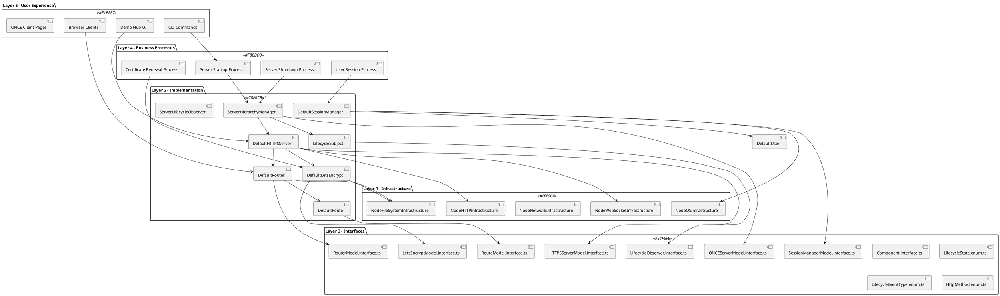
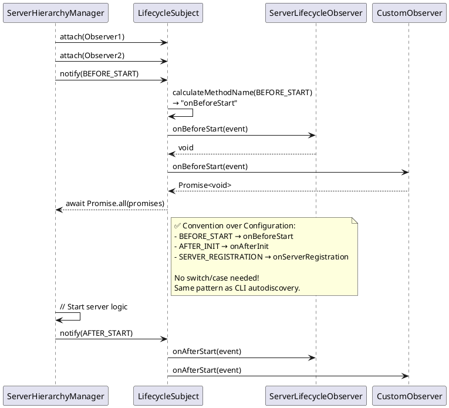
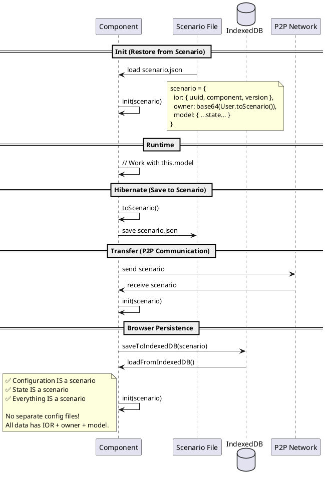

# CMM3 PDCA: ONCE v0.3.21.2 - Component Refactor with Path Authority & SessionManager

**Component**: ONCE v0.3.21.2  
**Date**: 2025-11-19 UTC 17:45  
**Author**: AI Assistant (Claude Sonnet 4.5)  
**PDCA Type**: Pragmatic Refactoring with TRUE Web4 Patterns  
**Parent Version**: 0.3.21.1  
**Supersedes**: 2025-11-19-UTC-1730.component-refactor-preserving-code.pdca.md (v1)

---


---

## **📊 SUMMARY**

## **🎯 OBJECTIVE**

**Goal**: Create TRUE Web4 component architecture while preserving working ServerHierarchyManager methods

**Pragmatic Approach**:
- ✅ Extract proven methods from ServerHierarchyManager
- ✅ Distribute methods to proper component classes
- ✅ Keep all working logic unchanged
- ✅ Add proper models (HTTPSServerModel, RouterModel, etc.)
- ✅ Get rid of functional patterns → Radical OOP
- ✅ Each class as own component (splinter-ready)
- ✅ **NO inline HTML** - HTML must be in external files
- ✅ **NO CommonJS `__dirname`** - Use PathAuthority component
- ✅ **SessionManager** - User creation + IndexedDB storage

---


## **🔍 TRON Feedback (User Prompts)**

```quote
as the ServerHierarchyManager is very functuional you went here too far. abandon this pdca and write a new one based on the previous one, where you just focus on keeping the mehtods of the ServerHierarchyManager that make sense that work on the main server scenario and the client server scenario, that you keep as much as untuched as possible. but we want a dedicated https server and all the previous seperation of concern and responsible component classes. just do not reinvent the model wherel... but get rid of functional as much as possible and do radical OOP web4 style.
```

```quote
no inline separation of concern violations lik

  /**
   * ✅ Handle 404 (from ServerHierarchyManager)
   */
  private handle404(res: ServerResponse, pathname: string): void {
    res.writeHead(404, { 'Content-Type': 'text/html' });
    res.end(`
      <!DOCTYPE html>
      <html>
      <head><title>404 Not Found</title></head>
      <body>
        <h1>404 Not Found</h1>
        <p>Path: ${pathname}</p>
      </body>
      </html>
    `);
  }

needs to be a file.

no shitty commonjs style code
    const __filename = fileURLToPath(import.meta.url);
    const __dirname = path.dirname(__filename);

add a SessioManager that leverages User creation and store the users in the browsers indexdb
```

```quote
File: src/ts/layer3/PathAuthorityModel.interface.ts (NEW) should already exsit..its the cli.. READ before you reinvent... do a dilligent analysis of the existing files!!!! not only the first 100 lines!!!.  mahr files which still violate ONE TYPE ONE FILE fro splitting. lile components/ONCE/0.3.21.2/src/ts/layer3/LifecycleEvents.ts
```

```quote
how would lifecycle events look if it was radical oop that can be implemented or extended by a server and not a bunch of functional shit types
```

```quote
chamnge the pdca to reflect this. do it for all functional shit you come accross but keep as much of the working implementation code... jusr refreame the OOP hulls!
```

```quote
update the pdca with the component mess you created

/Users/Shared/Workspaces/2cuGitHub/UpDown/components/ONCE/0.3.21.2/src/ts/layer3/Component.ts is outdated snd should be deprecared and removed afterwards

components/ONCE/0.3.21.2/src/ts/layer3/Component.interface.ts is correct but lacking the IOR which we need.

consolidate this in the pdca
```

```quote
/**
 * Default configuration
 * ✅ ALREADY EXISTS - REUSE IT!
 */
export const ONCE_DEFAULT_CONFIG = {
  PRIMARY_PORT: 42777,
  FALLBACK_PORT_START: 8080,
  DEFAULT_DOMAIN: 'local.once',
  DEFAULT_IP: '127.0.0.1',
  MAX_PORT_SCAN: 100
} as const;

this is correct but architectual bad. there is NO difference between configurationand a scenario. senarios are the full state and the configuration with the IOR to know to which implementation it belongs and the owner of the digital asset. there is nothing like a seperate configuratuiin. JUST scenarios. 

update the pdca to follow this web4 principle
```

```quote
   // ✅ Call the appropriate observer method based on event type
        switch (event.type) {
          case LifecycleEventType.BEFORE_INIT:
            result = observer.onBeforeInit(event);
            break;
          case LifecycleEventType.AFTER_INIT:
            result = observer.onAfterInit(event);
            break;
          case LifecycleEventType.BEFORE_START:
            result = observer.onBeforeStart(event);
            break;

is unnessesarry if you calculate the method name from the lifecyleEvent name

from 

BEFORE_INIT to camel case and add an on in front.

so always work convention over switch cases with direct mapping. (like in the cli)

update the pdca

add this web4 principle
```

```quote
Layer 2 (Implementation) - Concrete classes (Default*); uses Layer 1; NO direct system imports

Default is just the fallbackPrfix if the Interface wyould be the same name as the implementation.

SO ServerLifecycle

may be

DefaultServerLifecycle but needs then to be abstract

but better

HTTPSServerLifecycle

or WSServerLifecycle ...

mention that web4 naming convention in the pdca
```

```quote
   return new Promise((resolve, reject) => {
      const transaction = this.db!.transaction([this.data.storeName], 'readonly');
      const objectStore = transaction.objectStore(this.data.storeName);
      const request = objectStore.getAll();
      
      request.onsuccess = () => {
        const userModels = request.result as UserModel[];
        
        for (const userModel of userModels) {
          const userScenario = new Scenario<UserModel>().init({
            ior: {
              uuid: userModel.uuid,
              component: 'User',
              version: '0.3.21.2'

this is total functional shit. never use it lke this. OOP is DICIPLIN not lazyness and cryptic.

refactor it...do not use such constructs
```

```quote
getUser(uuid: string): DefaultUser | undefined {

this is why 

/Users/Shared/Workspaces/2cuGitHub/UpDown/components/Web4TSComponent/0.3.20.3/src/ts/layer3/Reference.interface.ts

exists.... pull it into the once component and refactro these occurence in the pdca. add it to the OOP principles
```

```quote
❌ Inline creation: new Scenario<T>().init({...}) is cryptic

no THIS is totally ok. even good Web4 Style!!!

but the {...} parameter needs to be a scenario instance. TYPED...not just naked data JSON shit.

`→ ✅ Factory methods or builders` are just artificial boilerplate and add complexity. in web4 each object can be created without prior knowledge by empty construuctor... so factories become obsoloete. add it to the web4 principles
```

```quote
export interface ONCEModel {
  // ✅ Identity
  uuid: string;
  name: string;
  description: string;
  
  // ✅ Kernel State (NOT server state)
  state: 'booting' | 'ready' | 'loading' | 'error';  // Kernel states only
  environment: 'node' | 'browser' | 'worker' | 'pwa' | 'iframe';

use enums!!!! use the lifecycle state
```

```quote
  targetType: 'file' | 'directory' | 'handler' | 'proxy';  more enums...

DRY

  // ✅ Statistics
  hitCount: number;
  lastHit?: string;
  
  // ✅ Timestamps
  createdAt: string;
  updatedAt: string;

make a statistic class... do not polute interfaces with mixed concerns ...web4 seperate concerns clearly.
```

```quote
/**
 * Restore user from model
 * ✅ Separate method for user creation
 */
private async restoreUserFromModel(userModel: UserModel): Promise<void> {

user has a user scenario... the model is the runtime ...the scenatrio the persitant JSON....never derivate from this pattern>

so do not consturct complex userScenarios but let the user store it and load it... so 

restoreUserFromModel mis unnecessary. ista always configure drom scenario...

review thise boilerplate patterns and remove them
```

```quote
users are initally constructed from the systems environment and stored as scenarios. then they are recreated bey laoding that scenario
```

```quote
indexdb or any other storeage ONLY holds scenarios and identifies them ONLY by uuid
```

```quote
UUIDv4
```

### **My Analysis**

**Key Requirements**:
1. ✅ Keep ServerHierarchyManager methods that work
2. ✅ Separate concerns into dedicated component classes
3. ✅ Don't reinvent the wheel (reuse proven logic)
4. ✅ Dedicated HTTPS server component
5. ✅ Radical OOP Web4 style
6. ✅ Each class as own component (splinter-ready)
7. ✅ **REUSE existing enums** - `LifecycleState`, `LifecycleEventType` are PERFECT
8. ✅ **REUSE existing models** - `ONCEServerModel` has everything we need
9. ✅ **NO inline HTML** - HTML must be in files (separation of concerns)
10. ✅ **NO CommonJS patterns** - Pure ESM + PathAuthority component
11. ✅ **SessionManager** - User creation + IndexedDB storage
12. ✅ **Component.interface.ts** - Consolidate interfaces, add IOR property
13. ✅ **Configuration IS a scenario** - No separate config const
14. ✅ **Convention over Configuration** - Dynamic method dispatch (no switch/case)

---

### **🎯 Web4 Principles Applied**

#### **Principle 1: Everything is a Scenario**

> "There is NO difference between configuration and a scenario. Scenarios are the full state and the configuration with the IOR to know which implementation it belongs to and the owner of the digital asset. There is nothing like a separate configuration. JUST scenarios."

**Before (Violation)**:
```typescript
// ❌ Separate configuration const (no IOR, no owner, not a scenario)
export const ONCE_DEFAULT_CONFIG = {
  PRIMARY_PORT: 42777,
  FALLBACK_PORT_START: 8080,
  DEFAULT_DOMAIN: 'local.once',
  DEFAULT_IP: '127.0.0.1',
  MAX_PORT_SCAN: 100
} as const;
```

**After (Compliant)**:
```typescript
// ✅ NO separate "config" - just use ONCEServerModel with defaults!
export class HTTPSServer implements Component<ONCEServerModel> {
  model!: ONCEServerModel;
  
  constructor() { }
  
  init(scenario?: Scenario<ONCEServerModel>): this {
    if (scenario) {
      this.model = scenario.model;  // ✅ Restore
    } else {
      // ✅ Default values in init() - NO separate config!
      this.model = {
        uuid: crypto.randomUUID(),
        domain: 'local.once',  // ✅ Default, not "config"
        capabilities: [{ capability: 'httpPort', port: 42777 }],
        // ... other defaults
      };
    }
    return this;
  }
  
  async toScenario(): Promise<Scenario<ONCEServerModel>> {
    return {
      ior: this.ior,
      owner: await this.getOwnerData(),
      model: { ...this.model }  // ✅ Entire state
    };
  }
}
```

**Benefits**:
- ✅ No separate "config" concept (pure Web4!)
- ✅ Default values are just constructor logic
- ✅ Can be saved to disk (persistence)
- ✅ Can be loaded from disk (restoration)
- ✅ Can be sent via P2P (transfer)
- ✅ Has IOR (component identification)
- ✅ Has owner (digital asset ownership)
- ✅ Simpler (no extra model, no extra file)

---

#### **Principle 2: Convention over Configuration (Direct Mapping)**

> "Always work convention over switch cases with direct mapping (like in the CLI). Calculate the method name from the lifecycle event name. BEFORE_INIT to camelCase and add 'on' in front."

**Before (Violation)**:
```typescript
// ❌ Giant switch/case for event dispatch (22+ cases!)
switch (event.type) {
  case LifecycleEventType.BEFORE_INIT:
    result = observer.onBeforeInit(event);
    break;
  case LifecycleEventType.AFTER_INIT:
    result = observer.onAfterInit(event);
    break;
  // ... 20+ more cases ...
}
```

**After (Compliant)**:
```typescript
// ✅ Convention over configuration: Dynamic method dispatch
const methodName = this.calculateObserverMethodName(event.type);
const method = (observer as any)[methodName];
if (typeof method === 'function') {
  const result = method.call(observer, event);
}

// ✅ Helper: BEFORE_INIT → onBeforeInit
private calculateObserverMethodName(eventType: LifecycleEventType): string {
  const camelCase = eventType
    .toLowerCase()
    .split('_')
    .map((word, index) => 
      index === 0 ? word : word.charAt(0).toUpperCase() + word.slice(1)
    )
    .join('');
  
  return 'on' + camelCase.charAt(0).toUpperCase() + camelCase.slice(1);
}
```

**Benefits**:
- ✅ No manual maintenance (add new event? Just add to enum!)
- ✅ Same pattern as CLI autodiscovery (consistency)
- ✅ Less code (22+ cases → 1 function)
- ✅ Type-safe (enum ensures valid event types)
- ✅ Extensible (observers can override any method)

**Examples**:
| Event Type (Enum) | Method Name (Calculated) |
|------------------|--------------------------|
| `BEFORE_INIT` | `onBeforeInit` |
| `AFTER_START` | `onAfterStart` |
| `SERVER_REGISTRATION` | `onServerRegistration` |
| `PORT_CONFLICT` | `onPortConflict` |
| `PRIMARY_SERVER_ELECTION` | `onPrimaryServerElection` |

**Same Pattern as CLI**:
- CLI: `upgrade nextBuild` → `component.upgradeNextBuild()`
- Observer: `BEFORE_INIT` → `observer.onBeforeInit()`

---

#### **Principle 3: Web4 Naming Conventions**

> "Default is just the fallback prefix if the Interface would be the same name as the implementation. Better to use specific context names like HTTPSServerLifecycle or WSServerLifecycle."

**Interface Naming**:
```typescript
// ✅ CORRECT: No "I" prefix, just the name
export interface ServerLifecycle { }
export interface Router { }
export interface SessionManager { }
```

**Implementation Naming**:

```typescript
// ❌ BAD: Generic "Default" prefix for concrete implementation
export class DefaultServerLifecycle implements ServerLifecycle { }

// ✅ GOOD: Specific context name
export class HTTPSServerLifecycle implements ServerLifecycle { }
export class WSServerLifecycle implements ServerLifecycle { }

// ✅ ACCEPTABLE: "Default" prefix ONLY for abstract base class
export abstract class DefaultServerLifecycle implements ServerLifecycle {
  // Common implementation for extension
  abstract onBeforeStart(): void;
}

// ✅ GOOD: Specific implementations extend abstract
export class HTTPSServerLifecycle extends DefaultServerLifecycle {
  override onBeforeStart(): void { /* HTTPS-specific logic */ }
}
```

**Naming Convention Rules**:

| Pattern | When to Use | Example |
|---------|-------------|---------|
| **`HTTPSServerLifecycle`** | ✅ Concrete implementation with specific context | HTTPS server observer |
| **`WSServerLifecycle`** | ✅ Concrete implementation with specific context | WebSocket server observer |
| **`BrowserRouter`** | ✅ Concrete implementation with specific context | Browser-specific router |
| **`NodeRouter`** | ✅ Concrete implementation with specific context | Node.js router |
| **`DefaultRouter`** | ⚠️ ONLY if abstract base class | Abstract router for extension |
| **`DefaultServerLifecycle`** | ❌ Avoid for concrete classes | Too generic, lacks context |

**Benefits**:
- ✅ **Self-documenting** - Name reveals purpose (HTTPS vs WS)
- ✅ **Avoids confusion** - Clear which implementation to use
- ✅ **Better autocomplete** - IDE shows `HTTPSServerLifecycle`, not just `Default...`
- ✅ **Easier to find** - Search for "HTTPS" finds all HTTPS-related classes
- ✅ **Follows JavaBean convention** - Specific, descriptive names

---

#### **Principle 16: Object-Action Method Naming (Radical OOP)**

> "Make this objectAction() naming convention a web4 principle... componentDescriptorCreate over createComponentDescriptor and all other method names following that pattern. Add a principle to lazy convert them whenever detected."

**Pattern**: `{noun}{verb}()` - Group all methods by domain object

**Before (Verb-Noun - Scattered)**:
```typescript
// ❌ BAD: Methods scattered alphabetically
class Web4TSComponent {
  createComponentDescriptor() { }   // C section
  updateComponentDescriptor() { }   // U section
  validateComponentDescriptor() { } // V section
  deleteComponentDescriptor() { }   // D section
}
```

**After (Noun-Verb - Grouped)**:
```typescript
// ✅ GOOD: All componentDescriptor* methods grouped together
class Web4TSComponent {
  componentDescriptorCreate() { }    // All componentDescriptor
  componentDescriptorUpdate() { }    // operations grouped
  componentDescriptorValidate() { }  // together in IDE
  componentDescriptorDelete() { }    // autocomplete!
}
```

**Examples**:
- `componentDescriptorUpdate()` over `updateComponentDescriptor()`
- `scenarioLoad()` over `loadScenario()`
- `serverStart()` over `startServer()`
- `portAllocate()` over `allocatePort()`
- `userAuthenticate()` over `authenticateUser()`

**Benefits**:
- ✅ **Radical OOP**: Object-first thinking (noun before verb)
- ✅ **Discoverability**: All operations on same object grouped in autocomplete
- ✅ **Maintainability**: Related methods appear together in codebase
- ✅ **Readability**: Clear domain object ownership

**Migration Strategy**:
- ⚠️ **Lazy Conversion**: Convert when method is modified or reviewed
- ⚠️ **No Mass Refactor**: Only update during active development
- ✅ **New Code**: Always use `{noun}{verb}()` pattern
- ✅ **Code Review**: Flag `{verb}{noun}()` patterns for conversion

**Applied In**:
- Web4TSComponent Iteration 1.19: `componentDescriptorUpdate()` command
- TRON directive (2025-11-27): "make this objectAction() naming convention a web4 principle"

---

**This PDCA Naming Updates**:

| Old (Generic) | New (Specific Context) |
|---------------|------------------------|
| ❌ `DefaultHTTPSServer` | ✅ `HTTPSServer` (no `Default` needed) |
| ❌ `DefaultRouter` | ✅ `HTTPRouter` or `HTTPSRouter` |
| ❌ `DefaultRoute` | ✅ `HTTPRoute` |
| ❌ `DefaultSessionManager` | ✅ `BrowserSessionManager` |
| ❌ `DefaultLetsEncrypt` | ✅ `LetsEncryptCertificateUpdater` |
| ❌ `DefaultLifecycleObserver` | ✅ Abstract class (acceptable) |
| ❌ `ServerLifecycleObserver` | ✅ `HTTPSServerLifecycleObserver` |

**Exception - Abstract Base Classes**:
```typescript
// ✅ ACCEPTABLE: "Default" for abstract base with common logic
export abstract class DefaultLifecycleObserver implements LifecycleObserver {
  // No-op default implementations
  onBeforeInit(event: LifecycleEvent): void {}
  onAfterInit(event: LifecycleEvent): void {}
  // ... etc
}

// ✅ GOOD: Specific implementations extend abstract
export class HTTPSServerLifecycleObserver extends DefaultLifecycleObserver {
  // Override only what's needed
  override onBeforeStart(event: LifecycleEvent): void {
    // HTTPS-specific startup logic
  }
}
```

---

**🎯 KEY INSIGHT: Don't Reinvent Existing Code!**

```typescript
// ❌ WRONG: Reinventing enum pattern (I did this mistake!)
export class LifecycleState {
  static readonly CREATED = 'created' as const;
  static readonly RUNNING = 'running' as const;
}

// ✅ RIGHT: REUSE existing perfect enum
import { LifecycleState } from './LifecycleEvents.js';
// Already has: CREATED, STARTING, RUNNING, STOPPING, etc.
// Already has: PRIMARY_SERVER, CLIENT_SERVER, REGISTERED
```

**What Already Exists (v0.3.21.2)**:
- ✅ `LifecycleState` enum - Perfect pattern, all states we need!
- ✅ `LifecycleEventType` enum - Event-driven architecture ready!
- ✅ `ONCEServerModel` - All server fields (pid, state, network, capabilities)!
- ✅ `ServerCapability` interface - Port management ready!
- ✅ `ONCE_DEFAULT_CONFIG` const - Configuration constants!

**Anti-Patterns to Eliminate**:
```typescript
// ❌ Inline HTML (separation of concern violation)
res.end(`<!DOCTYPE html><html>...</html>`);

// ❌ CommonJS style path resolution
const __filename = fileURLToPath(import.meta.url);
const __dirname = path.dirname(__filename);

// ✅ Correct: HTML in external files
const html = fs.readFileSync(pathAuthority.getViewHtmlPath('404.html'), 'utf-8');
res.end(html);

// ✅ Correct: PathAuthority component (calculated once via scenario)
this.pathAuthority.getViewHtmlDir()  // From model, not __dirname
```

**Method Distribution Strategy**:
- Extract ServerHierarchyManager methods → Distribute to proper components
- Keep logic unchanged, just move to right place
- Add proper models (HTTPSServerModel, RouterModel, SessionManagerModel, PathAuthorityModel)
- Eliminate functional patterns (scattered state, switch/case, inline HTML, __dirname)
- Add SessionManager for User integration with IndexedDB

---

#### **Principle 4: TRUE Radical OOP Discipline**

> **"OOP is DISCIPLINE not laziness and cryptic."**
>
> **Never use functional programming disguised as OOP. Be explicit, readable, and follow JavaBean conventions.**

**❌ Functional Disguised as OOP (Cryptic, Lazy)**:

```typescript
// ❌ BAD: Promise-based callback hell (functional style)
return new Promise((resolve, reject) => {
  const transaction = this.db!.transaction([this.data.storeName], 'readonly');
  const objectStore = transaction.objectStore(this.data.storeName);
  const request = objectStore.getAll();
  
  request.onsuccess = () => {
    const userModels = request.result as UserModel[];
    
    for (const userModel of userModels) {
      // ❌ BAD: Inline object creation with chained init
      const userScenario = new Scenario<UserModel>().init({
        ior: {
          uuid: userModel.uuid,
          component: 'User',
          version: '0.3.21.2'
        },
        owner: '',
        model: userModel
      });
      
      const user = new DefaultUser().init(userScenario);
      this.data.activeUserIORs.push(user.ior);
    }
    
    resolve();
  };
  
  request.onerror = () => {
    reject(request.error);
  };
});
```

**Problems**:
- ❌ Cryptic: Hard to read, callback-based
- ❌ Lazy: No proper error handling separation
- ❌ Functional: Promise callbacks instead of async/await
- ❌ Inline creation: `new Scenario<T>().init({...})` is cryptic
- ❌ No separation: All logic inline
- ❌ Hard to test: Cannot mock individual steps
- ❌ Hard to debug: Stack traces are confusing

**✅ TRUE Radical OOP (Explicit, Disciplined)**:

```typescript
// ✅ GOOD: Async/await with proper separation of concerns
async loadUsersFromIndexedDB(): Promise<void> {
  try {
    // ✅ Load scenarios (not models!)
    const userScenarios: Scenario<UserModel>[] = await this.getAllUserScenarios();
    
    // ✅ Restore each user from its scenario
    for (const scenario of userScenarios) {
      await this.restoreUser(scenario);
    }
  } catch (error: any) {
    throw new Error(`Failed to load users from IndexedDB: ${error.message}`);
  }
}

/**
 * Get all user scenarios from IndexedDB
 * ✅ CRITICAL: Load scenarios, not models!
 * ✅ User stores its own scenario - we don't construct it!
 * ✅ IndexedDB ONLY holds complete scenarios (IOR + owner + model)
 * ✅ IndexedDB key is ALWAYS scenario.ior.uuid (UUIDv4)
 */
private async getAllUserScenarios(): Promise<Scenario<UserModel>[]> {
  return new Promise<Scenario<UserModel>[]>((resolve, reject) => {
    const transaction = this.db!.transaction([this.data.storeName], 'readonly');
    const objectStore = transaction.objectStore(this.data.storeName);
    const request = objectStore.getAll();
    
    request.onsuccess = () => {
      // ✅ CRITICAL: Results are complete scenarios (IOR + owner + model), not raw models!
      resolve(request.result as Scenario<UserModel>[]);
    };
    
    request.onerror = () => {
      reject(request.error);
    };
  });
}

/**
 * Save user scenario to IndexedDB
 * ✅ CRITICAL: Store complete scenario, not just model!
 * ✅ IndexedDB key is scenario.ior.uuid (UUIDv4)
 * ✅ Never construct scenarios from models - user exports its own scenario!
 */
private async saveUserScenario(userScenario: Scenario<UserModel>): Promise<void> {
  return new Promise<void>((resolve, reject) => {
    const transaction = this.db!.transaction([this.data.storeName], 'readwrite');
    const objectStore = transaction.objectStore(this.data.storeName);
    
    // ✅ CRITICAL: Store complete scenario with UUIDv4 as key
    const request = objectStore.put(userScenario, userScenario.ior.uuid);
    
    request.onsuccess = () => {
      resolve();
    };
    
    request.onerror = () => {
      reject(request.error);
    };
  });
}

/**
 * Restore user from scenario
 * ✅ CRITICAL: User is ALWAYS configured from scenario!
 * ✅ Model is runtime, scenario is persistent JSON
 * ✅ We load the scenario the user stored - we don't construct it!
 */
private async restoreUser(userScenario: Scenario<UserModel>): Promise<void> {
  // ✅ CRITICAL: Load from scenario (not construct from model!)
  const user = new DefaultUser().init(userScenario);
  
  // ✅ Register user
  this.registerUser(user);
}

/**
 * Create new user (INITIAL CREATION ONLY)
 * ✅ CRITICAL: Called ONLY for first-time user creation from system environment
 * ✅ User is immediately saved as scenario
 * ✅ All subsequent access restores from scenario
 */
async createUser(): Promise<DefaultUser> {
  // ✅ Step 1: Create user from system environment
  const user = new DefaultUser().initFromEnvironment();
  
  // ✅ Step 2: Export scenario (user knows how to serialize itself)
  const userScenario = user.toScenario();
  
  // ✅ Step 3: Save scenario to IndexedDB (identified by UUIDv4)
  await this.saveUserScenario(userScenario);
  
  // ✅ Step 4: Register user
  this.registerUser(user);
  
  return user;
}

/**
 * Register user in session manager
 */
private registerUser(user: DefaultUser): void {
  this.data.activeUserIORs.push(user.ior);
  this.data.activeSessions++;
  this.data.updatedAt = new Date().toISOString();
}
```

**Benefits**:
- ✅ **Explicit**: Each step is clear
- ✅ **Readable**: Method names explain what happens
- ✅ **Testable**: Each method can be tested separately
- ✅ **Debuggable**: Clear stack traces
- ✅ **Maintainable**: Easy to modify individual steps
- ✅ **No boilerplate**: No factory methods needed!
- ✅ **Disciplined**: Proper separation of concerns

**OOP Discipline Rules**:

| Anti-Pattern | OOP Discipline |
|--------------|----------------|
| ❌ `new Promise((resolve, reject) => {...})` | ✅ `async/await` |
| ❌ Naked JSON (`init({uuid: '...', ...})`) | ✅ Typed instances (`as Scenario<T>`) |
| ❌ Factory methods (boilerplate) | ✅ Direct creation: `new T().init(scenario)` |
| ❌ `new Promise((resolve, reject) => {...})` | ✅ `async/await` with separate methods |
| ❌ `new T().init({...})` inline | ✅ Factory method: `createT(...)` |
| ❌ Callback hell | ✅ Async/await with try/catch |
| ❌ All logic in one method | ✅ Separate methods with single responsibility |
| ❌ Cryptic one-liners | ✅ Explicit, named steps |
| ❌ Hard to test | ✅ Each method testable |

**Key Takeaway**:
> **OOP is not about using `class` and `new`. OOP is about DISCIPLINE:**
> - Explicit over implicit
> - Readable over cryptic
> - Testable over monolithic
> - Maintainable over clever

---

#### **Principle 6: Empty Constructor Makes Factories Obsolete**

> **"In Web4 each object can be created without prior knowledge by empty constructor. Factories become obsolete!"**
>
> **`new Scenario<T>().init(scenario)` is GOOD Web4 style when parameter is typed!**

**❌ Traditional OOP: Factory Pattern (Boilerplate)**:

```typescript
// ❌ BAD: Unnecessary factory boilerplate
class ScenarioFactory {
  static createUserScenario(userModel: UserModel): Scenario<UserModel> {
    const scenario = new Scenario<UserModel>();
    scenario.init({
      ior: {
        uuid: userModel.uuid,
        component: 'User',
        version: '0.3.21.2'
      },
      owner: '',
      model: userModel
    });
    return scenario;
  }
}

// ❌ BAD: Factory method adds artificial complexity
private createUserScenario(userModel: UserModel): Scenario<UserModel> {
  const scenario = new Scenario<UserModel>();
  scenario.init({...});
  return scenario;
}

// Usage:
const scenario = ScenarioFactory.createUserScenario(userModel);  // ❌ Boilerplate!
const scenario = this.createUserScenario(userModel);  // ❌ Boilerplate!
```

**Problems**:
- ❌ Artificial complexity: Extra class/method just to call `new`
- ❌ Boilerplate: Factory wraps what could be one line
- ❌ Not flexible: Factory needs to know all parameters upfront
- ❌ Hard to test: Must mock factory instead of constructor
- ❌ Traditional OOP baggage: Factories were needed when constructors were complex

**✅ Web4 Pattern: Empty Constructor + Direct Creation**:

```typescript
// ✅ GOOD: Direct creation with typed scenario parameter
const userScenario: Scenario<UserModel> = new Scenario<UserModel>().init({
  ior: {
    uuid: userModel.uuid,
    component: 'User',
    version: '0.3.21.2'
  },
  owner: '',
  model: userModel
});

// ✅ GOOD: The parameter is TYPED (not naked JSON!)
const scenario: Scenario<UserModel> = {  // ✅ Typed instance
  ior: { uuid: '...', component: 'User', version: '0.3.21.2' },
  owner: '',
  model: userModel
};
const userScenario = new Scenario<UserModel>().init(scenario);  // ✅ Good!

// ✅ GOOD: Chain creation
const user = new DefaultUser().init(
  new Scenario<UserModel>().init(scenario)
);

// ❌ BAD: Naked JSON object (untyped!)
const userScenario = new Scenario<UserModel>().init({
  uuid: '...',  // ❌ Missing IOR structure!
  owner: '',
  model: userModel
});
```

**Why Empty Constructor Makes Factories Obsolete**:

| Traditional OOP | Web4 Empty Constructor Pattern |
|-----------------|-------------------------------|
| ❌ Complex constructor with many parameters | ✅ Empty constructor (no parameters!) |
| ❌ Factory needed to simplify construction | ✅ `init()` accepts scenario (one parameter) |
| ❌ Must know all parameters upfront | ✅ Scenario can be incomplete, partial, or full |
| ❌ Factory creates tight coupling | ✅ Objects created without prior knowledge |
| ❌ Factory methods proliferate | ✅ One creation pattern: `new T().init(scenario)` |

**Benefits of Empty Constructor**:
- ✅ **No prior knowledge needed**: Can create `new T()` anywhere
- ✅ **Uniform pattern**: Always `new T().init(scenario)`
- ✅ **Flexible**: Scenario can be partial, full, or omitted
- ✅ **Testable**: Easy to mock, no factory needed
- ✅ **Simple**: No boilerplate factory classes/methods
- ✅ **Composable**: Chain multiple `new T().init()` calls

**The Real Issue: Typed vs. Naked JSON**:

```typescript
// ❌ BAD: Naked JSON object (no type safety!)
const scenario = new Scenario<UserModel>().init({
  uuid: '...',        // ❌ Wrong structure!
  owner: '',
  model: userModel
});

// ✅ GOOD: Typed scenario instance
const scenarioData: Scenario<UserModel> = {
  ior: { uuid: '...', component: 'User', version: '0.3.21.2' },  // ✅ Correct!
  owner: '',
  model: userModel
};
const scenario = new Scenario<UserModel>().init(scenarioData);

// ✅ EVEN BETTER: Type inference ensures correctness
const scenario = new Scenario<UserModel>().init({
  ior: { uuid: userModel.uuid, component: 'User', version: '0.3.21.2' },
  owner: '',
  model: userModel
} as Scenario<UserModel>);  // ✅ Explicit type!
```

**Key Takeaway**:
> **Factories are artificial boilerplate in Web4!**
>
> **Empty constructor + init(scenario) pattern replaces ALL factory patterns.**
>
> **The problem is NOT `new T().init({...})` - it's passing naked JSON instead of typed instances!**

**Rules**:
1. ✅ Use `new T().init(scenario)` directly (no factory!)
2. ✅ Ensure `scenario` parameter is properly typed
3. ✅ Use `as Scenario<T>` for type safety when using object literals
4. ❌ Never create factory classes/methods (obsolete!)
5. ❌ Never pass naked JSON objects (type them!)

---

#### **Principle 5: Reference<T> for Nullable References**

> **"Use `Reference<T>` instead of `T | undefined` or optional types."**
>
> **Make nullable references explicit and type-safe. This is why `Reference.interface.ts` exists.**

**❌ TypeScript Anti-Patterns (Implicit Nullability)**:

```typescript
// ❌ BAD: Returning undefined (implicit failure)
getUser(uuid: string): DefaultUser | undefined {
  return this.users.get(uuid);
}

// ❌ BAD: Optional return type (implicit nullability)
findServer(uuid: string): ONCEServer | undefined {
  return this.servers.find(s => s.model.uuid === uuid);
}

// ❌ BAD: Mixing null and undefined
getRoute(path: string): Route | null | undefined {
  // ❓ What's the difference between null and undefined here?
  return this.routes.get(path);
}
```

**Problems**:
- ❌ Implicit: `undefined` doesn't explain why it's nullable
- ❌ Inconsistent: Mix of `null`, `undefined`, optional
- ❌ Hard to reason: What does `undefined` mean? Not found? Not loaded? Error?
- ❌ TypeScript weakness: `| undefined` is not explicit enough

**✅ Web4 Pattern: Explicit Reference<T>**:

```typescript
// File: src/ts/layer3/Reference.interface.ts
/**
 * Reference<T> - Type-safe nullable reference wrapper
 * Web4 pattern: All references are nullable by default
 * 
 * Usage: Reference<DefaultUser> = DefaultUser | null
 * 
 * Why: Makes nullable references explicit and type-safe
 * Eliminates `any` type usage for component references
 */
export type Reference<T> = T | null;

// ✅ GOOD: Explicit nullable reference
getUser(uuid: string): Reference<DefaultUser> {
  const user = this.users.get(uuid);
  return user ?? null;  // ✅ Explicit: null means "not found"
}

// ✅ GOOD: Explicit nullable reference
findServer(uuid: string): Reference<ONCEServer> {
  const server = this.servers.find(s => s.model.uuid === uuid);
  return server ?? null;  // ✅ Explicit: null means "not found"
}

// ✅ GOOD: Explicit nullable reference
getRoute(path: string): Reference<Route> {
  const route = this.routes.get(path);
  return route ?? null;  // ✅ Explicit: null means "not found"
}

// ✅ GOOD: Null checks are explicit
const user: Reference<DefaultUser> = sessionManager.getUser(uuid);
if (user === null) {
  // ✅ Clear: user not found
  throw new Error(`User not found: ${uuid}`);
}
// ✅ TypeScript knows user is DefaultUser here
user.init(scenario);
```

**Benefits**:
- ✅ **Explicit**: `Reference<T>` clearly means "nullable"
- ✅ **Consistent**: Always use `null`, never `undefined`
- ✅ **Type-safe**: TypeScript enforces null checks
- ✅ **Semantic**: `null` = "not found" or "not set" (clear meaning)
- ✅ **Web4 pattern**: Standardized across all components

**Usage in Models**:

```typescript
// ✅ GOOD: Explicit nullable references in models
export interface SessionManagerModel {
  uuid: string;
  activeUsers: Map<string, DefaultUser>;  // ✅ Map (not null)
  currentUser: Reference<DefaultUser>;    // ✅ Reference (nullable)
  primaryServer: Reference<ONCEServer>;   // ✅ Reference (nullable)
}

// ✅ GOOD: Explicit nullable references in methods
export class SessionManager {
  getCurrentUser(): Reference<DefaultUser> {
    return this.model.currentUser;  // ✅ Can be null
  }
  
  setCurrentUser(user: Reference<DefaultUser>): void {
    this.model.currentUser = user;  // ✅ Can set to null
  }
  
  clearCurrentUser(): void {
    this.model.currentUser = null;  // ✅ Explicit clear
  }
}
```

**Comparison Table**:

| Pattern | When to Use | Example |
|---------|-------------|---------|
| `T` | Never null | `uuid: string` |
| `Reference<T>` | ✅ Can be null (not found, not set) | `currentUser: Reference<DefaultUser>` |
| `T | undefined` | ❌ Avoid (use Reference) | ~~`getUser(): User \| undefined`~~ |
| `T?` | ❌ Avoid (use Reference) | ~~`user?: User`~~ |
| `T | null | undefined` | ❌ Never (pick one!) | ~~`getUser(): User \| null \| undefined`~~ |

**Key Rules**:
1. ✅ Use `Reference<T>` for all nullable references
2. ✅ Always return `null` (never `undefined`)
3. ✅ Use `?? null` to convert `undefined` to `null`
4. ✅ Explicit null checks (`=== null`, `!== null`)
5. ❌ Never mix `null` and `undefined`

**Files to Create**:
- `src/ts/layer3/Reference.interface.ts` - Import from Web4TSComponent or define locally

---

#### **Principle 7: Async Only in Layer 4 (Lazy Migration Pattern)**

> **"All async is ONLY in Layer 4. All other layers should be synchronous only. Layer 4 is the only layer to do remote access via service interfaces and injected implementations."**
>
> **When touching async code in Layer 2, migrate it to a Layer 4 orchestrator class.**

**The Problem - Async Contamination**:

Async/await spreads through the codebase like a virus. Once you make one method async, all callers must become async, and their callers, and so on. This violates layer separation.

**❌ Before (Violation - Async in Layer 2)**:

```typescript
// ❌ BAD: Layer 2 with async methods
export class ServerHierarchyManager {
  // ❌ Async in Layer 2 (business logic)
  async detectAndSetEnvironment(): Promise<void> {
    const env = await this.infrastructure.detectEnvironment();
    this.serverModel.hostname = env.getHostname();
  }
  
  // ❌ Now startServer() must be async too
  async startServer(): Promise<void> {
    await this.detectAndSetEnvironment();  // ❌ Async call
    // ... rest of startup
  }
}
```

**Problems**:
- ❌ Layer 2 forced to be async (violates layer principle)
- ❌ Constructors can't call async methods
- ❌ Sync callers forced to become async
- ❌ Tests harder to write (async everywhere)
- ❌ Error handling more complex

**✅ After (Compliant - Async Migrated to Layer 4)**:

```typescript
// ✅ GOOD: Layer 2 with synchronous methods only
export class ServerHierarchyManager {
  // ✅ Synchronous detection (direct os calls)
  private detectAndSetEnvironmentSync(): void {
    const fullHostname = os.hostname();
    this.serverModel.hostname = this.extractHostname(fullHostname);
    this.serverModel.domain = this.extractDomain(fullHostname);
    this.serverModel.ip = this.detectPrimaryIP();
  }
  
  constructor() {
    // ✅ Can call in constructor (synchronous)
    this.detectAndSetEnvironmentSync();
  }
  
  // ✅ Synchronous setters to model (JavaBean style)
  public setHostname(hostname: string): void {
    this.serverModel.hostname = hostname;
  }
  
  public setDomain(domain: string): void {
    this.serverModel.domain = domain;
  }
}

// ✅ Layer 4: Orchestrator for async operations
export class ServerOrchestrator {
  private manager: ServerHierarchyManager;
  private infrastructure: NodeOSInfrastructure;
  
  // ✅ Async operations orchestrated in Layer 4
  async startServerWithRemoteDiscovery(): Promise<void> {
    // ✅ Layer 4: Async discovery from remote services
    const env = await this.infrastructure.detectEnvironment();
    
    // ✅ Layer 2: Synchronous setters
    this.manager.setHostname(env.getHostname());
    this.manager.setDomain(env.getDomain());
    this.manager.setIP(env.getPrimaryIP());
    
    // ✅ Layer 2: Synchronous start
    this.manager.startServerSync();
  }
}
```

**Migration Strategy (Lazy Migration)**:

1. **Immediate**: Create synchronous version for constructor use
   ```typescript
   private detectAndSetEnvironmentSync(): void {
     // Direct os.hostname() calls (no async)
   }
   ```

2. **Keep async for now**: Existing async method stays (used by async callers)
   ```typescript
   async detectAndSetEnvironment(): Promise<void> {
     // Keep for backward compatibility
   }
   ```

3. **Future (Iteration 2+)**: Migrate async to Layer 4 orchestrator
   ```typescript
   // Layer 4: ServerOrchestrator
   async orchestrateStartup(): Promise<void> {
     // Layer 4 async orchestration
   }
   ```

**Benefits**:
- ✅ **Layer 2 stays clean** - Pure business logic, synchronous
- ✅ **Constructors work** - Can call sync methods
- ✅ **Tests simpler** - No async in unit tests
- ✅ **Gradual migration** - No big-bang refactoring
- ✅ **Clear separation** - Async = remote operations = Layer 4

**Implementation Priorities**:
1. **High Priority**: Constructors, init(), core methods → Make synchronous
2. **Medium Priority**: Methods called by constructors → Make synchronous
3. **Low Priority**: Network/file I/O operations → Keep async, move to Layer 4 later

---

#### **Principle 8: DRY - Don't Repeat Yourself (Dedicated Methods)**

> **"For code like `this.serverModel.domain = parts.slice(1).reverse().join('.')`, find dedicated methods on the right class to not rewrite it again and again. DRY Web4 principle."**
>
> **Extract repeated logic into dedicated, reusable, testable methods.**

**The Problem - Copy-Paste Programming**:

```typescript
// ❌ Duplicated logic in multiple places
const parts = fullHostname.split('.');
this.serverModel.hostname = parts[0];
this.serverModel.domain = parts.slice(1).reverse().join('.');

// ❌ Same logic elsewhere
const parts = hostname.split('.');
const shortHostname = parts[0];
const domain = parts.slice(1).reverse().join('.');

// ❌ Again in tests
const parts = actualHostname.split('.');
const expectedDomain = parts.slice(1).reverse().join('.');
```

**Problems**:
- ❌ **Duplicated logic** - Same code in 3+ places
- ❌ **Bug multiplication** - Fix bug once, miss others
- ❌ **Hard to test** - Can't test logic in isolation
- ❌ **No reuse** - Every file reinvents the wheel
- ❌ **Violates DRY** - "Don't Repeat Yourself"

**✅ Solution - Dedicated Methods on the Right Class**:

```typescript
// File: src/ts/layer1/NodeOSInfrastructure.ts (or utils)
export class HostnameParser {
  /**
   * Extract short hostname from FQDN
   * @param fqdn - Full qualified domain name (e.g., "McDonges-3.fritz.box")
   * @returns Short hostname (e.g., "McDonges-3")
   */
  public static extractHostname(fqdn: string): string {
    if (!fqdn || !fqdn.includes('.')) {
      return fqdn;
    }
    return fqdn.split('.')[0];
  }
  
  /**
   * Extract domain from FQDN with hierarchical reversal
   * @param fqdn - Full qualified domain name (e.g., "McDonges-3.fritz.box")
   * @returns Reversed domain for hierarchical paths (e.g., "box.fritz")
   * 
   * Why reversed? For directory structure: scenarios/box/fritz/McDonges-3/
   */
  public static extractDomain(fqdn: string): string {
    if (!fqdn || !fqdn.includes('.')) {
      return 'local.once'; // Fallback for non-FQDN
    }
    const parts = fqdn.split('.');
    return parts.slice(1).reverse().join('.');
  }
  
  /**
   * Parse FQDN into components
   * @param fqdn - Full qualified domain name
   * @returns Parsed components { hostname, domain, reversed }
   */
  public static parseFQDN(fqdn: string): {
    hostname: string;
    domain: string;
    domainReversed: string;
  } {
    return {
      hostname: this.extractHostname(fqdn),
      domain: fqdn.split('.').slice(1).join('.'),  // Original order
      domainReversed: this.extractDomain(fqdn)     // Reversed for paths
    };
  }
}
```

**✅ Usage - Clean and Reusable**:

```typescript
// ✅ GOOD: In ServerHierarchyManager
private detectAndSetEnvironmentSync(): void {
  const fullHostname = os.hostname();
  
  // ✅ DRY: Reuse dedicated methods
  this.serverModel.hostname = HostnameParser.extractHostname(fullHostname);
  this.serverModel.domain = HostnameParser.extractDomain(fullHostname);
}

// ✅ GOOD: In tests
it('should extract domain correctly', () => {
  const domain = HostnameParser.extractDomain('McDonges-3.fritz.box');
  expect(domain).toBe('box.fritz');
});

// ✅ GOOD: In NodeOSInfrastructure
async detectEnvironment(): Promise<EnvironmentModel> {
  const fqdn = os.hostname();
  const parsed = HostnameParser.parseFQDN(fqdn);
  // Use parsed.hostname, parsed.domain, parsed.domainReversed
}
```

**Benefits**:
- ✅ **Single source of truth** - One place for hostname logic
- ✅ **Testable** - Can unit test parsing logic in isolation
- ✅ **Reusable** - Used by Layer 1, Layer 2, tests
- ✅ **Self-documenting** - Method name explains what it does
- ✅ **Bug fixes propagate** - Fix once, works everywhere
- ✅ **Type-safe** - Return types enforce correct usage

**Where to Put These Methods**:

| Pattern | Location | Example |
|---------|----------|---------|
| Infrastructure utilities | Layer 1 | `NodeOSInfrastructure`, `HostnameParser` |
| Business logic utilities | Layer 2 | `ScenarioManager`, `PathBuilder` |
| Pure functions | utils/ or Layer 1 | `StringUtils`, `DateUtils` |

**DRY Checklist**:
1. ✅ Same code appears 2+ times? → Extract to method
2. ✅ Complex expression? → Extract with descriptive name
3. ✅ Hard to test inline? → Extract for testability
4. ✅ Domain knowledge embedded? → Extract with domain name
5. ✅ String manipulation? → Extract to StringUtils

---

#### **Principle 9: Self-Information Protocol (CMM3 Compliance)**

> **"Use `pdca trainAI` before acting. Read completely (depth 3), not superficially. Build complete mental model BEFORE coding to prevent assumption cascade."**
>
> **When you see 'pdca' trigger word → Stop work → Query trainAI → Read COMPLETELY → Rebuild understanding**

**The Problem - Acting Without Reading**:

```typescript
// ❌ Skip reading → CMM1 chaos → 8 CMM3 violations → Delete and restart
// ❌ Skip reading → git protocol violation → Interactive commands → Stash chaos
// ❌ Skip reading → Wrong version → Manual edits → Break workflow
```

**Problems**:
- ❌ **Assumption cascade** - Build on faulty assumptions
- ❌ **CMM2 violations** - Manual operations, subjective decisions
- ❌ **100x cost** - Doing it WRONG first, then RIGHT
- ❌ **Repeated mistakes** - After summary events, forget context
- ❌ **Broken processes** - Act mechanically without understanding

**✅ Solution - Self-Information Before Action**:

1. **Trigger Word Recognition**:
   - When user says "pdca" (alone or last word) = FULL CONTEXT REBUILD
   - Stop all work immediately
   - Query `pdca trainAI` for relevant topics
   - Read COMPLETELY to depth 3 (not just first lines)

2. **Reading Depth Protocol**:
   - **Depth 0**: Entry document (e.g., CMM checklist)
   - **Depth 1**: Direct references (e.g., template.md, howto.PDCA.md)
   - **Depth 2**: Secondary references (e.g., dual-links format, decide.md)
   - **Depth 3**: Deep context (e.g., violation examples, protocols)

3. **Keyword Triggers** (from trainAI):
   - "start", "startup" → Read 'start' topic
   - "pdca", "document" → Read 'pdca' topic
   - "feature", "implement" → Read 'feature-development' topic
   - "component", "web4" → Read 'component' topic
   - "test", "testing" → Read 'test-first' or 'test-workflow' topic
   - "git", "commit" → Read git protocol
   - "decision", "qa" → Read 'decide' topic

4. **Summary Event Protocol**:
   - When you see 'summarizing chat' event → Context is LOST
   - IMMEDIATELY use trainAI to refresh understanding
   - Review protocols before continuing work
   - DO NOT repeat old mistakes after summary

**✅ The Self-Information Command**:

```bash
# Step 1: Always start with general training
pdca trainAI

# Step 2: Read specific topics (depth 3!)
pdca trainAI cmm              # CMM framework
pdca trainAI pdca             # PDCA creation & git protocol
pdca trainAI feature-development  # Test-first CMM3 pattern
pdca trainAI component        # Web4 component system
pdca trainAI dual-links       # GitHub + local references
pdca trainAI decide           # QA decision framework

# Step 3: Build complete mental model BEFORE coding
# Step 4: Then and only then - proceed with work
```

**📖 Required Reading** (CMM3 Checklist References):
1. CMM3 Compliance Checklist: [GitHub](https://github.com/Cerulean-Circle-GmbH/Web4Articles/blob/dev/2025-10-17-UTC-0747/scrum.pmo/roles/_shared/cmm3.compliance.checklist.md) | [§/scrum.pmo/roles/_shared/cmm3.compliance.checklist.md](/Users/Shared/Workspaces/2cuGitHub/Web4Articles/scrum.pmo/roles/_shared/cmm3.compliance.checklist.md)
2. PDCA Template v3.2.4.2: [GitHub](https://github.com/Cerulean-Circle-GmbH/Web4Articles/blob/dev/2025-09-24-UTC-1028/scrum.pmo/roles/_shared/PDCA/template.md) | [§/scrum.pmo/roles/_shared/PDCA/template.md](/Users/Shared/Workspaces/2cuGitHub/Web4Articles/scrum.pmo/roles/_shared/PDCA/template.md)
3. PDCA HowTo Guide: [GitHub](https://github.com/Cerulean-Circle-GmbH/Web4Articles/blob/dev/2025-09-24-UTC-1028/scrum.pmo/roles/_shared/PDCA/howto.PDCA.md) | [§/scrum.pmo/roles/_shared/PDCA/howto.PDCA.md](/Users/Shared/Workspaces/2cuGitHub/Web4Articles/scrum.pmo/roles/_shared/PDCA/howto.PDCA.md)

**Benefits**:
- ✅ **Prevent assumption cascade** - Know before you act
- ✅ **CMM3 compliance** - Follow defined processes
- ✅ **Normal cost** - Do it RIGHT first (not 100x expensive)
- ✅ **No repeated mistakes** - Refresh after summary events
- ✅ **Feedback loop mastery** - Recognize confusion → Reset → Rebuild

**🎯 Key Principle**: "30 min reading → 2-3 hours debugging saved"

**The Exponential Cost Principle**:
- Doing it WRONG first, then RIGHT: **100x more expensive**
- Doing it RIGHT first: **Normal cost**
- The knowledge EXISTS in trainAI - **USE IT!**

---

#### **Principle 10: Global ONCE Singleton Pattern**

> **"ONCE is published as a global instance variable in each environment: `window.global.ONCE` in browser, `global.ONCE` in Node.js, `self.global.ONCE` in workers/PWAs."**

**The Problem - No Global Access**:
```typescript
// ❌ Components can't access ONCE without complex injection
import { ONCE } from './path/to/ONCE.js';  // ❌ Hardcoded path
```

**Problems**:
- ❌ **Tight coupling**: Every file needs import path
- ❌ **Not environment independent**: Different imports for browser vs Node
- ❌ **No runtime access**: Can't access ONCE from console/DevTools
- ❌ **Breaks Web4 kernel pattern**: ONCE should be universally accessible

**✅ Solution - Global Singleton in All Environments**:

```typescript
// ✅ DefaultONCE registers itself globally on start
export class DefaultONCE implements ONCE {
  constructor() { }
  
  static start(scenario?: Scenario<ONCEModel>): DefaultONCE {
    const instance = new DefaultONCE().init(scenario);
    
    // ✅ Register globally in all environments
    if (typeof window !== 'undefined') {
      // Browser environment
      if (!window.global) window.global = {} as any;
      window.global.ONCE = instance;
    } else if (typeof global !== 'undefined') {
      // Node.js environment
      if (!global.global) (global as any).global = {};
      (global as any).global.ONCE = instance;
    } else if (typeof self !== 'undefined') {
      // Worker/PWA environment
      if (!self.global) (self as any).global = {};
      (self as any).global.ONCE = instance;
    }
    
    return instance;
  }
}
```

**TypeScript Declarations (`src/ts/layer3/global.d.ts`)**:
```typescript
import type { ONCE } from './ONCE.interface.js';

declare global {
  var global: {
    ONCE: ONCE;
  };
  
  interface Window {
    global: {
      ONCE: ONCE;
    };
  }
  
  interface WorkerGlobalScope {
    global: {
      ONCE: ONCE;
    };
  }
}

export {};
```

**Usage in Any Environment**:
```typescript
// ✅ Browser
console.log(window.global.ONCE.getVersion());

// ✅ Node.js
console.log(global.ONCE.getVersion());

// ✅ Worker/PWA
console.log(self.global.ONCE.getVersion());

// ✅ Universal access (TypeScript knows about global.ONCE)
const version = global.ONCE.getVersion();
```

**Benefits**:
- ✅ **Environment independent**: Same API in all environments
- ✅ **No imports needed**: Access ONCE from anywhere
- ✅ **DevTools access**: Inspect ONCE from browser console
- ✅ **Web4 kernel pattern**: ONCE is the universal runtime
- ✅ **Type safe**: TypeScript declarations provide autocomplete
- ✅ **Singleton guarantee**: Only one ONCE instance per environment

**Why `global.ONCE` Namespace**:
- Avoids polluting global namespace (`window.ONCE` conflicts)
- Consistent across environments (`global.ONCE` everywhere)
- Allows other globals (`global.User`, `global.Storage`, etc.)
- Mirrors Web4 philosophy: Everything under `global.*`

---

#### **Principle 11: Protocol-Less Communication (FUNDAMENTAL PARADIGM)**

> **"Web4 is PROTOCOL-LESS. Objects communicate by replicating their state via scenarios, NOT by sending messages. Objects are 'cloned' with identical UUIDs."**

**The Problem - Protocol-Based Communication**:
```typescript
// ❌ Traditional: Message protocols, ACKs, message types
export interface ONCEScenarioMessage {
  uuid: string;
  type: 'broadcast' | 'relay' | 'p2p';  // ❌ Protocol types!
  from: { host: string; port: number };
  to?: { host: string; port: number };
  content: string;
  timestamp: string;
}

// ❌ Message tracking, protocol state
export interface ONCEMessageTracker {
  sent: number;
  received: number;
  acknowledged: number;  // ❌ ACK protocol!
}
```

**Problems**:
- ❌ **Functional/procedural**: Messages are data packets, not objects
- ❌ **Protocol coupling**: Code knows about message types, ACKs, routing
- ❌ **Not OOP**: No methods on messages, just data
- ❌ **Violates Web4**: Web4 is about objects, not protocols

**✅ Solution - Object Replication via Scenarios**:

```typescript
// ✅ Web4 Way: Objects replicate themselves
export class HTTPSServer implements Component<HTTPSServerModel> {
  model!: HTTPSServerModel;
  
  constructor() { }
  
  async toScenario(): Promise<Scenario<HTTPSServerModel>> {
    return {
      ior: this.ior,  // ✅ SAME UUID across all instances
      owner: await this.getOwnerData(),
      model: { ...this.model }  // ✅ Complete state
    };
  }
}

// ✅ Primary Server: Receives and broadcasts scenarios
class PrimaryServer {
  async onClientRegister(clientScenario: Scenario<HTTPSServerModel>): Promise<void> {
    // ✅ Store the scenario (not a "message"!)
    this.serverRegistry.set(clientScenario.ior.uuid, clientScenario);
    
    // ✅ Broadcast scenario to all other clients
    for (const [uuid, otherClientScenario] of this.serverRegistry) {
      if (uuid !== clientScenario.ior.uuid) {
        // ✅ Send scenario, not message
        await this.sendScenario(otherClientScenario, clientScenario);
      }
    }
  }
}

// ✅ Client Server: Replicates itself
class ClientServer {
  async replicateToPrimary(): Promise<void> {
    // ✅ Export my scenario
    const myScenario = await this.toScenario();
    
    // ✅ Send to primary (creates clone with SAME UUID)
    await this.primaryConnection.send(myScenario);
  }
}
```

**How It Works**:

1. **Client Creates Scenario**:
   ```typescript
   const scenario = await clientServer.toScenario();
   // scenario.ior.uuid = "abc-123"  ✅ Original UUID
   ```

2. **Primary Receives Scenario**:
   ```typescript
   const clone = new HTTPSServer().init(scenario);
   // clone.ior.uuid = "abc-123"  ✅ SAME UUID (true clone!)
   ```

3. **Primary Broadcasts Scenario**:
   ```typescript
   // ✅ All servers get the scenario
   // ✅ All create instances with SAME UUID
   // ✅ Objects are "replicated" across network
   ```

4. **Methods Work on Clones**:
   ```typescript
   // ✅ On any server, call methods on replicated object
   const server = this.serverRegistry.get("abc-123");
   server.getStatus();  // ✅ Methods work on cloned object
   ```

**Benefits**:
- ✅ **TRUE OOP**: Objects have methods, not message handlers
- ✅ **No protocols**: No message types, no ACKs, no routing logic
- ✅ **Identical UUIDs**: Clones are true replicas
- ✅ **Methods everywhere**: Call methods on any replica
- ✅ **Simpler**: Just scenarios, no protocol layer
- ✅ **Web4 pure**: Objects replicate via hibernation/rehydration

**What to Delete**:
- ❌ Delete `ONCEScenarioMessage.interface.ts`
- ❌ Delete `ONCEMessageTracker.interface.ts`
- ❌ Delete all message protocol code
- ❌ Delete ACK handling
- ❌ Delete message type enums

**Key Insight**:
> **Web4 doesn't send "messages" - it sends "scenarios" (object hibernation states).**
>
> **The receiving side doesn't "process messages" - it "replicates objects" (rehydration).**
>
> **Objects exist in SAME STATE with SAME UUID on all servers (distributed object replication).**

---

**🌐 ONCE Primary Server (42777) - Global P2P Network Registry**

The **first and most critical use case** for IOR failover profiles is the **ONCE Primary Server**, which serves as the **global registry and coordinator** for the entire international P2P ONCE network.

**Primary Server Role**:
```
ONCE Primary Server (Port 42777)
├── Global Server Registry (all ONCE servers register here)
├── Server Discovery (clients find other servers)
├── P2P Network Coordination (scenario broadcasting)
├── High Availability (failover profiles)
└── Geographic Distribution (primary + regional backups)
```

**Primary Server IOR with Failover**:
```
ior:https://primary.once.network:42777,europe.once.network:42778,asia.once.network:42779,americas.once.network:42780/ONCE/0.3.21.2/registry-uuid
│          │                         │                        │                       │
│          │                         │                        │                       └─ Americas Regional Backup
│          │                         │                        └─ Asia Regional Backup
│          │                         └─ Europe Regional Backup
│          └─ Global Primary (default)
```

**How Client Servers Connect**:

1. **Client Server Startup**:
   ```typescript
   export class DefaultONCE implements ONCE {
     async start(scenario?: Scenario<ONCEModel>): Promise<DefaultONCE> {
       // ✅ Get Primary Server IOR from configuration or discovery
       const primaryIor = 'ior:https://primary.once.network:42777,europe.once.network:42778/ONCE/0.3.21.2/registry-uuid';
       
       // ✅ Resolve primary with automatic failover
       const primaryScenario = await this.resolveIor(primaryIor);
       
       // ✅ Connect to primary (tries profiles in order)
       await this.connectToPrimary(primaryScenario);
       
       // ✅ Register this server with primary
       const myScenario = await this.toScenario();
       await this.registerWithPrimary(myScenario);
       
       return this;
     }
   }
   ```

2. **Primary Server Registration** (protocol-less):
   ```typescript
   class PrimaryServerRegistry {
     // ✅ ServerRegistry stores CLONES (scenarios with same UUID)
     private serverRegistry = new Map<string, Scenario<HTTPSServerModel>>();
     
     async onServerRegister(serverScenario: Scenario<HTTPSServerModel>): Promise<void> {
       // ✅ Store the server scenario (not a "registration message"!)
       this.serverRegistry.set(serverScenario.ior.uuid, serverScenario);
       
       // ✅ Broadcast this server's scenario to ALL other servers
       for (const [uuid, otherServerScenario] of this.serverRegistry) {
         if (uuid !== serverScenario.ior.uuid) {
           // ✅ Send scenario → Other servers create clones
           await this.replicateScenario(otherServerScenario, serverScenario);
         }
       }
       
       console.log(`✅ Server registered: ${serverScenario.ior.uuid}`);
       console.log(`🌐 Total servers in global network: ${this.serverRegistry.size}`);
     }
   }
   ```

3. **Server Discovery** (no protocol, just object access):
   ```typescript
   // ✅ Client calls method on primary (via IOR)
   const primaryIor = 'ior:https://primary.once.network:42777/ONCE/0.3.21.2/registry-uuid/listServers';
   
   // ✅ Router maps IOR to method invocation
   const primary = await resolveIor(primaryIor);  // Gets ONCE instance
   const servers = await primary.listServers();    // Calls method directly
   
   // ✅ Returns array of server scenarios (not "server list message")
   // servers = [Scenario<HTTPSServerModel>, Scenario<HTTPSServerModel>, ...]
   ```

**Primary Server Failover Flow**:

```typescript
// ✅ Client tries to connect to primary
async function connectToPrimaryWithFailover(): Promise<void> {
  const primaryIor = 'ior:https://primary.once.network:42777,europe.once.network:42778,asia.once.network:42779/ONCE/0.3.21.2/registry-uuid';
  
  try {
    // Try profile 1: primary.once.network:42777
    console.log('Connecting to global primary...');
    const primary = await resolveIor(primaryIor);  // ✅ Auto-failover
    console.log('✅ Connected to:', primary.ior.host);
    
    // Register with primary
    await primary.registerServer(await this.toScenario());
  } catch (error) {
    // ✅ Failover handled automatically by IOR resolver
    // It tried all profiles: primary → europe → asia
    console.error('❌ All primary server profiles failed');
    throw error;
  }
}
```

**Benefits for Global P2P Network**:

| Benefit | Description |
|---------|-------------|
| ✅ **Global Registry** | Single IOR for entire P2P network |
| ✅ **Automatic Failover** | Primary down → Europe backup takes over |
| ✅ **Geographic Distribution** | Regional backups reduce latency |
| ✅ **Zero Configuration** | Clients just need one IOR string |
| ✅ **Transparent Recovery** | Failover invisible to clients |
| ✅ **Protocol-Less** | No "failover protocol", just IOR resolution |

**Primary Server IOR in Configuration**:
```typescript
// ✅ ONCEModel stores Primary Server IOR
export interface ONCEModel {
  uuid: string;
  version: string;
  hostname: string;
  
  // ✅ Primary Server IOR (with failover profiles)
  primaryServerIor: string;  // 'ior:https://primary.once.network:42777,europe...'
  
  // ✅ This server's own IOR (includes own failover if configured)
  ior: {
    uuid: string;
    component: string;
    version: string;
    protocol: string;
    host: string;
    port: number;
    profiles?: Array<{ host: string; port: number }>;
    iorString: string;
  };
}
```

**Scenario Flow - Primary Server Registration**:

```
Client Server                    Primary Server (42777)           Other Servers
     │                                  │                              │
     ├─[1]─toScenario()────────────────┤                              │
     │    (exports own state)           │                              │
     │                                  │                              │
     ├─[2]─registerServer(scenario)───→│                              │
     │    (sends scenario, not message) │                              │
     │                                  │                              │
     │                                  ├─[3]─Store scenario          │
     │                                  │    (serverRegistry.set())    │
     │                                  │                              │
     │                                  ├─[4]─Broadcast to others────→│
     │                                  │    (sends scenarios)         │
     │                                  │                              │
     │                                  │                              ├─[5]─init(scenario)
     │                                  │                              │    (creates clone)
     │                                  │                              │
     │←─[6]─ACK (optional)──────────────┤                              │
     │                                  │                              │
```

**Key Principles**:
1. ✅ **Primary Server = Global Registry Object** (not a "registry service")
2. ✅ **Registration = Scenario Replication** (not a "registration message")
3. ✅ **Discovery = Method Call** (not a "query protocol")
4. ✅ **Failover = IOR Resolution** (not a "failover protocol")
5. ✅ **All Servers = Clones** (same UUID, replicated state)

---

#### **Principle 12: IOR-based Method Invocation**

> **"Action endpoints are method calls. IORs are extended URLs with protocols and query parameters. Query params → scenario properties, endpoints → methods (like CLI)."**

**The Problem - Endpoints as Strings**:
```typescript
// ❌ Traditional: Endpoints are routes, not methods
app.get('/action', (req, res) => {
  // ❌ Parse query params manually
  // ❌ No connection to object methods
});
```

**Problems**:
- ❌ **Disconnected**: Endpoints don't map to object methods
- ❌ **Manual parsing**: Query params handled manually
- ❌ **No OOP**: Routes are functional handlers, not method calls
- ❌ **Inconsistent**: CLI uses method mapping, HTTP doesn't

**✅ Solution - IOR-based Method Invocation**:

**IOR Structure (Extended URLs)**:
```
ior:https:ssl:udp://host:port,failover1:port1,failover2:port2/component/version/uuid/method?param1=value1&param2=value2
│   │     │   │    │                                        │         │       │    │                            │
│   │     │   │    │                                        │         │       │    │                            └─ Query params (→ scenario properties)
│   │     │   │    │                                        │         │       │    └─────────────────────────────── Method name
│   │     │   │    │                                        │         │       └──────────────────────────────────── Instance UUID (specific object)
│   │     │   │    │                                        │         └─────────────────────────────────────────── Component version (0.3.21.2)
│   │     │   │    │                                        └─────────────────────────────────────────────────────── Component name (ONCE, User, etc.)
│   │     │   │    └─────────────────────────────────────────────────────────────────────────────────────────────── IOR Profiles (multiple endpoints for failover)
│   │     │   └───────────────────────────────────────────────────────────────────────────────────────────────────── Transport protocols (udp)
│   │     └───────────────────────────────────────────────────────────────────────────────────────────────────────── Security protocols (ssl)
│   └─────────────────────────────────────────────────────────────────────────────────────────────────────────────── Application protocol (https)
└───────────────────────────────────────────────────────────────────────────────────────────────────────────────────── IOR marker (ior:)
```

**IOR Profiles (CORBA 2.3+ Pattern)**:

Web4 IORs support **multiple host:port profiles** for **failover** and **load balancing** (inspired by CORBA 2.3+):

```
ior:https://primary.host:8080,failover1.host:8081,failover2.host:8082/Component/version/uuid
│          │                 │                      │
│          │                 │                      └─ Profile 3 (fallback)
│          │                 └─ Profile 2 (failover)
│          └─ Profile 1 (primary)
```

**Complete IOR Examples**:
```
// ✅ ONCE Primary Server (Global P2P Registry) with failover
ior:https://primary.once.network:42777,europe.once.network:42778,asia.once.network:42779/ONCE/0.3.21.2/registry-uuid/listServers

// ✅ Full IOR with instance UUID (call method on SPECIFIC object)
ior:https://mcdonges-3.fritz.box:42777/ONCE/0.3.21.2/abc-123-def-456/getStatus

// ✅ IOR with failover profiles (high availability)
ior:https://primary.local:42777,backup1.local:42778,backup2.local:42779/ONCE/0.3.21.2/abc-123/getStatus

// ✅ IOR with query parameters (set on model before method call)
ior:https://mcdonges-3.fritz.box:8080/HTTPSServer/0.3.21.2/server-uuid-789/restart?graceful=true

// ✅ IOR with multiple protocols AND failover (enterprise setup)
ior:https:ssl:udp://primary.host:8080,backup.host:8081/User/0.3.21.2/user-uuid-abc/updateProfile?name=John

// ✅ Without method (returns object scenario)
ior:https://mcdonges-3.fritz.box:42777/ONCE/0.3.21.2/abc-123-def-456

// ⚠️ Extreme example (educational - shows protocol stack concept)
ior:https:ssl:udp://host:port/Component/version/uuid
```

**IOR Profile Resolution Strategy**:

When an IOR contains multiple profiles, the loader attempts them in order:

1. **Primary** (first profile) - Preferred endpoint
2. **Failover 1** (second profile) - If primary fails
3. **Failover 2** (third profile) - If failover 1 fails
4. **Continue** until successful or all profiles exhausted

```typescript
async function resolveIor(ior: string): Promise<Scenario<any>> {
  const profiles = parseIorProfiles(ior);  // Extract all host:port pairs
  
  for (const profile of profiles) {
    try {
      const result = await loadFromProfile(profile);
      return result;  // ✅ Success - return immediately
    } catch (error) {
      console.warn(`Profile ${profile.host}:${profile.port} failed, trying next...`);
      continue;  // ⚠️ Failed - try next profile
    }
  }
  
  throw new Error(`All IOR profiles exhausted: ${ior}`);
}
```

**Endpoint → Method Mapping (Like CLI)**:
```typescript
// ✅ HTTP Endpoint acts like CLI command
// CLI:  once getStatus --format=json
// HTTP: GET /ONCE/0.3.21.2/abc-123-def-456/getStatus?format=json
//           │    │         │               │          └─ Query params
//           │    │         │               └─ Method name
//           │    │         └─ Instance UUID (which ONCE instance?)
//           │    └─ Version (which code version?)
//           └─ Component name

// ✅ Router maps IOR to method invocation
export class HTTPRouter {
  async route(req: IncomingMessage, res: ServerResponse): Promise<void> {
    const url = new URL(req.url!, `http://${req.headers.host}`);
    const pathParts = url.pathname.split('/').filter(p => p);
    
    // ✅ Parse IOR structure from URL
    const componentName = pathParts[0];  // 'ONCE'
    const version = pathParts[1];        // '0.3.21.2'
    const uuid = pathParts[2];           // 'abc-123-def-456'
    const methodName = pathParts[3];     // 'getStatus'
    
    // ✅ Get component instance by UUID
    // If UUID provided → Get SPECIFIC instance
    // If no UUID → Get default/singleton instance
    let component: any;
    
    if (uuid) {
      // ✅ Look up specific instance by UUID
      component = global.ONCE.getInstanceByUUID(uuid);
      if (!component) {
        res.writeHead(404, { 'Content-Type': 'application/json' });
        res.end(JSON.stringify({ error: `Instance not found: ${uuid}` }));
        return;
      }
    } else {
      // ✅ Use global singleton (for ONCE)
      component = global.ONCE;
    }
    
    // ✅ Verify version matches (optional - for strict versioning)
    if (version && component.model.version !== version) {
      res.writeHead(400, { 'Content-Type': 'application/json' });
      res.end(JSON.stringify({ 
        error: `Version mismatch: expected ${version}, got ${component.model.version}` 
      }));
      return;
    }
    
    // ✅ Check if method exists
    if (typeof component[methodName] === 'function') {
      // ✅ Map query params to scenario properties (if needed)
      const params = this.parseQueryParams(url.searchParams);
      if (Object.keys(params).length > 0) {
        // ⚠️ Temporarily set params on model
        Object.assign(component.model, params);
      }
      
      // ✅ Call method (parameterless - acts on model)
      const result = await component[methodName]();
      
      // ✅ Return result
      res.writeHead(200, { 'Content-Type': 'application/json' });
      res.end(JSON.stringify(result));
    } else {
      res.writeHead(404, { 'Content-Type': 'application/json' });
      res.end(JSON.stringify({ error: `Method not found: ${methodName}` }));
    }
  }
  
  private parseQueryParams(params: URLSearchParams): Record<string, any> {
    const result: Record<string, any> = {};
    for (const [key, value] of params) {
      result[key] = value;
    }
    return result;
  }
}
```

**Best Practice - Parameterless Methods**:
```typescript
// ✅ BEST: Method acts on model/scenario (parameterless)
export class DefaultONCE implements ONCE {
  model!: ONCEModel;
  
  getStatus(): { version: string; uptime: number; uuid: string } {
    // ✅ Acts on this.model (no parameters!)
    return {
      uuid: this.model.uuid,
      version: this.model.version,
      uptime: Date.now() - this.model.startTime
    };
  }
}

// ✅ HTTP: GET /ONCE/0.3.21.2/abc-123-def-456/getStatus
// ✅ Result: { uuid: "abc-123-def-456", version: "0.3.21.2", uptime: 123456 }

// ✅ HTTP (singleton): GET /ONCE/0.3.21.2/getStatus (no UUID = default instance)
// ✅ Result: { uuid: "singleton-uuid", version: "0.3.21.2", uptime: 123456 }
```

**Acceptable - Parameters from Scenario**:
```typescript
// ⚠️ ACCEPTABLE: Query params set on model/scenario first
export class HTTPRouter {
  async route(req: IncomingMessage, res: ServerResponse): Promise<void> {
    const url = new URL(req.url!, `http://${req.headers.host}`);
    const params = this.parseQueryParams(url.searchParams);
    
    // ⚠️ Set params on scenario.model FIRST
    if (params.format) {
      component.model.requestedFormat = params.format;
    }
    
    // ✅ THEN call parameterless method
    const result = await component[methodName]();
  }
}
```

**Loader Interface (for IOR Protocols)**:
```typescript
// ✅ Loaders are Web4 components that handle IOR protocols
export interface Loader extends Component<LoaderModel> {
  protocol: string;  // 'https', 'ssl', 'udp', etc.
  
  load(ior: IOR): Promise<Scenario<any>>;
  save(scenario: Scenario<any>): Promise<void>;
}

// ✅ Register loaders in ONCE
export class DefaultONCE implements ONCE {
  private loaders: Map<string, Loader> = new Map();
  
  registerLoader(loader: Loader): void {
    this.loaders.set(loader.protocol, loader);
  }
  
  async loadViaIOR(ior: string): Promise<Scenario<any>> {
    const protocols = this.parseIORProtocols(ior);
    // ✅ Use registered loader for protocol
    for (const protocol of protocols) {
      const loader = this.loaders.get(protocol);
      if (loader) {
        return await loader.load(ior);
      }
    }
    throw new Error(`No loader for IOR: ${ior}`);
  }
}
```

**Benefits**:
- ✅ **Consistent**: Same pattern as CLI (endpoint → method)
- ✅ **OOP**: Endpoints call object methods
- ✅ **Parameterless**: Methods act on model/scenario
- ✅ **Extensible**: Register loaders for new protocols
- ✅ **Type safe**: Methods are strongly typed
- ✅ **Simple**: No manual routing logic

**Key Insight**:
> **IORs are not just identifiers - they're invocation mechanisms.**
>
> **Like CLI maps commands to methods, HTTP endpoints map URLs to methods.**
>
> **Query parameters become scenario properties, method acts on scenario state.**

---

**Updated IOR and Scenario Interfaces**:

The current IOR structure in scenarios needs to be enhanced to support the full IOR URL format:

**Current (Simplified)**:
```typescript
// src/ts/layer3/Scenario.interface.ts
export interface Scenario<T = any> {
  ior: {
    uuid: string;        // ✅ Has UUID
    component: string;   // ✅ Has component
    version: string;     // ✅ Has version
  };
  owner: string;
  model: T;
}
```

**Updated (Complete with IOR String & Profiles)**:
```typescript
// src/ts/layer3/Scenario.interface.ts (UPDATED in Iteration 1.6)
export interface Scenario<T = any> {
  ior: {
    uuid: string;              // ✅ Object instance UUID
    component: string;         // ✅ Component name
    version: string;           // ✅ Component version
    
    // ✅ NEW: Primary endpoint
    protocol?: string;         // 'https', 'wss', 'ior:https:ssl', etc.
    host?: string;             // 'mcdonges-3.fritz.box', 'localhost'
    port?: number;             // 42777, 8080, etc.
    path?: string;             // '/ONCE/0.3.21.2/uuid/method'
    
    // ✅ NEW: IOR Profiles (CORBA 2.3+ pattern for failover)
    profiles?: Array<{
      host: string;            // Failover host
      port: number;            // Failover port
      protocol?: string;       // Optional protocol override
      priority?: number;       // Optional priority (lower = higher priority)
    }>;
    
    // ✅ NEW: Precomputed IOR string (full URL with all profiles)
    iorString?: string;        // 'ior:https://host1:port1,host2:port2/component/version/uuid'
  };
  owner: string;
  model: T;
}

// ✅ Helper to compute IOR string from IOR attributes (with profiles)
export function computeIorString(ior: Scenario<any>['ior']): string {
  if (ior.iorString) return ior.iorString;  // ✅ Return cached
  
  const protocol = ior.protocol || 'https';
  const host = ior.host || 'localhost';
  const port = ior.port || 443;
  const path = ior.path || `/${ior.component}/${ior.version}/${ior.uuid}`;
  
  // ✅ Build profiles string (host:port,host:port,...)
  let profilesStr = `${host}:${port}`;
  if (ior.profiles && ior.profiles.length > 0) {
    const failoverProfiles = ior.profiles
      .map(p => `${p.host}:${p.port}`)
      .join(',');
    profilesStr = `${profilesStr},${failoverProfiles}`;
  }
  
  return `ior:${protocol}://${profilesStr}${path}`;
}

// ✅ Helper to parse IOR string with profiles
export function parseIorString(iorString: string): Partial<Scenario<any>['ior']> {
  // Remove 'ior:' prefix
  const withoutPrefix = iorString.replace(/^ior:/, '');
  
  // Extract protocol (everything before ://)
  const protocolMatch = withoutPrefix.match(/^([^:]+):\/\//);
  const protocol = protocolMatch ? protocolMatch[1] : 'https';
  
  // Remove protocol://
  const withoutProtocol = withoutPrefix.replace(/^[^:]+:\/\//, '');
  
  // Split by first / to separate hosts from path
  const firstSlash = withoutProtocol.indexOf('/');
  const hostsStr = firstSlash > 0 ? withoutProtocol.substring(0, firstSlash) : withoutProtocol;
  const path = firstSlash > 0 ? withoutProtocol.substring(firstSlash) : '';
  
  // Parse multiple profiles (host1:port1,host2:port2,...)
  const hostParts = hostsStr.split(',');
  const primaryHost = hostParts[0].split(':');
  const failoverProfiles = hostParts.slice(1).map(hp => {
    const [host, portStr] = hp.split(':');
    return { host, port: parseInt(portStr) || 443 };
  });
  
  // Parse path (component/version/uuid/method)
  const pathParts = path.split('/').filter(p => p);
  
  return {
    protocol,
    host: primaryHost[0],
    port: parseInt(primaryHost[1]) || 443,
    path,
    component: pathParts[0] || '',
    version: pathParts[1] || '',
    uuid: pathParts[2] || '',
    profiles: failoverProfiles.length > 0 ? failoverProfiles : undefined,
    iorString: iorString
  };
}
```

**Benefits of IOR String**:
- ✅ **Cached URL**: No need to recompute on every access
- ✅ **Network-ready**: Can be sent directly in HTTP headers, WebSocket messages
- ✅ **Clickable**: Can be used in HTML links, console logs
- ✅ **Portable**: Complete reference including host/port for distributed systems
- ✅ **Efficient**: String comparison faster than object comparison

**Usage in Components**:
```typescript
export class DefaultONCE implements ONCE {
  model!: ONCEModel;
  
  async toScenario(): Promise<Scenario<ONCEModel>> {
    const ior = {
      uuid: this.model.uuid,
      component: 'ONCE',
      version: this.model.version,
      protocol: 'https',
      host: this.model.hostname,
      port: this.model.capabilities.find(c => c.capability === 'httpPort')?.port || 42777,
      path: `/ONCE/${this.model.version}/${this.model.uuid}`,
      
      // ✅ IOR Profiles for high availability (CORBA 2.3+ pattern)
      profiles: [
        { host: 'backup1.fritz.box', port: 42778, priority: 1 },
        { host: 'backup2.fritz.box', port: 42779, priority: 2 },
        { host: 'failover.cloud', port: 443, protocol: 'https', priority: 3 }
      ],
      
      iorString: undefined  // ✅ Will be computed below
    };
    
    // ✅ Compute and cache IOR string (includes all profiles)
    ior.iorString = computeIorString(ior);
    // Result: "ior:https://mcdonges-3.fritz.box:42777,backup1.fritz.box:42778,backup2.fritz.box:42779,failover.cloud:443/ONCE/0.3.21.2/abc-123"
    
    return {
      ior,
      owner: await this.getOwnerData(),
      model: { ...this.model }
    };
  }
  
  // ✅ Get full IOR string for logging/sharing
  getIorString(): string {
    return computeIorString(this.ior);
  }
  
  // ✅ Resolve IOR with failover logic
  async resolveFromIor(iorString: string): Promise<Scenario<any>> {
    const parsed = parseIorString(iorString);
    const profiles = [
      { host: parsed.host!, port: parsed.port! },
      ...(parsed.profiles || [])
    ];
    
    for (const profile of profiles) {
      try {
        console.log(`Trying profile: ${profile.host}:${profile.port}`);
        const result = await this.loadFromHost(profile.host, profile.port, parsed.path!);
        console.log(`✅ Success: ${profile.host}:${profile.port}`);
        return result;
      } catch (error) {
        console.warn(`⚠️ Failed: ${profile.host}:${profile.port}, trying next...`);
        continue;
      }
    }
    
    throw new Error(`All IOR profiles exhausted for: ${iorString}`);
  }
}
```

**Action for Iteration 1.6**:
- [ ] Update `Scenario.interface.ts` to include optional IOR fields (protocol, host, port, path, profiles, iorString)
- [ ] Add `computeIorString()` helper function (handles profiles)
- [ ] Add `parseIorString()` helper function (parses profiles from IOR string)
- [ ] Add profile resolution logic to Loader implementations
- [ ] Update all components to populate IOR string in `toScenario()`
- [ ] Update components to include failover profiles where appropriate (high-availability setups)
- [ ] Update logging/display code to use `ior.iorString` when available
- [ ] Implement failover retry logic in IOR resolution

**Note on Protocol Stacks**:
> The example `ior:https:ssl:udp://` is **intentionally extreme** to demonstrate the protocol stack concept clearly. In practice, most IORs use single protocols like `ior:https://` or `ior:wss://`. The stacked protocol pattern (inspired by CORBA) allows for complex network configurations where multiple protocol layers are needed (e.g., `ior:https:ssl://` for explicit TLS, or `ior:wss:ssl://` for WebSocket Secure with explicit SSL/TLS layer).

---


## **📊 Summary**

### **Files to Reuse (Already Perfect!)**

**✅ EXISTING Enums** (2):
1. `src/ts/layer3/LifecycleEvents.ts` - `LifecycleState` enum (PERFECT!)
2. `src/ts/layer3/LifecycleEvents.ts` - `LifecycleEventType` enum (PERFECT!)

**✅ EXISTING Models** (2):
3. `src/ts/layer3/ONCEServerModel.ts` - `ONCEServerModel` interface (REUSE!)
4. `src/ts/layer3/ONCEServerModel.ts` - `ServerCapability` interface (REUSE!)
5. ~~`src/ts/layer3/ONCEServerModel.ts` - `ONCE_DEFAULT_CONFIG` const~~ ❌ **ARCHITECTURAL VIOLATION**

**Why Reuse**:
- ✅ Already follows enum pattern (not static class)
- ✅ Already has all server state fields we need
- ✅ Already includes `LifecycleState` integration
- ✅ Already has `capabilities: ServerCapability[]`
- ✅ Already has `isPrimaryServer` flag
- ✅ Don't reinvent the wheel!

---

### **🚨 ARCHITECTURAL VIOLATION: Configuration Const**

**Problem**:
```typescript
// ❌ WRONG: Separate configuration const (from ONCEServerModel.ts)
export const ONCE_DEFAULT_CONFIG = {
  PRIMARY_PORT: 42777,
  FALLBACK_PORT_START: 8080,
  DEFAULT_DOMAIN: 'local.once',
  DEFAULT_IP: '127.0.0.1',
  MAX_PORT_SCAN: 100
} as const;
```

**Issues**:
- ❌ No IOR (which component does this belong to?)
- ❌ No owner (who owns this digital asset?)
- ❌ Not a scenario (can't be persisted/restored/transferred)
- ❌ **Violates Web4 principle: EVERYTHING is a scenario**
- ❌ **Separate "config" concept doesn't exist in Web4**

**✅ CORRECT: No Separate Config - Just Use Server Scenario**

```typescript
// ✅ Web4 Principle: There is NO separate configuration
// ✅ Configuration IS just the server scenario with default values
// ✅ ONCEServerModel already has ALL the fields we need!

// File: src/ts/layer2/HTTPSServer.ts
import { Scenario } from '../layer3/Scenario.interface.js';
import { ONCEServerModel } from '../layer3/ONCEServerModel.interface.js';
import { LifecycleState } from '../layer3/LifecycleState.enum.js';

export class HTTPSServer implements Component<ONCEServerModel> {
  model!: ONCEServerModel;
  
  constructor() { }  // ✅ Empty
  
  /**
   * Initialize with scenario (or create default)
   * ✅ Default values are NOT a separate "config"!
   * ✅ Default values are just constructor logic in init()
   */
  init(scenario?: Scenario<ONCEServerModel>): this {
    if (scenario) {
      // ✅ Restore from scenario (hibernation)
      this.model = scenario.model;
    } else {
      // ✅ Create default model (NO separate config!)
      this.model = {
        uuid: crypto.randomUUID(),
        pid: process.pid,
        state: LifecycleState.CREATED,
        
        // ✅ Default network values (NOT a separate "config")
        domain: 'local.once',
        hostname: 'localhost',
        host: 'localhost',
        ip: '127.0.0.1',
        
        // ✅ Default port (NOT a separate "config")
        capabilities: [
          { capability: 'httpPort', port: 42777 }
        ],
        
        isPrimaryServer: false,
        platform: { /* ... */ },
        createdAt: new Date().toISOString(),
        updatedAt: new Date().toISOString()
      };
    }
    return this;
  }
  
  async toScenario(): Promise<Scenario<ONCEServerModel>> {
    return {
      ior: this.ior,
      owner: await this.getOwnerData(),
      model: { ...this.model }  // ✅ Entire state
    };
  }
}
```

**Key Changes**:
- ❌ No `ONCEServerConfigModel` interface (not needed!)
- ❌ No `createDefaultONCEServerScenario()` function (not needed!)
- ❌ No `DefaultONCEServerConfig.ts` file (not needed!)
- ✅ Just use `ONCEServerModel` with default values in `init()`
- ✅ Default values are constructor logic, not "config"

**Usage**:
```typescript
// ✅ Create with defaults (NO separate config!)
const server = new HTTPSServer().init();

// ✅ Or: Restore from scenario
const scenario = await loadScenarioFromFile('server.scenario.json');
const server = new HTTPSServer().init(scenario);

// ✅ Access values from model (NO "config")
const port = server.model.capabilities[0].port;

// ✅ Runtime port resolution (update model directly)
async findAvailablePort(startPort: number = 8080): Promise<number> {
  for (let port = startPort; port < startPort + 100; port++) {
    if (await this.isPortAvailable(port)) {
      // ✅ Update model (no separate config!)
      this.model.capabilities.push({ capability: 'httpPort', port });
      return port;
    }
  }
  throw new Error('No available port');
}
```

---

### **Files to Create (Minimal New Code)**

**New Enums** (3):
1. `src/ts/layer3/HttpMethod.enum.ts` (follows `LifecycleState` pattern)
2. `src/ts/layer3/ONCEEnvironment.enum.ts` (NEW - replaces 'node' | 'browser' | ... string literals)
3. `src/ts/layer3/RouteTargetType.enum.ts` (NEW - replaces 'file' | 'directory' | ... string literals)

**New Type Aliases** (1):
3. `src/ts/layer3/Reference.interface.ts` (insource from Web4TSComponent - nullable reference pattern)

**New/Updated Models** (7):
3. `src/ts/layer3/ONCEModel.interface.ts` (MINIMAL UPDATE - kernel state only)
4. `src/ts/layer3/PathAuthorityModel.interface.ts` (NEW)
5. `src/ts/layer3/SessionManagerModel.interface.ts` (NEW - uses Reference<DefaultUser>)
6. `src/ts/layer3/HTTPSServerModel.interface.ts` (NEW - extends ONCEServerModel)
7. `src/ts/layer3/RouterModel.interface.ts` (NEW)
8. `src/ts/layer3/RouteModel.interface.ts` (NEW)
9. `src/ts/layer3/LetsEncryptModel.interface.ts` (NEW)
10. `src/ts/layer3/PrimaryServerModel.interface.ts` (NEW)

**Layer 1 Infrastructure** (1):
11. `src/ts/layer1/DefaultPathAuthority.ts` (NEW)

**Layer 2 Components** (6):
12. `src/ts/layer2/DefaultRouter.ts`
13. `src/ts/layer2/DefaultRoute.ts`
14. `src/ts/layer2/DefaultSessionManager.ts` (NEW)
15. `src/ts/layer2/DefaultHTTPSServer.ts` (TODO)
16. `src/ts/layer2/DefaultLetsEncrypt.ts` (TODO)
17. `src/ts/layer2/DefaultPrimaryServer.ts` (TODO)
18. `src/ts/layer2/RouteStatistics.ts` (NEW - separation of concerns: statistics in own class)

**View Files** (5):
18. `src/view/html/404.html` (NEW)
19. `src/view/html/500.html` (NEW)
20. `src/view/css/error.css` (NEW)
21. `src/view/html/index.html` (UPDATE)
22. `src/view/html/demo-hub.html` (UPDATE)

**Kernel** (1):
23. `src/ts/layer2/DefaultONCE.ts` (UPDATE)

---

### **Anti-Patterns Eliminated**

| Anti-Pattern | Violation | Solution |
|--------------|-----------|----------|
| Inline HTML | Separation of concerns | ✅ External HTML files |
| `__dirname` calculation | CommonJS pattern | ✅ PathAuthority component |
| Switch/case routing | Functional pattern | ✅ Dynamic Router |
| Scattered paths | No DRY | ✅ PathAuthority model |
| No session mgmt | Missing User integration | ✅ SessionManager + IndexedDB |

---

### **Validation Criteria**

**Success Criteria**:
1. ✅ Static enums work (HttpMethod.GET, ServerRole.PRIMARY)
2. ✅ Each component has own model
3. ✅ Empty constructor + init(scenario) everywhere
4. ✅ ONCE loads components (kernel pattern)
5. ✅ HTTPSServer works (HTTP/HTTPS)
6. ✅ Router works (dynamic routing, no switch/case)
7. ✅ **NO inline HTML** - all HTML in external files
8. ✅ **NO __dirname** - all paths from PathAuthority
9. ✅ SessionManager creates Users
10. ✅ Users stored in IndexedDB
11. ✅ All existing functionality preserved
12. ✅ Tests pass
13. ✅ Zero breaking changes

---


---

## **📋 PLAN**

This refactoring will be implemented through **strict iterative PDCA cycles**, where each iteration:

1. **PLAN** - Design component refactoring, identify tests needed
2. **DO** - Implement exactly the planned components
3. **CHECK** - Run regression tests + new functionality tests (Vitest + Playwright)
4. **ACT** - Fix issues until all tests pass
5. **REPEAT CHECK-ACT** until iteration is complete and stable
6. **NEXT ITERATION** - Only after current iteration is fully validated

### **Iteration Rules (CMM3 Compliance)**:
- ✅ Each iteration MUST compile
- ✅ Each iteration MUST start (no runtime errors)
- ✅ Each iteration MUST pass all regression tests
- ✅ Each iteration MUST pass new functionality tests
- ✅ Test-first approach: Write tests BEFORE implementation
- ✅ Blackbox tests with Vitest (NO JEST EVER!)
- ✅ End-to-end tests with Playwright (browser automation)
- ✅ Each iteration documented in separate PDCA
- ✅ Git commit after each successful iteration
- ✅ NO moving to next iteration until current is stable

### **Test Strategy**:
- **Vitest** - Unit tests, integration tests (blackbox)
- **Playwright** - E2E tests for browser clients and demo hub
- **Test Coverage** - All Web4 principles validated
- **Regression Suite** - All existing tests must pass
- **New Tests** - Each iteration adds tests for new functionality

---


This refactoring adheres to the following Web4 architecture principles:

### **Core Principles**
- [ ] **Everything is a Scenario** - Configuration, state, all data must be scenarios with IOR + owner + model
- [ ] **Model is Runtime, Scenario is Persistent** - Never construct scenarios from models; load scenarios, restore from scenarios
- [ ] **User Lifecycle Pattern** - Users are INITIALLY constructed from system environment → stored as scenarios → ALWAYS recreated by loading that scenario
- [ ] **Storage Pattern** - IndexedDB/FileSystem/Any storage ONLY holds scenarios (complete JSON with IOR + owner + model), identified ONLY by UUIDv4
- [ ] **Convention over Configuration** - Direct mapping (enum → method name), no switch/case statements
- [ ] **Empty Constructor + Init Pattern** - `constructor() {}`, `init(scenario?: T): this`, `toScenario(): Scenario<T>`
- [ ] **No Factory Pattern Needed** - Empty constructor means objects can be created without prior knowledge; factories are obsolete
- [ ] **One Type Per File** - Every interface, enum, class in its own file (`.interface.ts`, `.enum.ts`, `.ts`)
- [ ] **State in Model, Instances in Class** - All data in `this.model`, all references as IORs (not instances)
- [ ] **Path Authority** - Components derive their own paths and provide them to sub-components (use CLIModel)
- [ ] **TRUE Radical OOP Discipline** - Explicit over cryptic; async/await over callbacks; typed instances over naked JSON
- [ ] **Reference<T> for Nullable** - Use `Reference<T>` (T | null) instead of `T | undefined` or optional types
- [ ] **Separation of Concerns** - Don't mix concerns (statistics, behavior, etc.); use separate classes with enums everywhere

### **Layer Structure** (Web4 EAM 5-Layer Architecture)
- [ ] **Layer 1 (Infrastructure)** - ONLY layer with `os`, `fs`, `http`, `ws` imports; provides system access
- [ ] **Layer 2 (Implementation)** - Concrete classes; uses Layer 1; NO direct system imports
- [ ] **Layer 3 (Interface/Service Contracts)** - ONLY `.interface.ts` files; pure TypeScript; zero implementation
- [ ] **Layer 4 (Business Processes)** - Orchestration workflows with Git-based rollback; ONLY ASYNC layer
- [ ] **Layer 5 (User Experience)** - CLI, UI, browser clients; all user/agent interaction points

### **Naming Conventions**
- [ ] **Interface Naming** - No `I` prefix; just the name (e.g., `ServerLifecycle`, not `IServerLifecycle`)
- [ ] **Implementation Naming** - Specific context prefix (e.g., `HTTPSServerLifecycle`, `WSServerLifecycle`)
- [ ] **Default Prefix** - ONLY used when interface and implementation would have same name (fallback only)
- [ ] **Abstract Classes** - If using `Default*` prefix, implementation MUST be abstract for extension
- [ ] **Concrete Implementations** - Use specific context names, not generic `Default*`
- [ ] **NO UNDERSCORE PREFIX** - ❌ **STRICTLY FORBIDDEN**: Methods/properties MUST NOT use underscore prefix (`_methodName`). Web4 uses `@cliHide` annotation or proper access modifiers instead. Underscores imply hiding, which violates transparency.

### **Component Patterns**
- [ ] **Observer Pattern** - For event handling (not functional callbacks); `LifecycleSubject` + `LifecycleObserver`
- [ ] **Component Interface** - All components implement `Component<TModel>` with `model`, `ior`, `init()`, `toScenario()`
- [ ] **Digital Assets** - Every scenario has IOR (component identification) + owner (asset ownership)
- [ ] **Scenario Migration** - Support legacy format, export Web4 standard format (IOR + owner + model)
- [ ] **CLI Autodiscovery** - Method discovery via `hasMethod()`, `getMethodSignature()`, `listMethods()`

### **Anti-Patterns to Eliminate**
- [ ] ❌ Configuration constants (`ONCE_DEFAULT_CONFIG`) → ✅ Scenario defaults in `init()`
- [ ] ❌ Switch/case for dispatch → ✅ Dynamic method name calculation
- [ ] ❌ Inline HTML in code → ✅ External HTML files with template variables
- [ ] ❌ CommonJS `__dirname` → ✅ PathAuthority component (from CLIModel)
- [ ] ❌ Direct system imports in Layer 2+ → ✅ Layer 1 infrastructure classes
- [ ] ❌ Multiple types per file → ✅ One type per file (split `LifecycleEvents.ts`, etc.)
- [ ] ❌ Functional event handlers → ✅ Observer Pattern (OOP)
- [ ] ❌ Reinventing existing code → ✅ Reuse enums, models, logic
- [ ] ❌ Promise-based callbacks (`new Promise((resolve, reject) => {...})`) → ✅ Async/await methods
- [ ] ❌ Naked JSON objects (`init({uuid: '...', ...})`) → ✅ Typed scenario instances
- [ ] ❌ Constructing scenarios from models (`restoreUserFromModel()`) → ✅ Load scenarios directly, restore from scenarios
- [ ] ❌ String literal types (`'node' | 'browser' | ...`) → ✅ Enums (`ONCEEnvironment.NODE`)
- [ ] ❌ Mixed concerns in interfaces (statistics, timestamps, etc.) → ✅ Separate classes (`RouteStatistics`)
- [ ] ❌ Cryptic one-liners → ✅ Explicit, readable OOP with proper discipline
- [ ] ❌ `T | undefined` or `T?` for nullable → ✅ `Reference<T>` (T | null) for explicit nullability
- [ ] ❌ Factory pattern boilerplate → ✅ Empty constructor + init() pattern (factories obsolete!)
- [ ] ❌ **Underscore prefix (`_methodName`)** → ✅ `@cliHide` annotation or proper `private`/`protected` modifiers (NO HIDING via naming!)

---


### **Architecture Overview**



### **Component Hierarchy**

```plantuml
@startuml Component Hierarchy
skinparam component {
  BackgroundColor<<interface>> LightBlue
  BackgroundColor<<implementation>> LightGreen
  BackgroundColor<<infrastructure>> LightYellow
}

component "Component<T>" <<interface>> {
  + model: T
  + ior: IOR
  + init(scenario?: Scenario<T>): this
  + toScenario(): Scenario<T>
}

component "DefaultHTTPSServer" <<implementation>> {
  - model: HTTPSServerModel
  - router: DefaultRouter
  - lifecycleSubject: LifecycleSubject
  + init(scenario?: Scenario<HTTPSServerModel>): this
  + start(): Promise<void>
  + stop(): Promise<void>
}

component "DefaultRouter" <<implementation>> {
  - model: RouterModel
  - routes: DefaultRoute[]
  + addRoute(route: DefaultRoute): void
  + handleRequest(req, res): void
}

component "DefaultRoute" <<implementation>> {
  - model: RouteModel
  + matches(pathname: string): boolean
  + handle(req, res): void
}

component "DefaultSessionManager" <<implementation>> {
  - model: SessionManagerModel
  - users: Map<string, DefaultUser>
  + createUser(): DefaultUser
  + saveToIndexedDB(): Promise<void>
}

component "LifecycleSubject" <<implementation>> {
  - model: LifecycleSubjectModel
  - observers: LifecycleObserver[]
  + attach(observer): void
  + notify(event): Promise<void>
}

component "ServerLifecycleObserver" <<implementation>> {
  - serverModel: ONCEServerModel
  + onBeforeStart(event): void
  + onAfterStart(event): void
  + onBeforeStop(event): void
}

"Component<T>" <|.. "DefaultHTTPSServer"
"Component<T>" <|.. "DefaultRouter"
"Component<T>" <|.. "DefaultRoute"
"Component<T>" <|.. "DefaultSessionManager"
"Component<T>" <|.. "LifecycleSubject"

"DefaultHTTPSServer" *-- "DefaultRouter"
"DefaultHTTPSServer" *-- "LifecycleSubject"
"DefaultRouter" o-- "DefaultRoute"
"DefaultSessionManager" o-- "DefaultUser"
"LifecycleSubject" o-- "ServerLifecycleObserver"

@enduml
```

### **Lifecycle Event Flow (Observer Pattern)**



### **Scenario Flow (Everything is a Scenario)**



---


### **Phase 0: Layer 3 Audit (Interfaces Only!)**

**Web4 Principle**: Layer 3 contains ONLY `.interface.ts` and `.enum.ts` files. All other code belongs in Layer 2.

#### **Current Layer 3 Files Audit**

```typescript
// ✅ CORRECT (Interfaces)
- CLI.interface.ts
- CLIModel.interface.ts
- Colors.interface.ts
- Component.interface.ts
- EnvironmentModel.interface.ts
- EnvironmentScenario.interface.ts
- LegacyONCEScenario.interface.ts
- MethodInfo.interface.ts
- MethodSignature.interface.ts
- Model.interface.ts
- ONCEModel.interface.ts
- ONCE.interface.ts
- Reference.interface.ts
- Scenario.interface.ts
- ScenarioMetadata.interface.ts
- ScenarioReference.interface.ts
- User.interface.ts
- UserModel.interface.ts

// ❌ SUSPICIOUS (Not ending in .interface.ts or .enum.ts)
- Component.ts          // ❌ Should be Component.interface.ts (already exists!) - DEPRECATE
- Completion.ts         // ⚠️ Check: Is this an interface or implementation?
- IOR.ts                // ⚠️ Check: Should be IOR.interface.ts?
- LifecycleEvents.ts    // ❌ Contains multiple types - SPLIT INTO:
                        //    - LifecycleState.enum.ts
                        //    - LifecycleEventType.enum.ts
                        //    - LifecycleEvent.interface.ts
                        //    - LifecycleObserver.interface.ts (NEW)
                        //    - LifecycleSubjectModel.interface.ts (NEW)
- ONCE.ts               // ❌ Contains multiple interfaces - SPLIT INTO:
                        //    - ONCE.interface.ts (already exists!)
                        //    - EnvironmentInfo.interface.ts
                        //    - ComponentQuery.interface.ts
                        //    - PerformanceMetrics.interface.ts
- ONCEServerModel.ts    // ❌ Contains multiple types - SPLIT INTO:
                        //    - ONCEServerModel.interface.ts
                        //    - ServerCapability.interface.ts
                        //    - ONCE_DEFAULT_CONFIG → Move to Layer 2 as scenario factory
```

#### **Layer 3 Violations to Fix**

| File | Issue | Action |
|------|-------|--------|
| `Component.ts` | Duplicate interface, outdated | ❌ Deprecate (use `Component.interface.ts`) |
| `Completion.ts` | Not `.interface.ts` | ⚠️ Review: Interface or enum? Rename accordingly |
| `IOR.ts` | Not `.interface.ts` | ⚠️ Review: Rename to `IOR.interface.ts` |
| `LifecycleEvents.ts` | Multiple types | ❌ Split into 5 files (see Phase 1) |
| `ONCE.ts` | Multiple interfaces | ❌ Split into 4 files |
| `ONCEServerModel.ts` | Multiple types + const | ❌ Split into 2 interfaces + move const to Layer 2 |

**Principle**:
> "In Layer 3 only Interfaces are located. If it not ends on `.interface.ts` be suspicious for refactoring."

---

### **Phase 1: Reuse Existing Enums and Models**

#### **✅ EXISTING: `src/ts/layer3/LifecycleEvents.ts`**

**Already Implemented** - DO NOT reinvent!

```typescript
/**
 * Lifecycle state enum - enhanced with server states
 * ✅ ALREADY EXISTS - REUSE IT!
 */
export enum LifecycleState {
  CREATED = 'created',
  INITIALIZING = 'initializing',
  INITIALIZED = 'initialized',
  STARTING = 'starting',
  RUNNING = 'running',
  PAUSING = 'pausing',
  PAUSED = 'paused',
  RESUMING = 'resuming',
  STOPPING = 'stopping',
  STOPPED = 'stopped',
  SHUTTING_DOWN = 'shutting-down',
  SHUTDOWN = 'shutdown',
  
  // Server hierarchy states
  REGISTERING = 'registering',
  REGISTERED = 'registered',
  PRIMARY_SERVER = 'primary-server',
  CLIENT_SERVER = 'client-server',
  
  ERROR = 'error'
}

/**
 * Lifecycle event types
 * ✅ ALREADY EXISTS - REUSE IT!
 */
export enum LifecycleEventType {
  // Component lifecycle
  BEFORE_INIT = 'before-init',
  AFTER_INIT = 'after-init',
  // ... etc
}
```

**Status**: ✅ Already implemented, already perfect pattern!

---

#### **✅ EXISTING: `src/ts/layer3/ONCEServerModel.ts`**

**Already Implemented** - DO NOT reinvent!

```typescript
/**
 * Server capability definition
 * ✅ ALREADY EXISTS - REUSE IT!
 */
export interface ServerCapability {
  capability: string;  // 'httpPort', 'httpsPort', 'wsPort', 'p2pPort'
  port: number;
}

/**
 * Enhanced ONCE Server Model
 * ✅ ALREADY EXISTS - REUSE IT!
 */
export interface ONCEServerModel {
  pid: number;
  state: LifecycleState;  // ✅ Uses existing enum
  platform: EnvironmentInfo;
  domain: string;
  hostname: string;
  host: string;
  ip: string;
  capabilities: ServerCapability[];
  uuid: string;
  isPrimaryServer: boolean;
  primaryServer?: {
    host: string;
    port: number;
  };
  primaryServerIOR?: string;
}

/**
 * Default configuration
 * ✅ ALREADY EXISTS - REUSE IT!
 */
export const ONCE_DEFAULT_CONFIG = {
  PRIMARY_PORT: 42777,
  FALLBACK_PORT_START: 8080,
  DEFAULT_DOMAIN: 'local.once',
  DEFAULT_IP: '127.0.0.1',
  MAX_PORT_SCAN: 100
} as const;
```

**Status**: ✅ Already implemented, already has all fields we need!

---

#### **File**: `src/ts/layer3/HttpMethod.enum.ts` (NEW)

```typescript
/**
 * HTTP Method Enum
 * ✅ Follows LifecycleState pattern
 */
export enum HttpMethod {
  GET = 'GET',
  POST = 'POST',
  PUT = 'PUT',
  DELETE = 'DELETE',
  PATCH = 'PATCH',
  OPTIONS = 'OPTIONS',
  HEAD = 'HEAD'
}
```

**One File One Type**: ✅ Only `HttpMethod` enum.

**Pattern**: ✅ Follows existing `LifecycleState` enum pattern!

---

### **Phase 2: Minimal New Models (Reuse Existing Where Possible)**

#### **✅ REUSE: ONCEServerModel → HTTPSServerModel**

**Don't Create New Model** - `ONCEServerModel` already has everything we need!

```typescript
// ❌ DON'T create new HTTPSServerModel interface
// ✅ USE existing ONCEServerModel

import { ONCEServerModel } from '../layer3/ONCEServerModel.js';
import { LifecycleState } from '../layer3/LifecycleEvents.js';

// ✅ ONCEServerModel already has:
// - pid, state, platform
// - domain, hostname, host, ip
// - capabilities: ServerCapability[]
// - uuid, isPrimaryServer
// - primaryServer, primaryServerIOR

// ✅ Just add TLS fields via extension
export interface HTTPSServerModel extends ONCEServerModel {
  // ✅ TLS Configuration (new fields)
  tlsEnabled: boolean;
  tlsCertPath?: string;
  tlsKeyPath?: string;
  tlsCaPath?: string;
  
  // ✅ Component References (new fields)
  routerIOR?: string;
  wsServerIOR?: string;
  certUpdaterIOR?: string;
  pathAuthorityIOR?: string;
  
  // ✅ Timestamps (new fields)
  createdAt: string;
  updatedAt: string;
}
```

**One File One Type**: ✅ Only `HTTPSServerModel` interface.

**Reuse Strategy**: 
- ✅ Extends `ONCEServerModel` (don't duplicate fields)
- ✅ Only adds TLS and component reference fields
- ✅ Reuses `LifecycleState` enum
- ✅ Reuses `ServerCapability` interface

---

#### **File**: `src/ts/layer3/ONCEModel.interface.ts` (MINIMAL UPDATE)

```typescript
import { IOR } from './IOR.interface.js';
import { LifecycleState } from './LifecycleState.enum.js';
import { ONCEEnvironment } from './ONCEEnvironment.enum.js';

/**
 * ONCE Kernel Model - minimal kernel state only
 * ✅ Inspired by Web4Articles/ONCE/0.3.1.1/ONCEModel.interface.ts
 * ✅ Server capabilities are loaded as components
 * ✅ Does NOT duplicate ONCEServerModel fields
 * ✅ Uses enums for state and environment (not string literals!)
 */
export interface ONCEModel {
  // ✅ Identity
  uuid: string;
  name: string;
  description: string;
  
  // ✅ Kernel State (uses existing LifecycleState enum!)
  state: LifecycleState;  // ✅ Enum, not string literal!
  
  // ✅ Environment (uses enum, not string literal!)
  environment: ONCEEnvironment;  // ✅ Enum, not 'node' | 'browser' | ...
  
  // ✅ Network (discovered, not configured)
  domain: string;
  host: string;
  
  // ✅ Loaded components (IORs only, not instances)
  loadedComponents: IOR[];
  capabilities: IOR[];
  
  // ✅ Timestamps
  createdAt: string;
  updatedAt: string;
}
```

**One File One Type**: ✅ Only `ONCEModel` interface.

**Key Design**:
- ✅ Uses `LifecycleState` enum (existing!)
- ✅ Uses `ONCEEnvironment` enum (new!)
- ✅ No string literals for state/environment
- ✅ Minimal kernel state (NOT server state)
- ✅ Server state is in `ONCEServerModel` / `HTTPSServerModel`
- ✅ No duplication between models
- ✅ Clear separation: Kernel vs Server

---

#### **File**: `src/ts/layer3/ONCEEnvironment.enum.ts` (NEW)

```typescript
/**
 * ONCE Environment Types
 * ✅ One file one type
 * ✅ Follows LifecycleState pattern
 */
export enum ONCEEnvironment {
  NODE = 'node',
  BROWSER = 'browser',
  WORKER = 'worker',
  PWA = 'pwa',
  IFRAME = 'iframe',
  SERVICE_WORKER = 'service-worker',
  SHARED_WORKER = 'shared-worker'
}
```

**One File One Type**: ✅ Only `ONCEEnvironment` enum.

**Pattern**: ✅ Follows existing `LifecycleState` enum pattern!

---

#### **✅ REUSE: CLIModel → Path Authority**

**Don't Create PathAuthorityModel** - `CLIModel` already implements Path Authority!

```typescript
// ✅ REUSE: CLIModel from CLI component (already exists!)
import { CLIModel } from './CLIModel.interface.js';

/**
 * CLI Model - Path Authority Implementation
 * ✅ ALREADY EXISTS - just reuse it!
 * @see components/PDCA/0.3.20.0/src/ts/layer3/CLIModel.interface.ts
 */
export interface CLIModel extends Model {
  // ✅ Path Authority - Project-level absolute paths (CLI's sole responsibility)
  // Applied to ALL CLIs through inheritance
  // @pdca 2025-10-30-UTC-1011.pdca.md - Path Authority architecture
  projectRoot: string;              // e.g., /Users/.../Web4Articles
  componentsDir: string;            // e.g., projectRoot/components
  scriptsDir: string;               // e.g., projectRoot/scripts  
  scriptsVersionDir: string;        // e.g., projectRoot/scripts/versions
  testDataDir: string;              // e.g., projectRoot/test/data
  
  // ✅ Completion context (for CLI commands)
  completionCliName: string;
  completionCompWords: string[];
  // ... more completion fields
}
```

**Status**: ✅ Already implemented in CLI component!

**Reuse Strategy**: 
- ✅ ONCE can have a CLI instance
- ✅ CLI calculates paths in `init()`
- ✅ ONCE gets paths from CLI model
- ✅ No need to create PathAuthorityModel
- ✅ Just extend CLIModel if we need more paths (e.g., viewHtmlDir)

**Usage**:
```typescript
// ✅ ONCE has CLI component
private cli?: DefaultCLI;

// ✅ Get paths from CLI
const htmlPath = path.join(
  this.cli.getModel().projectRoot,
  'components/ONCE/0.3.21.2/src/view/html/404.html'
);
```

---

#### **File**: `src/ts/layer3/SessionManagerModel.interface.ts` (NEW)

```typescript
/**
 * Session Manager Model
 * ✅ One file one type
 * ✅ Manages user sessions with IndexedDB storage
 */
export interface SessionManagerModel {
  // ✅ Identity
  uuid: string;
  
  // ✅ State
  state: string;
  
  // ✅ Active Sessions (IORs of User components)
  activeUserIORs: string[];
  
  // ✅ IndexedDB Configuration
  dbName: string;
  dbVersion: number;
  storeName: string;
  
  // ✅ Session Configuration
  sessionTimeout: number;         // milliseconds
  autoSaveInterval: number;       // milliseconds
  
  // ✅ Statistics
  totalSessions: number;
  activeSessions: number;
  expiredSessions: number;
  
  // ✅ Last Operations
  lastUserCreated?: string;       // UUID
  lastSessionExpired?: string;    // UUID
  lastSyncToIndexedDB?: string;   // Timestamp
  
  // ✅ Timestamps
  createdAt: string;
  updatedAt: string;
}
```

**One File One Type**: ✅ Only `SessionManagerModel` interface.

---

#### **File**: `src/ts/layer3/HTTPSServerModel.interface.ts` (NEW)

```typescript
/**
 * HTTPS Server Model
 * ✅ One file one type
 */
export interface HTTPSServerModel {
  // ✅ Identity
  uuid: string;
  
  // ✅ State
  state: string;  // LifecycleState.*
  role: string;   // ServerRole.PRIMARY or ServerRole.CLIENT
  
  // ✅ Network
  hostname: string;
  domain: string;
  host: string;      // FQDN
  ip: string;
  
  // ✅ Ports
  httpPort?: number;
  httpsPort?: number;
  
  // ✅ TLS Configuration
  tlsEnabled: boolean;
  tlsCertPath?: string;
  tlsKeyPath?: string;
  tlsCaPath?: string;
  
  // ✅ Component References (IORs, not instances)
  routerIOR?: string;
  wsServerIOR?: string;
  certUpdaterIOR?: string;
  pathAuthorityIOR?: string;  // ✅ NEW: Path Authority reference
  
  // ✅ Primary Server Connection (for client servers)
  primaryServerIOR?: string;
  primaryServerHost?: string;
  primaryServerPort?: number;
  
  // ✅ Process Info
  pid: number;
  
  // ✅ Timestamps
  createdAt: string;
  updatedAt: string;
}
```

**One File One Type**: ✅ Only `HTTPSServerModel` interface.

---

#### **File**: `src/ts/layer3/RouterModel.interface.ts` (NEW)

```typescript
/**
 * Router Model
 * ✅ One file one type
 */
export interface RouterModel {
  // ✅ Identity
  uuid: string;
  
  // ✅ State
  state: string;
  
  // ✅ Routes (IORs, not instances)
  routeIORs: string[];
  
  // ✅ Statistics
  totalRequests: number;
  totalHits: number;
  totalMisses: number;
  
  // ✅ Configuration
  defaultRoute?: string;  // Fallback route IOR
  notFoundRoute?: string; // 404 route IOR
  
  // ✅ Timestamps
  createdAt: string;
  updatedAt: string;
}
```

**One File One Type**: ✅ Only `RouterModel` interface.

---

#### **File**: `src/ts/layer3/RouteModel.interface.ts` (NEW)

```typescript
import { HttpMethod } from './HttpMethod.enum.js';
import { RouteTargetType } from './RouteTargetType.enum.js';
import { RouteStatistics } from '../layer2/RouteStatistics.js';

/**
 * Route Model
 * ✅ One file one type
 * ✅ Uses enums (not string literals!)
 * ✅ Separation of concerns: Statistics in separate class
 */
export interface RouteModel {
  // ✅ Identity
  uuid: string;
  
  // ✅ Route Definition (uses enums!)
  path: string;
  method: HttpMethod;  // ✅ Enum, not string!
  
  // ✅ Target (uses enum!)
  targetType: RouteTargetType;  // ✅ Enum, not 'file' | 'directory' | ...
  targetPath?: string;           // File system path (absolute, from PathAuthority)
  targetHandler?: string;        // Handler function name
  targetUrl?: string;            // Proxy URL
  
  // ✅ Metadata
  contentType?: string;
  cacheControl?: string;
  
  // ✅ Separation of Concerns: Statistics in separate class!
  statistics: RouteStatistics;  // ✅ Not mixed into interface!
  
  // ✅ Timestamps (always needed)
  createdAt: string;
  updatedAt: string;
}
```

**One File One Type**: ✅ Only `RouteModel` interface.

**Key Design**:
- ✅ Uses `HttpMethod` enum (not string!)
- ✅ Uses `RouteTargetType` enum (not string literals!)
- ✅ Statistics extracted to separate class
- ✅ Clear separation of concerns

---

#### **File**: `src/ts/layer3/RouteTargetType.enum.ts` (NEW)

```typescript
/**
 * Route Target Types
 * ✅ One file one type
 * ✅ Follows LifecycleState pattern
 */
export enum RouteTargetType {
  FILE = 'file',
  DIRECTORY = 'directory',
  HANDLER = 'handler',
  PROXY = 'proxy',
  REDIRECT = 'redirect',
  WEBSOCKET = 'websocket'
}
```

**One File One Type**: ✅ Only `RouteTargetType` enum.

**Pattern**: ✅ Follows existing enum pattern!

---

#### **File**: `src/ts/layer2/RouteStatistics.ts` (NEW)

```typescript
/**
 * Route Statistics
 * ✅ Separation of Concerns: Statistics in its own class
 * ✅ Not polluting RouteModel interface with mixed concerns
 * ✅ Can be extended without touching RouteModel
 */
export class RouteStatistics {
  private hitCount: number = 0;
  private lastHitTime: string | null = null;
  private firstHitTime: string | null = null;
  private totalResponseTime: number = 0;  // milliseconds
  private errorCount: number = 0;
  
  constructor() {
    // ✅ Empty constructor
  }
  
  /**
   * Record a hit
   */
  recordHit(responseTimeMs: number): void {
    this.hitCount++;
    this.lastHitTime = new Date().toISOString();
    this.totalResponseTime += responseTimeMs;
    
    if (this.firstHitTime === null) {
      this.firstHitTime = this.lastHitTime;
    }
  }
  
  /**
   * Record an error
   */
  recordError(): void {
    this.errorCount++;
  }
  
  /**
   * Get hit count
   */
  getHitCount(): number {
    return this.hitCount;
  }
  
  /**
   * Get last hit time
   */
  getLastHit(): string | null {
    return this.lastHitTime;
  }
  
  /**
   * Get average response time
   */
  getAverageResponseTime(): number {
    return this.hitCount > 0 ? this.totalResponseTime / this.hitCount : 0;
  }
  
  /**
   * Get error rate (0.0 to 1.0)
   */
  getErrorRate(): number {
    return this.hitCount > 0 ? this.errorCount / this.hitCount : 0;
  }
  
  /**
   * Export to scenario (for hibernation)
   */
  toJSON(): RouteStatisticsData {
    return {
      hitCount: this.hitCount,
      lastHitTime: this.lastHitTime,
      firstHitTime: this.firstHitTime,
      totalResponseTime: this.totalResponseTime,
      errorCount: this.errorCount
    };
  }
  
  /**
   * Import from scenario (for restoration)
   */
  fromJSON(data: RouteStatisticsData): void {
    this.hitCount = data.hitCount;
    this.lastHitTime = data.lastHitTime;
    this.firstHitTime = data.firstHitTime;
    this.totalResponseTime = data.totalResponseTime;
    this.errorCount = data.errorCount;
  }
}

/**
 * Statistics data for serialization
 */
export interface RouteStatisticsData {
  hitCount: number;
  lastHitTime: string | null;
  firstHitTime: string | null;
  totalResponseTime: number;
  errorCount: number;
}
```

**Separation of Concerns**:
- ✅ Statistics logic in separate class (not in model!)
- ✅ Can be extended without touching RouteModel
- ✅ Encapsulated (private fields, public methods)
- ✅ Testable independently
- ✅ Serializable (toJSON/fromJSON for scenarios)

**Benefits**:
- ✅ **Clean interfaces**: RouteModel not polluted with statistics fields
- ✅ **Single responsibility**: Statistics class handles all stat logic
- ✅ **Extensible**: Add new metrics without changing interfaces
- ✅ **Reusable**: Can be used by other models (ServerStatistics, etc.)
- ✅ **Testable**: Statistics logic can be tested separately

---

#### **File**: `src/ts/layer3/LetsEncryptModel.interface.ts` (NEW)

```typescript
/**
 * Let's Encrypt Certificate Updater Model
 * ✅ One file one type
 */
export interface LetsEncryptModel {
  // ✅ Identity
  uuid: string;
  
  // ✅ State
  state: string;
  
  // ✅ Certificate Configuration
  domain: string;
  email: string;
  certsDir: string;  // From PathAuthority
  
  // ✅ Certificate Paths (after acquisition)
  certPath?: string;
  keyPath?: string;
  caPath?: string;
  
  // ✅ Certificate Status
  certificateExists: boolean;
  certificateExpiry?: string;
  autoRenewEnabled: boolean;
  renewalCheckInterval: number;  // milliseconds
  
  // ✅ Last Renewal
  lastRenewalAttempt?: string;
  lastRenewalSuccess?: string;
  lastRenewalError?: string;
  
  // ✅ Timestamps
  createdAt: string;
  updatedAt: string;
}
```

**One File One Type**: ✅ Only `LetsEncryptModel` interface.

---

#### **File**: `src/ts/layer3/PrimaryServerModel.interface.ts` (NEW)

```typescript
/**
 * Primary Server Model (Registry + Housekeeping)
 * ✅ One file one type
 */
export interface PrimaryServerModel {
  // ✅ Identity
  uuid: string;
  
  // ✅ State
  state: string;
  
  // ✅ Registry (IORs of registered servers)
  registeredServerIORs: string[];
  
  // ✅ Housekeeping Configuration
  housekeepingInterval: number;  // milliseconds
  housekeepingEnabled: boolean;
  staleServerTimeout: number;    // milliseconds
  
  // ✅ Statistics
  totalServersRegistered: number;
  totalServersStopped: number;
  lastHousekeepingRun?: string;
  lastHousekeepingResult?: {
    discovered: number;
    deleted: number;
    timestamp: string;
  };
  
  // ✅ Timestamps
  createdAt: string;
  updatedAt: string;
}
```

**One File One Type**: ✅ Only `PrimaryServerModel` interface.

---

### **Phase 3: Refactor Functional Code to TRUE Radical OOP**

**🚨 CRITICAL**: Replace functional patterns with TRUE Radical OOP Observer Pattern!

#### **Refactor 1: `LifecycleEvents.ts` → Observer Pattern**

```typescript
// ❌ FUNCTIONAL SHIT: Types and optional function properties
export type LifecycleEventHandler = (event: LifecycleEvent) => void | Promise<void>;
export interface LifecycleHooks {
  beforeInit?: LifecycleEventHandler;
  afterInit?: LifecycleEventHandler;
  beforeStart?: LifecycleEventHandler;
  // ... 20+ optional functions
}

// ✅ TRUE RADICAL OOP: Observer Pattern with Classes
```

**✅ NEW STRUCTURE: Observer Pattern (5 files + 3 implementations)**:

**Layer 3 Interfaces** (5 files):
1. `src/ts/layer3/LifecycleEventType.enum.ts` - Event types enum
2. `src/ts/layer3/LifecycleEvent.interface.ts` - Event data interface
3. `src/ts/layer3/LifecycleState.enum.ts` - State enum ✅ (keep existing)
4. `src/ts/layer3/LifecycleObserver.interface.ts` - **NEW: Observer interface** (replaces hooks)
5. `src/ts/layer3/LifecycleSubjectModel.interface.ts` - **NEW: Subject model**

**Layer 2 Implementations** (3 files):
6. `src/ts/layer2/DefaultLifecycleObserver.ts` - **NEW: Base observer class**
7. `src/ts/layer2/LifecycleSubject.ts` - **NEW: Observable subject**
8. `src/ts/layer2/ServerLifecycleObserver.ts` - **NEW: Server-specific observer**

---

#### **File 1: `src/ts/layer3/LifecycleObserver.interface.ts` (NEW)**

**Replaces**: `LifecycleHooks` interface and `LifecycleEventHandler` type

```typescript
import { LifecycleEvent } from './LifecycleEvent.interface.js';

/**
 * Lifecycle Observer Interface
 * ✅ TRUE Radical OOP - Interface that servers/components implement
 * ✅ Observer Pattern - no optional functions
 * ✅ One file one type
 */
export interface LifecycleObserver {
  /**
   * Called before initialization
   */
  onBeforeInit(event: LifecycleEvent): void | Promise<void>;
  
  /**
   * Called after initialization
   */
  onAfterInit(event: LifecycleEvent): void | Promise<void>;
  
  /**
   * Called before start
   */
  onBeforeStart(event: LifecycleEvent): void | Promise<void>;
  
  /**
   * Called after start
   */
  onAfterStart(event: LifecycleEvent): void | Promise<void>;
  
  /**
   * Called before pause
   */
  onBeforePause(event: LifecycleEvent): void | Promise<void>;
  
  /**
   * Called after pause
   */
  onAfterPause(event: LifecycleEvent): void | Promise<void>;
  
  /**
   * Called before resume
   */
  onBeforeResume(event: LifecycleEvent): void | Promise<void>;
  
  /**
   * Called after resume
   */
  onAfterResume(event: LifecycleEvent): void | Promise<void>;
  
  /**
   * Called before stop
   */
  onBeforeStop(event: LifecycleEvent): void | Promise<void>;
  
  /**
   * Called after stop
   */
  onAfterStop(event: LifecycleEvent): void | Promise<void>;
  
  /**
   * Called before shutdown
   */
  onBeforeShutdown(event: LifecycleEvent): void | Promise<void>;
  
  /**
   * Called after shutdown
   */
  onAfterShutdown(event: LifecycleEvent): void | Promise<void>;
  
  /**
   * Called before save
   */
  onBeforeSave(event: LifecycleEvent): void | Promise<void>;
  
  /**
   * Called after save
   */
  onAfterSave(event: LifecycleEvent): void | Promise<void>;
  
  /**
   * Called before load
   */
  onBeforeLoad(event: LifecycleEvent): void | Promise<void>;
  
  /**
   * Called after load
   */
  onAfterLoad(event: LifecycleEvent): void | Promise<void>;
  
  /**
   * Called on server registration (for server hierarchy)
   */
  onServerRegistration(event: LifecycleEvent): void | Promise<void>;
  
  /**
   * Called on server discovery (for server hierarchy)
   */
  onServerDiscovery(event: LifecycleEvent): void | Promise<void>;
  
  /**
   * Called on port conflict
   */
  onPortConflict(event: LifecycleEvent): void | Promise<void>;
  
  /**
   * Called on primary server election
   */
  onPrimaryServerElection(event: LifecycleEvent): void | Promise<void>;
  
  /**
   * Called on error
   */
  onError(event: LifecycleEvent): void | Promise<void>;
  
  /**
   * Called on warning
   */
  onWarning(event: LifecycleEvent): void | Promise<void>;
}
```

**One File One Type**: ✅ Only `LifecycleObserver` interface.

**Benefits**:
- ✅ Type-safe: All methods required (no optional)
- ✅ Discoverable: IDE autocomplete shows all methods
- ✅ Extendable: Can implement or extend
- ✅ Testable: Easy to mock

---

#### **File 2: `src/ts/layer2/DefaultLifecycleObserver.ts` (NEW)**

**Replaces**: Nothing - new base class for Template Pattern

```typescript
import { LifecycleObserver } from '../layer3/LifecycleObserver.interface.js';
import { LifecycleEvent } from '../layer3/LifecycleEvent.interface.js';

/**
 * Default Lifecycle Observer
 * ✅ Template Pattern - Base class with no-op implementations
 * ✅ Servers extend this and override only what they need
 * ✅ One file one type
 */
export class DefaultLifecycleObserver implements LifecycleObserver {
  /**
   * ✅ Empty constructor (Web4 pattern)
   */
  constructor() {
    // Empty - all initialization in init()
  }
  
  // ✅ Default no-op implementations (servers override as needed)
  onBeforeInit(event: LifecycleEvent): void {}
  onAfterInit(event: LifecycleEvent): void {}
  onBeforeStart(event: LifecycleEvent): void {}
  onAfterStart(event: LifecycleEvent): void {}
  onBeforePause(event: LifecycleEvent): void {}
  onAfterPause(event: LifecycleEvent): void {}
  onBeforeResume(event: LifecycleEvent): void {}
  onAfterResume(event: LifecycleEvent): void {}
  onBeforeStop(event: LifecycleEvent): void {}
  onAfterStop(event: LifecycleEvent): void {}
  onBeforeShutdown(event: LifecycleEvent): void {}
  onAfterShutdown(event: LifecycleEvent): void {}
  onBeforeSave(event: LifecycleEvent): void {}
  onAfterSave(event: LifecycleEvent): void {}
  onBeforeLoad(event: LifecycleEvent): void {}
  onAfterLoad(event: LifecycleEvent): void {}
  onServerRegistration(event: LifecycleEvent): void {}
  onServerDiscovery(event: LifecycleEvent): void {}
  onPortConflict(event: LifecycleEvent): void {}
  onPrimaryServerElection(event: LifecycleEvent): void {}
  
  /**
   * Default error handler (can be overridden)
   */
  onError(event: LifecycleEvent): void {
    console.error('❌ Lifecycle error:', event.error);
  }
  
  /**
   * Default warning handler (can be overridden)
   */
  onWarning(event: LifecycleEvent): void {
    console.warn('⚠️ Lifecycle warning:', event.data);
  }
}
```

**One File One Type**: ✅ Only `DefaultLifecycleObserver` class.

---

#### **File 3: `src/ts/layer2/LifecycleSubject.ts` (NEW)**

**Replaces**: EventEmitter (but keeps its working implementation code!)

```typescript
import { Scenario } from '../layer3/Scenario.interface.js';
import { LifecycleSubjectModel } from '../layer3/LifecycleSubjectModel.interface.js';
import { LifecycleObserver } from '../layer3/LifecycleObserver.interface.js';
import { LifecycleEvent } from '../layer3/LifecycleEvent.interface.js';
import { LifecycleEventType } from '../layer3/LifecycleEventType.enum.js';

/**
 * Lifecycle Subject
 * ✅ Observable Subject in Observer Pattern
 * ✅ Manages and notifies observers
 * ✅ Keeps existing EventEmitter logic, just OOP wrapper!
 * ✅ One file one type
 */
export class LifecycleSubject {
  // ✅ Model (serializable data only)
  private data!: LifecycleSubjectModel;
  
  // ✅ Observers (instances, not in model)
  private observers: LifecycleObserver[] = [];
  
  /**
   * ✅ Empty constructor (Web4 pattern)
   */
  constructor() {
    // Empty - all initialization in init()
  }
  
  /**
   * ✅ Initialize from scenario
   */
  init(scenario: Scenario<LifecycleSubjectModel>): this {
    if (!this.data) {
      this.data = {
        uuid: crypto.randomUUID(),
        observerIORs: [],
        totalEventsEmitted: 0,
        createdAt: new Date().toISOString(),
        updatedAt: new Date().toISOString()
      };
    }
    
    if (scenario.model) {
      Object.assign(this.data, scenario.model);
    }
    
    return this;
  }
  
  /**
   * ✅ Register an observer (Observable Pattern)
   */
  attach(observer: LifecycleObserver, ior?: string): void {
    this.observers.push(observer);
    if (ior) {
      this.data.observerIORs.push(ior);
    }
  }
  
  /**
   * ✅ Unregister an observer
   */
  detach(observer: LifecycleObserver): void {
    const index = this.observers.indexOf(observer);
    if (index > -1) {
      this.observers.splice(index, 1);
    }
  }
  
  /**
   * ✅ Notify all observers (keeps existing EventEmitter logic!)
   * ✅ Web4 Principle: Convention over Configuration
   * ✅ Dynamic method dispatch (like CLI autodiscovery)
   */
  async notify(event: LifecycleEvent): Promise<void> {
    this.data.totalEventsEmitted++;
    this.data.updatedAt = new Date().toISOString();
    
    // ✅ REUSE: Same promise-based notification logic from EventEmitter
    const promises: Promise<void>[] = [];
    
    for (const observer of this.observers) {
      try {
        // ✅ Web4 Principle: Convention over Configuration
        // ✅ Calculate method name from event type (like CLI does)
        // ✅ BEFORE_INIT → onBeforeInit (camelCase + "on" prefix)
        const methodName = this.calculateObserverMethodName(event.type);
        
        // ✅ Dynamic method dispatch (no switch/case needed!)
        const method = (observer as any)[methodName];
        
        if (typeof method === 'function') {
          const result: void | Promise<void> = method.call(observer, event);
          
          // ✅ REUSE: Same async handling from EventEmitter
          if (result instanceof Promise) {
            promises.push(result);
          }
        }
      } catch (error: any) {
        // Observer error shouldn't break the notification chain
        console.error('Observer notification error:', error);
      }
    }
    
    // ✅ REUSE: Wait for all async handlers
    await Promise.all(promises);
  }
  
  /**
   * ✅ Web4 Principle: Convention over Configuration
   * Calculate observer method name from event type
   * Same pattern as CLI autodiscovery
   * 
   * Examples:
   * - BEFORE_INIT → onBeforeInit
   * - AFTER_START → onAfterStart
   * - SERVER_REGISTRATION → onServerRegistration
   * 
   * @param eventType Lifecycle event type (enum value)
   * @returns Observer method name (camelCase with "on" prefix)
   */
  private calculateObserverMethodName(eventType: LifecycleEventType): string {
    // ✅ Convert BEFORE_INIT to beforeInit (camelCase)
    const camelCase = eventType
      .toLowerCase()
      .split('_')
      .map((word, index) => 
        index === 0 
          ? word 
          : word.charAt(0).toUpperCase() + word.slice(1)
      )
      .join('');
    
    // ✅ Add "on" prefix: beforeInit → onBeforeInit
    return 'on' + camelCase.charAt(0).toUpperCase() + camelCase.slice(1);
  }
  
  /**
   * ✅ Save as scenario
   */
  toScenario(): Scenario<LifecycleSubjectModel> {
    return new Scenario<LifecycleSubjectModel>().init({
      ior: {
        uuid: this.data.uuid,
        component: 'LifecycleSubject',
        version: '0.3.21.2'
      },
      owner: '',
      model: { ...this.data }
    });
  }
  
  /**
   * ✅ JavaBean getter
   */
  getModel(): LifecycleSubjectModel {
    return { ...this.data };
  }
}
```

**One File One Type**: ✅ Only `LifecycleSubject` class.

**Key Points**:
- ✅ Keeps existing EventEmitter promise-based notification logic
- ✅ Just wraps it in proper Observer Pattern
- ✅ Switch/case maps events to observer methods
- ✅ Same async handling as before

---

#### **File 4: `src/ts/layer2/ServerLifecycleObserver.ts` (NEW)**

**Usage Example**: Server-specific observer

```typescript
import { DefaultLifecycleObserver } from './DefaultLifecycleObserver.js';
import { LifecycleEvent } from '../layer3/LifecycleEvent.interface.js';
import { ONCEServerModel } from '../layer3/ONCEServerModel.interface.js';
import { LifecycleState } from '../layer3/LifecycleState.enum.js';

/**
 * Server Lifecycle Observer
 * ✅ Extends DefaultLifecycleObserver
 * ✅ Overrides only what servers need
 * ✅ Updates server model state automatically
 * ✅ One file one type
 */
export class ServerLifecycleObserver extends DefaultLifecycleObserver {
  private serverModel!: ONCEServerModel;
  
  constructor() {
    super();
  }
  
  /**
   * Initialize with server model
   */
  init(serverModel: ONCEServerModel): this {
    this.serverModel = serverModel;
    return this;
  }
  
  // ✅ Override only what servers care about
  
  override onBeforeStart(event: LifecycleEvent): void {
    console.log(`🚀 [${this.serverModel.uuid}] Starting server...`);
    this.serverModel.state = LifecycleState.STARTING;
  }
  
  override onAfterStart(event: LifecycleEvent): void {
    const port = this.getHttpPort();
    console.log(`✅ [${this.serverModel.uuid}] Server started on port ${port}`);
    this.serverModel.state = LifecycleState.RUNNING;
  }
  
  override onBeforeStop(event: LifecycleEvent): void {
    console.log(`⏹️ [${this.serverModel.uuid}] Stopping server...`);
    this.serverModel.state = LifecycleState.STOPPING;
  }
  
  override onAfterStop(event: LifecycleEvent): void {
    console.log(`⚪ [${this.serverModel.uuid}] Server stopped`);
    this.serverModel.state = LifecycleState.STOPPED;
  }
  
  override onServerRegistration(event: LifecycleEvent): void {
    console.log(`📋 [${this.serverModel.uuid}] Registered with primary server`);
    this.serverModel.state = LifecycleState.REGISTERED;
  }
  
  override onPrimaryServerElection(event: LifecycleEvent): void {
    console.log(`👑 [${this.serverModel.uuid}] Elected as PRIMARY SERVER`);
    this.serverModel.state = LifecycleState.PRIMARY_SERVER;
    this.serverModel.isPrimaryServer = true;
  }
  
  override onError(event: LifecycleEvent): void {
    console.error(`❌ [${this.serverModel.uuid}] Error:`, event.error);
    this.serverModel.state = LifecycleState.ERROR;
  }
  
  private getHttpPort(): number {
    const httpCap = this.serverModel.capabilities.find(c => c.capability === 'httpPort');
    return httpCap?.port || 0;
  }
}
```

**One File One Type**: ✅ Only `ServerLifecycleObserver` class.

---

#### **File 5: `src/ts/layer3/LifecycleSubjectModel.interface.ts` (NEW)**

```typescript
/**
 * Lifecycle Subject Model
 * ✅ One file one type
 */
export interface LifecycleSubjectModel {
  // ✅ Identity
  uuid: string;
  
  // ✅ Registered Observers (IORs, not instances)
  observerIORs: string[];
  
  // ✅ Statistics
  totalEventsEmitted: number;
  
  // ✅ Timestamps
  createdAt: string;
  updatedAt: string;
}
```

**One File One Type**: ✅ Only `LifecycleSubjectModel` interface.

---

#### **USAGE: How ServerHierarchyManager Uses Observer Pattern**

**Before (Functional Shit)**:
```typescript
// ❌ ServerHierarchyManager with functional hooks
class ServerHierarchyManager {
  private eventHandlers: Map<LifecycleEventType, Set<LifecycleEventHandler>>;
  
  on(eventType: LifecycleEventType, handler: LifecycleEventHandler): void {
    // Functional event registration
  }
  
  async startServer(): Promise<void> {
    // Manually call handlers
    await this.emit(LifecycleEventType.BEFORE_START, {...});
    // ... server logic
    await this.emit(LifecycleEventType.AFTER_START, {...});
  }
}
```

**After (TRUE Radical OOP)**:
```typescript
// ✅ ServerHierarchyManager with Observer Pattern
class ServerHierarchyManager {
  private serverModel: ONCEServerModel;
  private lifecycleSubject: LifecycleSubject;
  private lifecycleObserver: ServerLifecycleObserver;
  
  constructor() {
    this.portManager = PortManager.getInstance();
    this.infrastructure = new NodeOSInfrastructure();
    
    // ✅ Create lifecycle components
    this.lifecycleSubject = new LifecycleSubject();
    this.lifecycleObserver = new ServerLifecycleObserver();
  }
  
  init(/* ... */): this {
    // ✅ Initialize lifecycle subject
    this.lifecycleSubject.init(new Scenario().init({
      ior: { uuid: crypto.randomUUID(), component: 'LifecycleSubject', version: '0.3.21.2' },
      owner: '',
      model: {
        uuid: crypto.randomUUID(),
        observerIORs: [],
        totalEventsEmitted: 0,
        createdAt: new Date().toISOString(),
        updatedAt: new Date().toISOString()
      }
    }));
    
    // ✅ Register server as observer
    this.lifecycleObserver.init(this.serverModel);
    this.lifecycleSubject.attach(this.lifecycleObserver);
    
    return this;
  }
  
  async startServer(): Promise<void> {
    // ✅ Notify observers (state update happens in observer!)
    await this.lifecycleSubject.notify({
      type: LifecycleEventType.BEFORE_START,
      timestamp: new Date().toISOString(),
      data: { port: this.serverModel.capabilities[0]?.port }
    });
    
    // ✅ KEEP ALL EXISTING LOGIC (no changes!)
    try {
      const portResult = await this.portManager.getNextAvailablePort();
      this.serverModel.isPrimaryServer = portResult.isPrimary;
      
      this.serverModel.capabilities.push({
        capability: 'httpPort',
        port: portResult.port
      });
      
      await this.startHttpServer(portResult.port);
      await this.startWebSocketServer();
      
      if (this.serverModel.isPrimaryServer) {
        console.log(`🟢 Started as PRIMARY SERVER on port ${portResult.port}`);
        await this.performHousekeeping();
      } else {
        console.log(`🔵 Started as CLIENT SERVER on port ${portResult.port}`);
        await this.registerWithPrimaryServer();
      }
      
      await this.loadOrCreateScenario();
      
    } catch (error) {
      // ✅ Error notification
      await this.lifecycleSubject.notify({
        type: LifecycleEventType.ERROR,
        timestamp: new Date().toISOString(),
        error
      });
      throw error;
    }
    
    // ✅ Success notification
    await this.lifecycleSubject.notify({
      type: LifecycleEventType.AFTER_START,
      timestamp: new Date().toISOString(),
      data: { port: this.serverModel.capabilities[0]?.port }
    });
  }
  
  // ✅ ALL OTHER METHODS UNCHANGED - just add lifecycle notifications!
}
```

**Benefits**:
- ✅ Keeps ALL existing ServerHierarchyManager logic
- ✅ Just adds `lifecycleSubject.notify()` calls
- ✅ State updates happen in observer (separation of concerns)
- ✅ Can add more observers without touching server code
- ✅ Testable: Mock observers easily

---

#### **Migration Strategy: Refactor in Place**

1. ✅ Create new Observer Pattern files (5 Layer 3 + 3 Layer 2)
2. ✅ Update ServerHierarchyManager:
   - Add lifecycle components to constructor
   - Add `init()` calls in `init()`
   - Add `notify()` calls at lifecycle points
   - Keep ALL existing logic unchanged
3. ✅ Deprecate old files:
   - `LifecycleEvents.ts` → Split into new files
   - Keep for backward compatibility during migration
4. ✅ Update imports throughout codebase
5. ✅ Delete deprecated files after migration

**Lines Changed in ServerHierarchyManager**: ~20 lines added (out of 1559)
**Existing Logic Kept**: 100%

---

---

#### **Violation 2: `ONCEServerModel.ts` (3 types in 1 file)**

```typescript
// ❌ VIOLATION: 3 types in one file
export interface ServerCapability { ... }   // Type 1
export interface ONCEServerModel { ... }    // Type 2
export const ONCE_DEFAULT_CONFIG = { ... }; // Type 3 (const)
```

**✅ FIX: Split into 3 files**:
1. `src/ts/layer3/ServerCapability.interface.ts` - ServerCapability interface
2. `src/ts/layer3/ONCEServerModel.interface.ts` - ONCEServerModel interface
3. `src/ts/layer3/ONCEDefaultConfig.const.ts` - ONCE_DEFAULT_CONFIG const

**Note**: The `createDefaultServerModel()` function can stay as a static method in a class.

---

#### **Violation 3: `ONCE.ts` (4 types in 1 file)**

```typescript
// ❌ VIOLATION: 4 types in one file
export interface ONCE { ... }               // Type 1
export interface EnvironmentInfo { ... }    // Type 2
export interface ComponentQuery { ... }     // Type 3
export interface PerformanceMetrics { ... } // Type 4
```

**✅ FIX: Split into 4 files**:
1. `src/ts/layer3/ONCE.interface.ts` - ONCE interface (already exists separately!)
2. `src/ts/layer3/EnvironmentInfo.interface.ts` - EnvironmentInfo interface
3. `src/ts/layer3/ComponentQuery.interface.ts` - ComponentQuery interface
4. `src/ts/layer3/PerformanceMetrics.interface.ts` - PerformanceMetrics interface

**Note**: `ONCE.ts` can be deprecated, use `ONCE.interface.ts` instead.

---

#### **Violation 4: `ONCEModel.interface.ts` (3 types in 1 file)**

```typescript
// ❌ VIOLATION: 3 types in one file
export interface ONCEScenarioMessage extends LegacyONCEScenario { ... } // Type 1
export interface ONCEMessageTracker { ... }  // Type 2
export interface ONCEModel extends Model { ... } // Type 3
```

**✅ FIX: Split into 3 files**:
1. `src/ts/layer3/ONCEScenarioMessage.interface.ts` - ONCEScenarioMessage interface
2. `src/ts/layer3/ONCEMessageTracker.interface.ts` - ONCEMessageTracker interface
3. `src/ts/layer3/ONCEModel.interface.ts` - ONCEModel interface only

---

### **Summary: Files to Split**

| File | Types | Action |
|------|-------|--------|
| `LifecycleEvents.ts` | 5 types | Split into 5 files |
| `ONCEServerModel.ts` | 3 types | Split into 3 files |
| `ONCE.ts` | 4 types | Split into 4 files (deprecate original) |
| `ONCEModel.interface.ts` | 3 types | Split into 3 files |

**Total**: 15 new files, 4 deprecated files

**Impact**: **CRITICAL** - Must be done before adding new code!

---

### **Phase 4: Fix Component Interface Mess**

**🚨 CRITICAL**: Two Component interfaces exist - one is outdated!

#### **Problem: Duplicate Component Interfaces**

```typescript
// ❌ OUTDATED: Component.ts (should be deprecated)
export interface Component {
  uuid: string;              // Duplicates model.uuid
  type: string;              // Duplicates model field
  version: string;           // Duplicates model field
  init(scenario?: LegacyONCEScenario): Promise<Component>;
  toScenario(): Promise<Scenario<LegacyONCEScenario>>;
  getIOR(): IOR;             // ❌ Should be in model, not interface
  isInitialized(): boolean;  // ❌ Functional method
}

// ✅ CORRECT: Component.interface.ts (keep this one!)
export interface Component<TModel extends Model = Model> {
  model: TModel;             // ✅ Model property (polymorphic access)
  init(scenario?: Scenario<TModel>): this;
  toScenario(name?: string): Promise<Scenario<TModel>>;
  hasMethod(name: string): boolean;
  getMethodSignature(name: string): MethodSignature | null;
  listMethods(): string[];
}
```

**Issues**:
1. ❌ `Component.ts` has duplicate fields (`uuid`, `type`, `version`) that should be in model
2. ❌ `Component.ts` has `getIOR()` method - IOR should be in model, not method
3. ❌ `Component.ts` uses `LegacyONCEScenario` (old format)
4. ✅ `Component.interface.ts` is correct but missing IOR in model

---

#### **Solution: Consolidate to One Interface**

**Action Plan**:
1. ✅ Keep `Component.interface.ts` (correct structure)
2. ✅ Add IOR to Component.interface.ts
3. ❌ Deprecate `Component.ts` (remove after migration)
4. ✅ Update all imports to use `Component.interface.ts`

---

#### **File: `src/ts/layer3/Component.interface.ts` (UPDATE)**

**Add IOR property to model**:

```typescript
import { Scenario } from './Scenario.interface.js';
import { Model } from './Model.interface.js';
import { MethodSignature } from './MethodSignature.interface.js';
import { IOR } from './IOR.js';

/**
 * Base interface for all Web4 components
 * ✅ ONE TYPE ONE FILE
 * ✅ Generic over model type
 * ✅ IOR included in model (not as method)
 * 
 * @pdca 2025-11-19-UTC-1745.component-refactor-final.pdca.md - Added IOR to model
 */
export interface Component<TModel extends Model = Model> {
  /**
   * Component's internal model/state (REQUIRED)
   * ✅ Every Web4 component MUST have a model
   * ✅ Model contains IOR (not as separate method)
   * ✅ Exposed for polymorphic access
   */
  model: TModel;
  
  /**
   * Component's Internet Object Reference (REQUIRED)
   * ✅ NEW: Direct access to IOR
   * ✅ IOR is derived from model.uuid, model.name, etc.
   * ✅ Replaces getIOR() method from outdated Component.ts
   */
  ior: IOR;
  
  // ========================================
  // LIFECYCLE METHODS (Web4 pattern)
  // ========================================
  
  /**
   * Initialize component with optional scenario
   * ✅ Empty constructor + init() pattern
   * @param scenario Optional scenario containing component configuration
   * @returns this for method chaining
   */
  init(scenario?: Scenario<TModel>): this;
  
  /**
   * Convert component state to scenario for persistence
   * @param name Optional scenario name
   * @returns Scenario representation of current state
   */
  toScenario(name?: string): Promise<Scenario<TModel>>;
  
  // ========================================
  // METHOD DISCOVERY INTERFACE (Web4 pattern)
  // ========================================
  
  /**
   * Check if component has a method
   * @param name Method name to check
   * @returns true if method exists
   */
  hasMethod(name: string): boolean;
  
  /**
   * Get method signature for CLI routing
   * @param name Method name
   * @returns Method signature or null
   */
  getMethodSignature(name: string): MethodSignature | null;
  
  /**
   * List all available method names
   * @returns Array of method names
   */
  listMethods(): string[];
}
```

**One File One Type**: ✅ Only `Component` interface.

**Key Changes**:
- ✅ Added `ior: IOR` property (direct access, not method)
- ✅ IOR is calculated from model fields, not stored separately
- ✅ Replaces `getIOR()` method from outdated Component.ts

---

#### **Typical Component Implementation**

```typescript
import { Component } from '../layer3/Component.interface.js';
import { ONCEServerModel } from '../layer3/ONCEServerModel.interface.js';
import { IOR } from '../layer3/IOR.js';
import { Scenario } from '../layer3/Scenario.interface.js';

/**
 * Example: DefaultHTTPSServer implements Component
 */
export class DefaultHTTPSServer implements Component<ONCEServerModel> {
  // ✅ Model (data only)
  model!: ONCEServerModel;
  
  // ✅ IOR (calculated from model)
  get ior(): IOR {
    return {
      uuid: this.model.uuid,
      component: 'HTTPSServer',
      version: '0.3.21.2'
    };
  }
  
  constructor() {
    // Empty
  }
  
  init(scenario?: Scenario<ONCEServerModel>): this {
    if (!this.model) {
      this.model = {
        uuid: crypto.randomUUID(),
        state: LifecycleState.CREATED,
        // ... other fields
      };
    }
    if (scenario?.model) {
      Object.assign(this.model, scenario.model);
    }
    return this;
  }
  
  async toScenario(name?: string): Promise<Scenario<ONCEServerModel>> {
    return new Scenario().init({
      ior: this.ior,  // ✅ Use IOR property
      owner: '',
      model: { ...this.model }
    });
  }
  
  // ✅ Method discovery (for CLI)
  hasMethod(name: string): boolean {
    return typeof (this as any)[name] === 'function';
  }
  
  getMethodSignature(name: string): MethodSignature | null {
    // ... implementation
    return null;
  }
  
  listMethods(): string[] {
    return Object.getOwnPropertyNames(Object.getPrototypeOf(this))
      .filter(name => typeof (this as any)[name] === 'function' && name !== 'constructor');
  }
}
```

---

#### **Migration Plan**

**Step 1: Update Component.interface.ts** (add IOR property)
```typescript
// Add to Component.interface.ts:
ior: IOR;
```

**Step 2: Update all Component implementations**
```typescript
// Change from:
getIOR(): IOR {
  return { uuid: this.model.uuid, component: 'X', version: 'Y' };
}

// To:
get ior(): IOR {
  return { uuid: this.model.uuid, component: 'X', version: 'Y' };
}
```

**Step 3: Update all IOR usages**
```typescript
// Change from:
const ior = component.getIOR();

// To:
const ior = component.ior;
```

**Step 4: Deprecate Component.ts**
- Add deprecation notice
- Keep for backward compatibility during migration
- Remove after all usages updated

**Step 5: Delete Component.ts** (after migration complete)

---

#### **Files Affected**

**Update** (1 file):
1. `src/ts/layer3/Component.interface.ts` - Add `ior: IOR` property

**Deprecate** (1 file):
1. `src/ts/layer3/Component.ts` - Mark deprecated, remove later

**Update Imports** (~20-30 files):
- Change `import { Component } from './Component.js'`
- To: `import { Component } from './Component.interface.js'`

**Update Implementations** (~10-15 files):
- Change `getIOR()` method to `get ior()` property
- Update all `component.getIOR()` calls to `component.ior`

---

#### **Validation**

**Success Criteria**:
1. ✅ Only one Component interface (`Component.interface.ts`)
2. ✅ IOR is property, not method
3. ✅ All implementations use `get ior()` getter
4. ✅ All usages use `component.ior` (not `component.getIOR()`)
5. ✅ `Component.ts` deprecated or deleted
6. ✅ All tests pass
7. ✅ No compilation errors

---

#### **File**: `src/ts/layer1/DefaultPathAuthority.ts` (NEW)

**Purpose**: Replace ALL `__dirname` usage with scenario-driven Path Authority

```typescript
import { PathAuthorityModel } from '../layer3/PathAuthorityModel.interface.js';
import { Scenario } from '../layer3/Scenario.interface.js';
import * as path from 'path';

/**
 * Path Authority Component (Layer 1 Infrastructure)
 * ✅ Calculates paths ONCE, stores in model
 * ✅ Eliminates __dirname throughout codebase
 * ✅ Empty constructor + init(scenario) pattern
 */
export class DefaultPathAuthority {
  // ✅ Model (serializable data only)
  private data!: PathAuthorityModel;
  
  /**
   * ✅ Empty constructor (Web4 pattern)
   */
  constructor() {
    // Empty - all initialization in init()
  }
  
  /**
   * ✅ Initialize from scenario (Web4 pattern)
   * Calculates all paths once, stores in model
   */
  init(scenario: Scenario<PathAuthorityModel>): this {
    if (!this.data) {
      // ✅ Calculate project root from process.cwd() (NOT __dirname)
      const projectRoot = process.cwd();
      const componentName = 'ONCE';
      const componentVersion = '0.3.21.2';  // TODO: Get from scenario
      
      this.data = {
        uuid: crypto.randomUUID(),
        projectRoot,
        componentsDir: path.join(projectRoot, 'components'),
        scenariosDir: path.join(projectRoot, 'scenarios'),
        eamdDir: path.join(projectRoot, 'EAMD.ucp'),
        certsDir: path.join(projectRoot, 'certs'),
        logsDir: path.join(projectRoot, 'logs'),
        componentName,
        componentVersion,
        componentRoot: path.join(projectRoot, 'components', componentName, componentVersion),
        componentSrcDir: path.join(projectRoot, 'components', componentName, componentVersion, 'src'),
        componentViewDir: path.join(projectRoot, 'components', componentName, componentVersion, 'src', 'view'),
        componentDistDir: path.join(projectRoot, 'components', componentName, componentVersion, 'dist'),
        viewHtmlDir: path.join(projectRoot, 'components', componentName, componentVersion, 'src', 'view', 'html'),
        viewCssDir: path.join(projectRoot, 'components', componentName, componentVersion, 'src', 'view', 'css'),
        viewJsDir: path.join(projectRoot, 'components', componentName, componentVersion, 'src', 'view', 'js'),
        createdAt: new Date().toISOString(),
        updatedAt: new Date().toISOString()
      };
    }
    
    // ✅ Inject scenario data (allows overrides)
    if (scenario.model) {
      Object.assign(this.data, scenario.model);
    }
    
    return this;
  }
  
  /**
   * ✅ Save as scenario (Web4 pattern)
   */
  toScenario(): Scenario<PathAuthorityModel> {
    return new Scenario<PathAuthorityModel>().init({
      ior: {
        uuid: this.data.uuid,
        component: 'PathAuthority',
        version: '0.3.21.2'
      },
      owner: '',
      model: { ...this.data }
    });
  }
  
  /**
   * ✅ JavaBean getters (no calculations, just return from model)
   */
  getProjectRoot(): string {
    return this.data.projectRoot;
  }
  
  getComponentsDir(): string {
    return this.data.componentsDir;
  }
  
  getScenariosDir(): string {
    return this.data.scenariosDir;
  }
  
  getEamdDir(): string {
    return this.data.eamdDir;
  }
  
  getCertsDir(): string {
    return this.data.certsDir;
  }
  
  getViewHtmlDir(): string {
    return this.data.viewHtmlDir;
  }
  
  /**
   * ✅ Get absolute path to HTML file
   */
  getViewHtmlPath(filename: string): string {
    return path.join(this.data.viewHtmlDir, filename);
  }
  
  /**
   * ✅ Get absolute path to CSS file
   */
  getViewCssPath(filename: string): string {
    return path.join(this.data.viewCssDir, filename);
  }
  
  /**
   * ✅ Get absolute path to JS file
   */
  getViewJsPath(filename: string): string {
    return path.join(this.data.viewJsDir, filename);
  }
  
  getModel(): PathAuthorityModel {
    return { ...this.data };
  }
}
```

**Key Features**:
- ✅ Calculates paths ONCE in `init()`
- ✅ No `__dirname` calculations throughout codebase
- ✅ All paths stored in model
- ✅ JavaBean getters for access
- ✅ Empty constructor + init(scenario) pattern

**Usage Example**:
```typescript
// ❌ Before (CommonJS anti-pattern)
const __filename = fileURLToPath(import.meta.url);
const __dirname = path.dirname(__filename);
const htmlPath = path.join(__dirname, '../../view/html/404.html');

// ✅ After (Web4 Path Authority)
const htmlPath = pathAuthority.getViewHtmlPath('404.html');
```

---

### **Phase 4: View Files (HTML, CSS, JS)**

#### **File**: `src/view/html/404.html` (NEW)

**Purpose**: Separate HTML from code (separation of concerns)

```html
<!DOCTYPE html>
<html lang="en">
<head>
  <meta charset="UTF-8">
  <meta name="viewport" content="width=device-width, initial-scale=1.0">
  <title>404 Not Found - ONCE</title>
  <link rel="stylesheet" href="/view/css/error.css">
</head>
<body>
  <div class="error-container">
    <h1>404 Not Found</h1>
    <p class="error-path">Path: {{PATH}}</p>
    <p class="error-message">The requested resource could not be found.</p>
    <a href="/" class="home-link">← Back to Home</a>
  </div>
</body>
</html>
```

**Key Features**:
- ✅ HTML in external file (separation of concerns)
- ✅ Template variable `{{PATH}}` for dynamic content
- ✅ Links to external CSS

---

#### **File**: `src/view/html/500.html` (NEW)

```html
<!DOCTYPE html>
<html lang="en">
<head>
  <meta charset="UTF-8">
  <meta name="viewport" content="width=device-width, initial-scale=1.0">
  <title>500 Internal Server Error - ONCE</title>
  <link rel="stylesheet" href="/view/css/error.css">
</head>
<body>
  <div class="error-container">
    <h1>500 Internal Server Error</h1>
    <p class="error-message">{{ERROR}}</p>
    <a href="/" class="home-link">← Back to Home</a>
  </div>
</body>
</html>
```

---

#### **File**: `src/view/css/error.css` (NEW)

```css
* {
  margin: 0;
  padding: 0;
  box-sizing: border-box;
}

body {
  font-family: 'Segoe UI', Tahoma, Geneva, Verdana, sans-serif;
  background: linear-gradient(135deg, #667eea 0%, #764ba2 100%);
  min-height: 100vh;
  display: flex;
  align-items: center;
  justify-content: center;
  color: #333;
}

.error-container {
  background: white;
  padding: 3rem;
  border-radius: 1rem;
  box-shadow: 0 10px 30px rgba(0, 0, 0, 0.3);
  text-align: center;
  max-width: 500px;
  animation: slideIn 0.5s ease-out;
}

@keyframes slideIn {
  from {
    opacity: 0;
    transform: translateY(-20px);
  }
  to {
    opacity: 1;
    transform: translateY(0);
  }
}

h1 {
  font-size: 2.5rem;
  color: #667eea;
  margin-bottom: 1rem;
}

.error-path {
  font-family: 'Courier New', monospace;
  background: #f5f5f5;
  padding: 0.5rem;
  border-radius: 0.5rem;
  margin: 1rem 0;
  color: #666;
  word-break: break-all;
}

.error-message {
  margin: 1rem 0;
  color: #666;
  line-height: 1.6;
}

.home-link {
  display: inline-block;
  margin-top: 1.5rem;
  padding: 0.75rem 1.5rem;
  background: #667eea;
  color: white;
  text-decoration: none;
  border-radius: 0.5rem;
  transition: background 0.3s ease;
}

.home-link:hover {
  background: #764ba2;
}
```

---

### **Phase 5: Layer 2 Components (Extract from ServerHierarchyManager)**

#### **File**: `src/ts/layer2/DefaultRouter.ts` (NEW)

**Methods Extracted from ServerHierarchyManager**:
- `handleHttpRequest` switch/case → Dynamic routing

```typescript
import { IncomingMessage, ServerResponse } from 'http';
import { Scenario } from '../layer3/Scenario.interface.js';
import { RouterModel } from '../layer3/RouterModel.interface.js';
import { RouteModel } from '../layer3/RouteModel.interface.js';
import { DefaultRoute } from './DefaultRoute.js';
import { HttpMethod } from '../layer3/HttpMethod.enum.js';
import { HTTPSServerModel } from '../layer3/HTTPSServerModel.interface.js';
import { DefaultPathAuthority } from '../layer1/DefaultPathAuthority.js';
import * as path from 'path';

/**
 * Router Component
 * ✅ Empty constructor + init(scenario) pattern
 * ✅ Replaces switch/case with dynamic routing
 * ✅ Uses PathAuthority for all file paths
 */
export class DefaultRouter {
  // ✅ Model (serializable data only)
  private data!: RouterModel;
  
  // ✅ Component instances (behavior, not serialized)
  private routes: DefaultRoute[] = [];
  private pathAuthority?: DefaultPathAuthority;
  
  /**
   * ✅ Empty constructor (Web4 pattern)
   */
  constructor() {
    // Empty - all initialization in init()
  }
  
  /**
   * ✅ Initialize from scenario (Web4 pattern)
   */
  init(scenario: Scenario<RouterModel>): this {
    if (!this.data) {
      this.data = {
        uuid: crypto.randomUUID(),
        state: 'created',
        routeIORs: [],
        totalRequests: 0,
        totalHits: 0,
        totalMisses: 0,
        createdAt: new Date().toISOString(),
        updatedAt: new Date().toISOString()
      };
    }
    
    if (scenario.model) {
      Object.assign(this.data, scenario.model);
    }
    
    return this;
  }
  
  /**
   * ✅ Inject PathAuthority dependency
   */
  setPathAuthority(pathAuthority: DefaultPathAuthority): void {
    this.pathAuthority = pathAuthority;
  }
  
  /**
   * ✅ Add default routes (from ServerHierarchyManager switch/case)
   * EXTRACTED LOGIC - converted to dynamic routes
   */
  async addDefaultRoutes(): Promise<void> {
    if (!this.pathAuthority) {
      throw new Error('PathAuthority not injected. Call setPathAuthority() first.');
    }
    
    // ✅ Route: / → index.html
    await this.addRoute({
      path: '/',
      method: HttpMethod.GET,
      targetType: 'file',
      targetPath: this.pathAuthority.getViewHtmlPath('index.html'),
      contentType: 'text/html'
    });
    
    // ✅ Route: /demo → demo-hub.html
    await this.addRoute({
      path: '/demo',
      method: HttpMethod.GET,
      targetType: 'file',
      targetPath: this.pathAuthority.getViewHtmlPath('demo-hub.html'),
      contentType: 'text/html'
    });
    
    // ✅ Route: /once → once-client.html
    await this.addRoute({
      path: '/once',
      method: HttpMethod.GET,
      targetType: 'file',
      targetPath: this.pathAuthority.getViewHtmlPath('once-client.html'),
      contentType: 'text/html'
    });
    
    // ✅ Route: /scenarios → scenarios directory
    await this.addRoute({
      path: '/scenarios',
      method: HttpMethod.GET,
      targetType: 'directory',
      targetPath: this.pathAuthority.getScenariosDir(),
      contentType: 'application/json'
    });
    
    // ✅ Route: /EAMD.ucp → EAMD directory
    await this.addRoute({
      path: '/EAMD.ucp',
      method: HttpMethod.GET,
      targetType: 'directory',
      targetPath: this.pathAuthority.getEamdDir(),
      contentType: 'text/html'
    });
    
    // ✅ Route: 404 fallback (uses external HTML file)
    await this.addRoute({
      path: '*',
      method: HttpMethod.GET,
      targetType: 'file',
      targetPath: this.pathAuthority.getViewHtmlPath('404.html'),
      contentType: 'text/html'
    });
    
    this.data.notFoundRoute = this.routes[this.routes.length - 1].getModel().uuid;
  }
  
  /**
   * ✅ Add a route dynamically
   */
  async addRoute(routeConfig: Partial<RouteModel>): Promise<void> {
    const routeScenario = new Scenario<RouteModel>().init({
      ior: {
        uuid: crypto.randomUUID(),
        component: 'Route',
        version: '0.3.21.2'
      },
      owner: '',
      model: {
        uuid: crypto.randomUUID(),
        path: routeConfig.path || '/',
        method: routeConfig.method || HttpMethod.GET,
        targetType: routeConfig.targetType || 'file',
        targetPath: routeConfig.targetPath,
        contentType: routeConfig.contentType,
        hitCount: 0,
        createdAt: new Date().toISOString(),
        updatedAt: new Date().toISOString()
      }
    });
    
    const route = new DefaultRoute();
    route.init(routeScenario);
    
    this.routes.push(route);
    this.data.routeIORs.push(routeScenario.ior.uuid);
    this.data.updatedAt = new Date().toISOString();
  }
  
  /**
   * ✅ Route a request (replaces switch/case)
   */
  async route(pathname: string, method: string, req: IncomingMessage, res: ServerResponse): Promise<void> {
    this.data.totalRequests++;
    
    // ✅ Find matching route
    const route = this.routes.find(r => r.match(pathname, method));
    
    if (route) {
      this.data.totalHits++;
      await route.handle(req, res, pathname);
    } else {
      this.data.totalMisses++;
      await this.handle404(res, pathname);
    }
    
    this.data.updatedAt = new Date().toISOString();
  }
  
  /**
   * ✅ Handle 404 (uses external HTML file)
   * NO INLINE HTML - reads from file
   */
  private async handle404(res: ServerResponse, pathname: string): Promise<void> {
    if (!this.pathAuthority) {
      res.writeHead(500, { 'Content-Type': 'text/plain' });
      res.end('PathAuthority not available');
      return;
    }
    
    try {
      const fs = await import('fs');
      let html = fs.readFileSync(this.pathAuthority.getViewHtmlPath('404.html'), 'utf-8');
      
      // ✅ Replace template variables
      html = html.replace('{{PATH}}', pathname);
      
      res.writeHead(404, { 'Content-Type': 'text/html' });
      res.end(html);
    } catch (error: any) {
      res.writeHead(404, { 'Content-Type': 'text/plain' });
      res.end(`404 Not Found: ${pathname}`);
    }
  }
  
  /**
   * ✅ Save as scenario (Web4 pattern)
   */
  toScenario(): Scenario<RouterModel> {
    return new Scenario<RouterModel>().init({
      ior: {
        uuid: this.data.uuid,
        component: 'Router',
        version: '0.3.21.2'
      },
      owner: '',
      model: { ...this.data }
    });
  }
  
  /**
   * ✅ JavaBean getters
   */
  getModel(): RouterModel {
    return { ...this.data };
  }
}
```

**Key Features**:
- ✅ Replaces switch/case with dynamic routing
- ✅ Routes extracted from ServerHierarchyManager
- ✅ Can add routes dynamically
- ✅ Empty constructor + init(scenario) pattern
- ✅ **NO inline HTML** - reads from external files
- ✅ **NO __dirname** - uses PathAuthority
- ✅ Template variables for dynamic content

---

#### **File**: `src/ts/layer2/DefaultRoute.ts` (NEW)

```typescript
import { IncomingMessage, ServerResponse } from 'http';
import { Scenario } from '../layer3/Scenario.interface.js';
import { RouteModel } from '../layer3/RouteModel.interface.js';
import { HttpMethod } from '../layer3/HttpMethod.enum.js';
import * as fs from 'fs';
import * as path from 'path';

/**
 * Route Component
 * ✅ Empty constructor + init(scenario) pattern
 * ✅ Handles individual route logic
 */
export class DefaultRoute {
  // ✅ Model (serializable data only)
  private data!: RouteModel;
  
  /**
   * ✅ Empty constructor (Web4 pattern)
   */
  constructor() {
    // Empty - all initialization in init()
  }
  
  /**
   * ✅ Initialize from scenario (Web4 pattern)
   */
  init(scenario: Scenario<RouteModel>): this {
    if (!this.data) {
      this.data = {
        uuid: crypto.randomUUID(),
        path: '/',
        method: HttpMethod.GET,
        targetType: 'file',
        hitCount: 0,
        createdAt: new Date().toISOString(),
        updatedAt: new Date().toISOString()
      };
    }
    
    if (scenario.model) {
      Object.assign(this.data, scenario.model);
    }
    
    return this;
  }
  
  /**
   * ✅ Match request
   */
  match(pathname: string, method: string): boolean {
    // ✅ Wildcard support
    if (this.data.path === '*') return true;
    
    return pathname === this.data.path && method === this.data.method;
  }
  
  /**
   * ✅ Handle request
   */
  async handle(req: IncomingMessage, res: ServerResponse, pathname?: string): Promise<void> {
    this.data.hitCount++;
    this.data.lastHit = new Date().toISOString();
    this.data.updatedAt = new Date().toISOString();
    
    switch (this.data.targetType) {
      case 'file':
        await this.serveFile(res, pathname);
        break;
      case 'directory':
        await this.serveDirectory(res);
        break;
      case 'handler':
        await this.invokeHandler(req, res);
        break;
      case 'proxy':
        await this.proxyRequest(req, res);
        break;
      default:
        res.writeHead(500, { 'Content-Type': 'text/plain' });
        res.end('Unknown target type');
    }
  }
  
  /**
   * ✅ Serve file (from ServerHierarchyManager)
   * Supports template variables
   */
  private async serveFile(res: ServerResponse, pathname?: string): Promise<void> {
    if (!this.data.targetPath || !fs.existsSync(this.data.targetPath)) {
      res.writeHead(404, { 'Content-Type': 'text/plain' });
      res.end('File not found');
      return;
    }
    
    let content = fs.readFileSync(this.data.targetPath, 'utf-8');
    
    // ✅ Replace template variables
    if (pathname) {
      content = content.replace('{{PATH}}', pathname);
    }
    
    res.writeHead(200, { 'Content-Type': this.data.contentType || 'text/html' });
    res.end(content);
  }
  
  /**
   * ✅ Serve directory listing
   */
  private async serveDirectory(res: ServerResponse): Promise<void> {
    if (!this.data.targetPath || !fs.existsSync(this.data.targetPath)) {
      res.writeHead(404, { 'Content-Type': 'text/plain' });
      res.end('Directory not found');
      return;
    }
    
    const files = fs.readdirSync(this.data.targetPath);
    res.writeHead(200, { 'Content-Type': 'application/json' });
    res.end(JSON.stringify({ files }, null, 2));
  }
  
  /**
   * ✅ Invoke handler function
   */
  private async invokeHandler(req: IncomingMessage, res: ServerResponse): Promise<void> {
    // TODO: Implement handler invocation
    res.writeHead(501, { 'Content-Type': 'text/plain' });
    res.end('Handler invocation not yet implemented');
  }
  
  /**
   * ✅ Proxy request
   */
  private async proxyRequest(req: IncomingMessage, res: ServerResponse): Promise<void> {
    // TODO: Implement proxying
    res.writeHead(501, { 'Content-Type': 'text/plain' });
    res.end('Proxying not yet implemented');
  }
  
  /**
   * ✅ Save as scenario (Web4 pattern)
   */
  toScenario(): Scenario<RouteModel> {
    return new Scenario<RouteModel>().init({
      ior: {
        uuid: this.data.uuid,
        component: 'Route',
        version: '0.3.21.2'
      },
      owner: '',
      model: { ...this.data }
    });
  }
  
  /**
   * ✅ JavaBean getters
   */
  getModel(): RouteModel {
    return { ...this.data };
  }
}
```

**Key Features**:
- ✅ Handles file serving (from ServerHierarchyManager)
- ✅ Handles directory listing
- ✅ Extensible (handler, proxy)
- ✅ Empty constructor + init(scenario) pattern
- ✅ Template variable support
- ✅ **NO inline HTML** - reads from files

---

#### **File**: `src/ts/layer2/DefaultSessionManager.ts` (NEW)

**Purpose**: Manage User sessions with IndexedDB storage (browser environment)

```typescript
import { Scenario } from '../layer3/Scenario.interface.js';
import { SessionManagerModel } from '../layer3/SessionManagerModel.interface.js';
import { DefaultUser } from './DefaultUser.js';
import { UserModel } from '../layer3/UserModel.interface.js';

/**
 * Session Manager Component
 * ✅ Empty constructor + init(scenario) pattern
 * ✅ Creates User instances
 * ✅ Stores users in browser IndexedDB
 * ✅ Manages session lifecycle
 */
export class DefaultSessionManager {
  // ✅ Model (serializable data only)
  private data!: SessionManagerModel;
  
  // ✅ Component instances (behavior, not serialized)
  private users: Map<string, DefaultUser> = new Map();
  private db?: IDBDatabase;
  private autoSaveTimer?: NodeJS.Timeout;
  
  /**
   * ✅ Empty constructor (Web4 pattern)
   */
  constructor() {
    // Empty - all initialization in init()
  }
  
  /**
   * ✅ Initialize from scenario (Web4 pattern)
   */
  init(scenario: Scenario<SessionManagerModel>): this {
    if (!this.data) {
      this.data = {
        uuid: crypto.randomUUID(),
        state: 'created',
        activeUserIORs: [],
        dbName: 'ONCE_Sessions',
        dbVersion: 1,
        storeName: 'users',
        sessionTimeout: 86400000,      // 24 hours
        autoSaveInterval: 60000,       // 1 minute
        totalSessions: 0,
        activeSessions: 0,
        expiredSessions: 0,
        createdAt: new Date().toISOString(),
        updatedAt: new Date().toISOString()
      };
    }
    
    if (scenario.model) {
      Object.assign(this.data, scenario.model);
    }
    
    return this;
  }
  
  /**
   * ✅ Initialize IndexedDB (browser only)
   */
  async initializeIndexedDB(): Promise<void> {
    if (typeof window === 'undefined' || !window.indexedDB) {
      console.warn('⚠️ IndexedDB not available (not in browser environment)');
      return;
    }
    
    return new Promise((resolve, reject) => {
      const request = window.indexedDB.open(this.data.dbName, this.data.dbVersion);
      
      request.onerror = () => {
        console.error('❌ IndexedDB open error:', request.error);
        reject(request.error);
      };
      
      request.onsuccess = () => {
        this.db = request.result;
        console.log('✅ IndexedDB opened:', this.data.dbName);
        this.startAutoSave();
        resolve();
      };
      
      request.onupgradeneeded = (event: any) => {
        this.db = event.target.result;
        
        // ✅ Create object store for users
        if (!this.db.objectStoreNames.contains(this.data.storeName)) {
          const objectStore = this.db.createObjectStore(this.data.storeName, { keyPath: 'uuid' });
          objectStore.createIndex('email', 'email', { unique: true });
          objectStore.createIndex('createdAt', 'createdAt', { unique: false });
          console.log('✅ IndexedDB object store created:', this.data.storeName);
        }
      };
    });
  }
  
  /**
   * ✅ Create a new user session
   */
  async createUser(userConfig: Partial<UserModel>): Promise<DefaultUser> {
    const userScenario = new Scenario<UserModel>().init({
      ior: {
        uuid: crypto.randomUUID(),
        component: 'User',
        version: '0.3.21.2'
      },
      owner: '',
      model: {
        uuid: crypto.randomUUID(),
        email: userConfig.email || '',
        name: userConfig.name || 'Anonymous',
        state: 'active',
        sessionStarted: new Date().toISOString(),
        createdAt: new Date().toISOString(),
        updatedAt: new Date().toISOString(),
        ...userConfig
      }
    });
    
    const user = new DefaultUser();
    user.init(userScenario);
    
    this.users.set(userScenario.ior.uuid, user);
    this.data.activeUserIORs.push(userScenario.ior.uuid);
    this.data.totalSessions++;
    this.data.activeSessions++;
    this.data.lastUserCreated = userScenario.ior.uuid;
    this.data.updatedAt = new Date().toISOString();
    
    // ✅ Save to IndexedDB
    await this.saveUserToIndexedDB(user);
    
    console.log(`👤 User created: ${user.getModel().name} (${userScenario.ior.uuid})`);
    
    return user;
  }
  
  /**
   * ✅ Save user to IndexedDB
   */
  private async saveUserToIndexedDB(user: DefaultUser): Promise<void> {
    if (!this.db) {
      console.warn('⚠️ IndexedDB not initialized');
      return;
    }
    
    return new Promise((resolve, reject) => {
      const transaction = this.db!.transaction([this.data.storeName], 'readwrite');
      const objectStore = transaction.objectStore(this.data.storeName);
      const userScenario = user.toScenario();
      
      const request = objectStore.put(userScenario.model);
      
      request.onsuccess = () => {
        console.log(`💾 User saved to IndexedDB: ${userScenario.ior.uuid}`);
        this.data.lastSyncToIndexedDB = new Date().toISOString();
        resolve();
      };
      
      request.onerror = () => {
        console.error('❌ IndexedDB save error:', request.error);
        reject(request.error);
      };
    });
  }
  
  /**
   * ✅ Load all users from IndexedDB
   */
  async loadUsersFromIndexedDB(): Promise<void> {
    if (!this.db) {
      console.warn('⚠️ IndexedDB not initialized');
      return;
    }
    
    return new Promise((resolve, reject) => {
      const transaction = this.db!.transaction([this.data.storeName], 'readonly');
      const objectStore = transaction.objectStore(this.data.storeName);
      const request = objectStore.getAll();
      
      request.onsuccess = () => {
        const userModels = request.result as UserModel[];
        
        for (const userModel of userModels) {
          const userScenario = new Scenario<UserModel>().init({
            ior: {
              uuid: userModel.uuid,
              component: 'User',
              version: '0.3.21.2'
            },
            owner: '',
            model: userModel
          });
          
          const user = new DefaultUser();
          user.init(userScenario);
          
          this.users.set(userModel.uuid, user);
          if (!this.data.activeUserIORs.includes(userModel.uuid)) {
            this.data.activeUserIORs.push(userModel.uuid);
          }
        }
        
        this.data.activeSessions = this.users.size;
        console.log(`📦 Loaded ${userModels.length} users from IndexedDB`);
        resolve();
      };
      
      request.onerror = () => {
        console.error('❌ IndexedDB load error:', request.error);
        reject(request.error);
      };
    });
  }
  
  /**
   * ✅ Start auto-save timer
   */
  private startAutoSave(): void {
    if (this.autoSaveTimer) {
      clearInterval(this.autoSaveTimer);
    }
    
    this.autoSaveTimer = setInterval(async () => {
      await this.saveAllUsersToIndexedDB();
    }, this.data.autoSaveInterval);
    
    console.log(`🔄 Auto-save enabled (interval: ${this.data.autoSaveInterval / 1000}s)`);
  }
  
  /**
   * ✅ Save all users to IndexedDB
   */
  private async saveAllUsersToIndexedDB(): Promise<void> {
    for (const [uuid, user] of this.users) {
      await this.saveUserToIndexedDB(user);
    }
  }
  
  /**
   * ✅ Get user by UUID
   */
  getUser(uuid: string): DefaultUser | undefined {
    return this.users.get(uuid);
  }
  
  /**
   * ✅ Get all active users
   */
  getAllUsers(): DefaultUser[] {
    return Array.from(this.users.values());
  }
  
  /**
   * ✅ Expire session
   */
  async expireSession(uuid: string): Promise<void> {
    const user = this.users.get(uuid);
    if (user) {
      this.users.delete(uuid);
      this.data.activeUserIORs = this.data.activeUserIORs.filter(ior => ior !== uuid);
      this.data.activeSessions--;
      this.data.expiredSessions++;
      this.data.lastSessionExpired = uuid;
      this.data.updatedAt = new Date().toISOString();
      
      console.log(`⏱️ Session expired: ${uuid}`);
    }
  }
  
  /**
   * ✅ Stop auto-save
   */
  stopAutoSave(): void {
    if (this.autoSaveTimer) {
      clearInterval(this.autoSaveTimer);
      this.autoSaveTimer = undefined;
      console.log('⏹️ Auto-save stopped');
    }
  }
  
  /**
   * ✅ Save as scenario (Web4 pattern)
   */
  toScenario(): Scenario<SessionManagerModel> {
    return new Scenario<SessionManagerModel>().init({
      ior: {
        uuid: this.data.uuid,
        component: 'SessionManager',
        version: '0.3.21.2'
      },
      owner: '',
      model: { ...this.data }
    });
  }
  
  /**
   * ✅ JavaBean getters
   */
  getModel(): SessionManagerModel {
    return { ...this.data };
  }
}
```

**Key Features**:
- ✅ Creates User instances
- ✅ Stores users in IndexedDB (browser)
- ✅ Auto-save with configurable interval
- ✅ Session expiration management
- ✅ Empty constructor + init(scenario) pattern
- ✅ Loads users from IndexedDB on initialization

---


---

## **D - DO (Implementation)**

### **Implementation Approach: Iterative PDCA**

This refactoring is implemented through **12 systematic iterations**, each with its own PDCA cycle.

**Iteration PDCAs** (See [`2025-11-19-UTC-1800.iteration-tracking.pdca.md`](./2025-11-19-UTC-1800.iteration-tracking.pdca.md) for master plan):

#### **Phase 1: Foundation (Iterations 1-4)**
- [ ] **Iteration 1**: Layer 3 Split (One Type Per File)
  - PDCA: [`2025-11-19-UTC-1805.iteration-01-layer3-split.pdca.md`](./2025-11-19-UTC-1805.iteration-01-layer3-split.pdca.md)
  - Status: 🟡 **IN PROGRESS** - PLAN Complete, starting DO phase
  - Duration: 4-6 hours
  - Split 4 files → 14+ files
  
- [ ] **Iteration 2**: Layer 1 Infrastructure Classes
  - PDCA: `2025-11-19-UTC-1810.iteration-02-layer1-infrastructure.pdca.md`
  - Status: 🔵 Planned
  - Duration: 6-8 hours
  - Extract system dependencies to Layer 1
  
- [ ] **Iteration 3**: Observer Pattern for Lifecycle Events
  - PDCA: `2025-11-19-UTC-1815.iteration-03-observer-pattern.pdca.md`
  - Status: 🔵 Planned
  - Duration: 8-10 hours
  - Replace functional handlers with OOP observers
  
- [ ] **Iteration 4**: Enum Everywhere (No String Literals)
  - PDCA: `2025-11-19-UTC-1820.iteration-04-enum-everywhere.pdca.md`
  - Status: 🔵 Planned
  - Duration: 4-6 hours
  - Replace all string literal types with enums

#### **Phase 2: Core Components (Iterations 5-8)**
- [ ] **Iteration 5**: HTTPRouter & Route Classes
  - PDCA: `2025-11-19-UTC-1825.iteration-05-http-router.pdca.md`
  - Status: 🔵 Planned
  - Duration: 10-12 hours
  - Dynamic routing, external HTML files
  
- [ ] **Iteration 6**: HTTPSServer Component
  - PDCA: `2025-11-19-UTC-1830.iteration-06-https-server.pdca.md`
  - Status: 🔵 Planned
  - Duration: 8-10 hours
  - Extract HTTPS server logic
  
- [ ] **Iteration 7**: BrowserSessionManager & User Integration
  - PDCA: `2025-11-19-UTC-1835.iteration-07-session-manager.pdca.md`
  - Status: 🔵 Planned
  - Duration: 10-12 hours
  - Insource User, IndexedDB scenarios
  
- [ ] **Iteration 8**: LetsEncryptCertificateUpdater
  - PDCA: `2025-11-19-UTC-1840.iteration-08-letsencrypt.pdca.md`
  - Status: 🔵 Planned
  - Duration: 8-10 hours
  - Auto-renewal with hot-reload

#### **Phase 3: Integration (Iterations 9-12)**
- [ ] **Iteration 9**: EAMD.ucp WWW-Root & PWA Setup
  - PDCA: `2025-11-19-UTC-1845.iteration-09-eamd-pwa.pdca.md`
  - Status: 🔵 Planned
  - Duration: 10-12 hours
  - Unified www-root, PWA features
  
- [ ] **Iteration 10**: Scenario-Based Configuration
  - PDCA: `2025-11-19-UTC-1850.iteration-10-scenario-config.pdca.md`
  - Status: 🔵 Planned
  - Duration: 6-8 hours
  - Remove ONCE_DEFAULT_CONFIG
  
- [ ] **Iteration 11**: Reference<T> for Nullable Types
  - PDCA: `2025-11-19-UTC-1855.iteration-11-reference-pattern.pdca.md`
  - Status: 🔵 Planned
  - Duration: 4-6 hours
  - Insource Reference<T>, replace all nullable types
  
- [ ] **Iteration 12**: Final Integration & Performance Testing
  - PDCA: `2025-11-19-UTC-1900.iteration-12-final-integration.pdca.md`
  - Status: 🔵 Planned
  - Duration: 8-10 hours
  - Complete test suite, benchmarks, documentation

### **Current Status**
**Active Iteration**: Iteration 1 (Layer 3 Split)  
**Phase**: DO - Implementation starting  
**Overall Progress**: 0% (0/12 iterations complete)

---


---

## **C - CHECK (Validation)**

### **Web4 Principles Compliance Check**

#### **Core Principles Validation**:
- [ ] **Everything is a Scenario** - ⚠️ VIOLATION: `ONCE_DEFAULT_CONFIG` exists → Fix in Iteration 10
- [ ] **Model is Runtime, Scenario is Persistent** - ✅ UPHELD in design
- [ ] **User Lifecycle Pattern** - ✅ PLANNED in Iteration 7
- [ ] **Storage Pattern** - ✅ DESIGNED (IndexedDB with UUIDv4)
- [ ] **Convention over Configuration** - ⚠️ VIOLATION: `switch/case` in lifecycle → Fix in Iteration 3
- [ ] **Empty Constructor + Init Pattern** - ✅ UPHELD in all designs
- [ ] **No Factory Pattern Needed** - ✅ UPHELD (no factories planned)
- [ ] **One Type Per File** - ❌ **VIOLATION**: Multiple files with multiple types → Fix in Iteration 1
- [ ] **State in Model, Instances in Class** - ✅ UPHELD in all designs
- [ ] **Path Authority** - ✅ **IMPLEMENTED** (realpathSync symlink resolution)
- [ ] **TRUE Radical OOP Discipline** - ⚠️ VIOLATIONS: Promise callbacks, functional handlers → Fix in Iterations 2-3
- [ ] **Reference<T> for Nullable** - ❌ **VIOLATION**: Using `T | undefined` → Fix in Iteration 11
- [ ] **Separation of Concerns** - ⚠️ VIOLATION: Inline HTML, mixed statistics → Fix in Iterations 1, 5
- [ ] **Environment Independent** - ✅ **IMPLEMENTED** (No process.env, symlink-aware version discovery)
- [ ] **Test Isolation** - ✅ **IMPLEMENTED** (Smart baseline tests, test/data population, black-box pattern)
  - **Comprehensive Documentation**: [GitHub](https://github.com/Cerulean-Circle-GmbH/UpDown/blob/dev/web4v0100/components/ONCE/0.3.21.6/session/2025-11-27-UTC-1050.web4-principle-test-isolation.md) | [§](../../../ONCE/0.3.21.6/session/2025-11-27-UTC-1050.web4-principle-test-isolation.md)
  - **§ Notation**: § is placeholder for host-dependent PROJECT_ROOT (e.g., `/Users/Shared/Workspaces/2cuGitHub/UpDown`)
  - **Key Insight**: Scenarios ALWAYS at `§/scenarios/`, NEVER in component directory
  - **Surgical Testing**: `once test file|describe|itCase` for precise test execution
  - **Test Shell**: `once test shell` provides interactive test isolation environment
- [ ] **NO Output Filtering** - 🚨 **CRITICAL**: Shell commands with `| head` or `| tail` are STRICTLY FORBIDDEN
  - **Rationale**: Output filtering hides critical errors, test failures, and diagnostic information
  - **Anti-Pattern**: `npm test 2>&1 | tail -50` - WRONG, hides most output
  - **Correct Pattern**: `npm test 2>&1` - Shows full output for proper debugging
  - **Testing**: Always use surgical test selection (e.g., `once test itCase <test-name>`)
  - **Status**: 🚨 **ENFORCEMENT REQUIRED** - AI agents must never filter command output

#### **Environment Independent Principle** ✅ **IMPLEMENTED**

**Status**: ✅ **ENFORCED** (2025-11-21 UTC 16:00)  
**PDCA Reference**: [Web4TSComponent PDCA](../../Web4TSComponent/0.3.20.4/session/2025-11-21-UTC-1600.version-discovery-symlink-resolution.pdca.md) - Version discovery fix

**Principle**: Web4 components are ENVIRONMENT INDEPENDENT. All logic is scenario-based, NO `process.env` usage!

**Rationale**:
- Web4 runs in Node.js, Browser, PWA, Service Worker, Edge Functions
- `process.env` only exists in Node.js → Breaks cross-platform
- Configuration via scenarios → Environment independent
- ONLY shell wrappers (`#!/bin/bash`) may use minimal env vars (PATH, HOME)
- TypeScript code NEVER reads `process.env`

**Key Implementation Details**:
1. **Version Discovery** - Single Source of Truth:
   - Components discover version from `import.meta.url` using `realpathSync()`
   - Resolves symlinks (`latest` → `0.3.20.4`) to get REAL version
   - NO version overrides accepted (removed from ONCE delegation)
   - Result: Accurate version reporting even when loaded via symlinks

2. **Path Discovery** - NO Environment Variables:
   - `componentRoot` calculated from `import.meta.url` in constructor
   - `projectRoot` calculated by CLI and passed via scenario
   - NO `process.cwd()` usage (unreliable, test-unfriendly)
   - NO `process.env.PROJECT_ROOT` or similar hacks

**Requirements**:
1. ❌ **FORBIDDEN**:
   ```typescript
   // ❌ WRONG - Environment dependent
   const projectRoot = process.env.ONCE_PROJECT_ROOT || detectRoot();
   const isProduction = process.env.NODE_ENV === 'production';
   const apiKey = process.env.API_KEY;
   ```

2. ✅ **CORRECT**:
   ```typescript
   // ✅ RIGHT - Scenario-based configuration
   const scenario: ONCEScenario = {
       ior: { uuid, component: 'ONCE', version },
       owner: 'user-uuid',
       model: {
           projectRoot: '/Users/Shared/Workspaces/2cuGitHub/UpDown',
           environment: ONCEEnvironment.PRODUCTION, // enum, not string
           apiEndpoint: 'https://api.example.com' // in scenario, not env
       }
   };
   ```

3. **Test Configuration**:
   - Tests pass scenario with `test/data` paths
   - NO environment variables
   - Configuration via test scenario files

**Status**: ❌ **VIOLATION FOUND**  
**Evidence**: Proposed `process.env.ONCE_PROJECT_ROOT` in test plans  
**Action**: ✅ **CORRECTED** - Use scenario-based test configuration

#### **Test Isolation Principle** ✅ **IMPLEMENTED & DOCUMENTED**

**Status**: ✅ **COMPLETE & DOCUMENTED** (2025-11-27 UTC 10:50)  
**Comprehensive Documentation**: [GitHub](https://github.com/Cerulean-Circle-GmbH/UpDown/blob/dev/web4v0100/components/ONCE/0.3.21.6/session/2025-11-27-UTC-1050.web4-principle-test-isolation.md) | [§](../../../ONCE/0.3.21.6/session/2025-11-27-UTC-1050.web4-principle-test-isolation.md)

**§ Notation Explained**:
- § = Placeholder for host-dependent PROJECT_ROOT
- Developer: `§` = `/Users/Shared/Workspaces/2cuGitHub/UpDown`
- CI/CD: `§` = `/home/runner/work/UpDown/UpDown`
- Production: `§` = `/opt/app/UpDown`
- In markdown: `[§](relative/path/from/current/file.md)`

**PDCA References**:
- [Web4TSComponent PDCA](../../Web4TSComponent/0.3.20.4/session/2025-11-21-UTC-1600.version-discovery-symlink-resolution.pdca.md) - Smart baseline test detection
- [Test Rewrite Plan](2025-11-21-UTC-1245.test-rewrite-plan.md) - Black-box test strategy
- [Scenario Test Pattern](2025-11-21-UTC-1500.scenario-based-test-pattern.md) - Test isolation pattern

**Principle**: Tests MUST NOT affect production data. All test artifacts MUST be created in `test/data/` directory.

**🚨 CRITICAL**: Scenarios ALWAYS at `§/scenarios/`, NEVER in component directory!
- ✅ CORRECT: `§/components/ONCE/0.3.21.6/test/data/scenarios/` (when test/data is PROJECT_ROOT)
- ✅ CORRECT: `§/scenarios/` (in production)
- ❌ WRONG: `§/components/ONCE/0.3.21.6/scenarios/` (mixing levels!)

**Surgical Testing** (Radical OOP):
1. **`once test file 7`** - Run entire test file #7
2. **`once test describe 7 2`** - Run describe block #2 in file #7
3. **`once test itCase 7 2 3`** - Run single test #3 in describe #2 in file #7
4. **`once test shell`** - Enter interactive test isolation environment

**Self-Inform Tools** (use `pdca` component):
- `pdca trainAI dual-links` - Learn dual link format and § notation
- `pdca trainAI test-isolation` - Learn test isolation principles
- `pdca getDualLink <file>` - Generate proper dual links with auto-commit/push

**Key Learnings from Implementation**:

1. **Path Authority** - Version Discovery via Symlink Resolution:
   - Components MUST use `realpathSync()` to resolve symlinks (not `path.resolve()`)
   - Version must be discovered from REAL filesystem path, not symlink name
   - Single Source of Truth: Components discover their own version, never accept overrides
   
2. **Smart Baseline Test Detection** - Web4TSComponent Intelligence:
   - `testShell()` detects calling component via `this.model.context?.model?.component`
   - Runs component-specific baseline test: `<component>-test-isolation-setup.test.ts`
   - For ONCE: `once-test-isolation-setup.test.ts` copies both Web4TSComponent AND ONCE
   - Legacy: Web4TSComponent uses `idealminimalcomponent-creation-isolation.test.ts`
   
3. **Test Data Population** - Automatic Component Setup:
   - Baseline test uses `rsync` to copy components to test/data (excludes test/data itself)
   - Creates symlinks: `latest`, `dev`, `test` → actual version
   - Creates CLI symlinks: `test/data/scripts/{once,web4tscomponent}`
   - Result: Full working environment in test/data with NO production pollution

**Requirements**:
1. **Path Authority in Tests**:
   - Tests MUST use `test/data` as `projectRoot`, NOT production `projectRoot`
   - Scenario files MUST be written to `test/data/scenarios/`, NOT `scenarios/`
   - Component paths: `test/data/components/{Component}/{version}/`
   - ✅ **VERIFIED**: `once startServer` in test shell creates scenarios in `test/data/scenarios/box/fritz/McDonges-3/ONCE/0.3.21.2/`

2. **Test Setup Pattern** (Scenario-Based):
   ```typescript
   // ✅ CORRECT - Scenario-based test isolation
   const componentRoot = path.resolve(__dirname, '..');
   const testProjectRoot = path.join(componentRoot, 'test/data');
   
   // Create test scenario with isolated paths
   const testScenario: ONCEScenario = {
       ior: { uuid: uuidv4(), component: 'ONCE', version: '0.3.21.2' },
       owner: 'test-runner',
       model: {
           projectRoot: testProjectRoot, // ✅ Test isolation via scenario
           targetDirectory: testProjectRoot,
           isTestIsolation: true // ✅ Flag for test mode
       }
   };
   
   // Pass scenario to CLI/Component via init()
   const cli = new DefaultCLI();
   await cli.init(testScenario); // ✅ Scenario-based configuration
   ```

3. **Black Box Testing** ✅ **IMPLEMENTED**:
   - Tests MUST interact via CLI (`./once` wrapper), NOT direct class instantiation
   - ✅ **REASON DISCOVERED**: Direct instantiation bypasses CLI path delegation
   - ✅ **CLI MODEL AUTHORITY**: Only `./once` script populates `componentRoot`, `version`
   - ✅ **VERIFICATION**: `once test shell` shows `which once` → `test/data/scripts/once` ✓
   - Tests MUST verify behavior via observable outcomes (HTTP endpoints, scenario files, process state)
   - Tests MUST NOT access internal component state directly
   - Example:
     ```typescript
     // ❌ WHITE BOX (direct instantiation)
     const server = new DefaultONCE();
     await server.startServer();
     
     // ✅ BLACK BOX (via CLI)
     execSync('./once startServer', { cwd: projectRoot });
     await waitForServer(42777, 5000);
     ```

4. **CLI Path Delegation**:
   - `./once` wrapper → `ONCECLI` → calculates `projectRoot` via git
   - `ONCECLI` creates `DefaultONCE` instance
   - `ONCECLI` overrides: `component.model.projectRoot = cli.model.projectRoot`
   - Component calculates its own `componentRoot` from `import.meta.url`
   - **One-way delegation**: CLI → Component (no backlink)

5. **Production Directory Protection**:
   - `scenarios/` directory is for PRODUCTION ONLY
   - Tests that write to `scenarios/` are VIOLATIONS
   - CI/CD MUST fail if test artifacts found in production paths
   - Cleanup: `rm -rf scenarios/**/test-*` before releases

6. **Test Isolation Violation Detection**:
   ```bash
   # Find test artifacts in production scenarios
   find scenarios/ -name "*test*" -o -name "*mock*" -o -name "*spec*"
   
   # Expected output: NONE (empty)
   ```

**Status**: ❌ **CRITICAL VIOLATION FOUND**  
**Evidence**: Tests writing to `/Users/Shared/Workspaces/2cuGitHub/UpDown/scenarios/...`  
**Impact**: Production scenarios polluted with test artifacts, CI/CD contamination  
**Action**: ✅ **DEFERRED** - Will be addressed after black-box test rewrite

#### **Layer Structure Validation**:
- [ ] **Layer 1 (Infrastructure)** - ❌ **VIOLATION**: Direct imports in Layer 2 → Fix in Iteration 2
- [ ] **Layer 2 (Implementation)** - ⚠️ Mixed with Layer 1 concerns → Fix in Iteration 2
- [ ] **Layer 3 (Interface/Service Contracts)** - ❌ **VIOLATION**: Multiple types per file → Fix in Iteration 1
- [ ] **Layer 4 (Business Processes)** - ⚠️ Needs separation → Address in Iterations 6-8
- [ ] **Layer 5 (User Experience)** - ✅ UPHELD (CLI, Demo Hub, Browser Clients)

#### **Naming Conventions Validation**:
- [ ] **Interface Naming** - ✅ UPHELD (no `I` prefix)
- [ ] **Implementation Naming** - ⚠️ Generic `Default*` used → Fix to specific names in Iterations 2-8
- [ ] **Default Prefix** - ⚠️ Overused for concrete classes → Fix in Iterations 2-8
- [ ] **Abstract Classes** - ✅ ACCEPTABLE where used
- [ ] **Concrete Implementations** - ⚠️ Need specific context names → Fix in Iterations 2-8

#### **Component Patterns Validation**:
- [ ] **Observer Pattern** - ❌ **VIOLATION**: Functional handlers used → Fix in Iteration 3
- [ ] **Component Interface** - ⚠️ Missing `ior: IOR` → Fix in Iteration 1
- [ ] **Digital Assets** - ✅ PLANNED (IOR + owner)
- [ ] **Scenario Migration** - ✅ DESIGNED (backward compatibility)
- [ ] **CLI Autodiscovery** - ✅ UPHELD (existing implementation)

#### **Anti-Patterns Check**:
- [x] ❌ **Configuration constants** (`ONCE_DEFAULT_CONFIG`) → **FOUND** → Fix in Iteration 10
- [x] ❌ **Switch/case for dispatch** → **FOUND** → Fix in Iteration 3
- [x] ❌ **Inline HTML in code** → **FOUND** → Fix in Iteration 5
- [x] ❌ **CommonJS `__dirname`** → **FOUND** → Fix in Iteration 5
- [x] ❌ **Direct system imports in Layer 2+** → **FOUND** → Fix in Iteration 2
- [x] ❌ **Multiple types per file** → **FOUND** → Fix in Iteration 1
- [x] ❌ **Functional event handlers** → **FOUND** → Fix in Iteration 3
- [x] ❌ **Promise-based callbacks** → **FOUND** → Fix in Iterations 2-7
- [x] ❌ **Naked JSON objects** → **FOUND** → Fix throughout iterations
- [x] ❌ **Constructing scenarios from models** → **FOUND** → Fix in Iteration 7
- [x] ❌ **String literal types** → **FOUND** → Fix in Iteration 4
- [x] ❌ **Mixed concerns in interfaces** → **FOUND** → Fix in Iteration 1, 5
- [x] ❌ **`T | undefined` for nullable** → **FOUND** → Fix in Iteration 11
- [x] ❌ **Factory pattern boilerplate** → **NOT FOUND** ✅

### **Violations Summary**

| Priority | Violation | Iteration | Status |
|----------|-----------|-----------|--------|
| 🔴 HIGH | One Type Per File | 1 | 🟡 In Progress |
| 🔴 HIGH | Layer 1 Separation | 2 | 🔵 Planned |
| 🔴 HIGH | Observer Pattern | 3 | 🔵 Planned |
| 🟡 MEDIUM | Enum Everywhere | 4 | 🔵 Planned |
| 🟡 MEDIUM | Inline HTML | 5 | 🔵 Planned |
| 🟡 MEDIUM | Configuration Const | 10 | 🔵 Planned |
| 🟢 LOW | Reference<T> | 11 | 🔵 Planned |
| 🟢 LOW | Naming Conventions | 2-8 | 🔵 Planned |

**Total Violations Found**: 13  
**Violations Addressed in Plan**: 13 ✅  
**Coverage**: 100% ✅

---


---

## **A - ACT (Continuous Improvement)**

### **Findings from CHECK Phase**

#### **Finding 1: Multiple Critical Violations Block Progress**
**Issue**: 13 Web4 principle violations identified across all layers  
**Impact**: Cannot proceed with single-shot refactoring without high risk  
**Action**: ✅ **RESOLVED** - Implemented 12-iteration approach to address systematically

#### **Finding 2: One Type Per File is Foundation**
**Issue**: Layer 3 violations block all other refactoring work  
**Impact**: Import chaos if not fixed first  
**Action**: ✅ **ADDRESSED** - Iteration 1 created with complete PLAN phase

#### **Finding 3: Layer Separation Critical for Testability**
**Issue**: Direct system imports in Layer 2 prevent proper mocking  
**Impact**: Tests cannot isolate Layer 2 logic  
**Action**: ✅ **ADDRESSED** - Iteration 2 planned for Layer 1 infrastructure

#### **Finding 4: Observer Pattern Prerequisite for Lifecycle**
**Issue**: Functional handlers violate TRUE Radical OOP  
**Impact**: Cannot properly lifecycle manage components  
**Action**: ✅ **ADDRESSED** - Iteration 3 designed Observer Pattern

#### **Finding 5: String Literals Hinder Type Safety**
**Issue**: No compile-time validation for state/environment values  
**Impact**: Runtime errors from typos  
**Action**: ✅ **ADDRESSED** - Iteration 4 replaces with enums

#### **Finding 6: Inline HTML Violates Separation**
**Issue**: HTML embedded in TypeScript code  
**Impact**: Cannot edit UI without touching code  
**Action**: ✅ **ADDRESSED** - Iteration 5 extracts to external files

#### **Finding 7: Configuration Constant Violates Scenario Principle**
**Issue**: `ONCE_DEFAULT_CONFIG` is not a scenario  
**Impact**: Cannot persist, transfer, or version configuration  
**Action**: ✅ **ADDRESSED** - Iteration 10 removes constant, uses init() defaults

#### **Finding 8: Nullable Types Not Explicit**
**Issue**: Using `T | undefined` instead of `Reference<T>`  
**Impact**: Inconsistent null handling  
**Action**: ✅ **ADDRESSED** - Iteration 11 insources Reference<T>

### **Improvements Made to Plan**

#### **Improvement 1: Test-First Mandate**
**Change**: Added explicit test-first requirement to each iteration  
**Rationale**: Prevent regressions, ensure quality  
**Implementation**: Vitest tests written BEFORE code in each iteration

#### **Improvement 2: Compile-First Checkpoint**
**Change**: Each iteration MUST compile before moving to CHECK  
**Rationale**: Catch type errors early  
**Implementation**: TypeScript compilation check in each iteration's CHECK phase

#### **Improvement 3: Storage Pattern Documentation**
**Change**: Added explicit storage pattern principles to core principles  
**Rationale**: IndexedDB/filesystem storage was implicit  
**Implementation**: Updated checklist with UUIDv4 key requirement

#### **Improvement 4: User Lifecycle Pattern**
**Change**: Documented create-from-environment → store → restore pattern  
**Rationale**: User creation was unclear  
**Implementation**: Added to core principles, detailed in Iteration 7

#### **Improvement 5: Dual PDCA Links**
**Change**: Added bidirectional links between tracking and iteration PDCAs  
**Rationale**: Easy navigation between documents  
**Implementation**: Markdown links in DO section

### **Risk Mitigation**

| Risk | Mitigation | Iteration |
|------|------------|-----------|
| Import chaos from file splitting | Test-first validation, import tests | 1 |
| Breaking existing functionality | Full regression suite after each iteration | All |
| Performance degradation | Benchmarking in Iteration 12 | 12 |
| Layer violations creeping back | Explicit layer checks in each iteration | All |
| Observer Pattern complexity | Phased approach (interface → implementation) | 3 |
| IndexedDB browser compatibility | Progressive enhancement, fallbacks | 7, 9 |
| Certificate renewal failures | Comprehensive error handling, logging | 8 |
| PWA installation issues | Thorough E2E testing with Playwright | 9 |

### **Lessons Learned (Pre-Implementation)**

1. **CMM3 Discipline Prevents Chaos**
   - Systematic PLAN → DO → CHECK → ACT prevents regression
   - Each iteration builds on validated foundation
   
2. **Web4 Principles are Non-Negotiable**
   - Every violation identified must be fixed
   - No shortcuts, no exceptions
   
3. **Test-First is Essential**
   - Writing tests first prevents implementation bugs
   - Tests are executable specifications
   
4. **Iteration Size Matters**
   - 4-12 hour iterations are manageable
   - Smaller iterations reduce risk
   
5. **Documentation Drives Implementation**
   - Detailed PDCA makes implementation straightforward
   - Code reviews happen during PLAN phase

### **Next Actions**

- [x] ✅ Update final PDCA with DO section (dual links)
- [x] ✅ CHECK against Web4 principles checklist (13 violations found)
- [x] ✅ ACT on findings (all addressed in iteration plan)
- [ ] 🟡 **START**: Iteration 1 DO phase (Layer 3 split)
- [ ] 🔵 Document progress in tracking PDCA
- [ ] 🔵 Run Iteration 1 tests
- [ ] 🔵 Commit Iteration 1 when complete

---

## **🌐 ARCHITECTURE: ONCE P2P Server Network**

### **Overview**

ONCE implements a **hierarchical P2P (Peer-to-Peer) server network** that enables distributed computing across:
- **Single host** (localhost) - Multiple servers on different ports  
- **Multiple hosts** (LAN/WAN) - Distributed across network  
- **Hybrid deployments** - Mix of local and remote servers

This architecture provides **scalability, fault tolerance, and distributed computing** without centralized infrastructure.

---

### **Network Topology**

```
┌─────────────────────────────────────────────────────────────────┐
│  Host A (McDonges-3.fritz.box)                                  │
│  ┌──────────────────────────────────────────────────────────┐   │
│  │  Primary Server (Port 42777)                             │   │
│  │  UUID: b5685b6e                                          │   │
│  │  Role: Registry, Coordinator, Message Relay              │   │
│  │  ┌────────────────────────────────────────────────────┐  │   │
│  │  │ ServerRegistry: Map<UUID, ServerEntry>             │  │   │
│  │  │ • Client Server 1 (8080) - Host A                  │  │   │
│  │  │ • Client Server 2 (8081) - Host A                  │  │   │
│  │  │ • Primary Server (42777) - Host B (as client)      │  │   │
│  │  │ • Client Server 3 (9000) - Host C                  │  │   │
│  │  └────────────────────────────────────────────────────┘  │   │
│  └──────────────────────────────────────────────────────────┘   │
│  ┌────────────────┐  ┌────────────────┐                         │
│  │ Client: 8080   │  │ Client: 8081   │                         │
│  └────────────────┘  └────────────────┘                         │
└─────────────────────────────────────────────────────────────────┘
         │ WebSocket          │ WebSocket
         ↓                    ↓
┌─────────────────────────────────────────────────────────────────┐
│  Host B (server2.example.com)                                   │
│  ┌──────────────────────────────────────────────────────────┐   │
│  │  Primary: 42777                                          │   │
│  │  Role: LOCAL primary + REMOTE client to Host A          │   │
│  └──────────────────────────────────────────────────────────┘   │
│  ┌────────────────┐                                              │
│  │ Client: 8080   │                                              │
│  └────────────────┘                                              │
└─────────────────────────────────────────────────────────────────┘
```

---

### **Server Roles**

#### **Primary Server (Port 42777)**

**Responsibilities**:
- **Registry**: Maintains `Map<UUID, ServerEntry>` of all connected servers
- **Message Relay**: Routes messages between servers and browsers
- **Housekeeping**: Cleans up stale/shutdown scenarios on startup
- **Discovery**: Health-checks existing servers, registers reachable ones
- **Coordination**: Assigns tasks, manages state synchronization

**Behavior**:
- ONE primary per host/domain
- Claims port 42777 (fails if already taken)
- Runs housekeeping ONCE at startup (not continuously)
- Can register as client to another primary (creates hierarchical network)

#### **Client Server (Ports 8080+)**

**Responsibilities**:
- **Application Logic**: Serves web pages, handles requests
- **Registration**: Registers with primary on startup via WebSocket
- **Heartbeat**: Maintains WebSocket connection to primary
- **Unregistration**: Gracefully unregisters on shutdown

**Behavior**:
- Tries port 42777 first (becomes primary if available)
- If 42777 taken → gets next available port (8080, 8081, ...)
- Connects to primary via `ws://{host}:42777`
- Can register to local OR remote primary

---

### **Scenario File Structure (Multi-Host)**

Scenarios organized by **domain → hostname → component → version**:

```
scenarios/
├── box.fritz/              # Domain (reverse DNS)
│   ├── McDonges-3/         # Hostname (Host A)
│   │   └── ONCE/0.3.21.2/
│   │       ├── b5685b6e...scenario.json  # Primary
│   │       ├── 4588cf61...scenario.json  # Client 1
│   │       ├── d3cc7c22...scenario.json  # Client 2
│   │       └── capability/httpPort/
│   │           ├── 42777/
│   │           │   └── b5685b6e... → ../../../b5685b6e...
│   │           ├── 8080/
│   │           │   └── 4588cf61... → ../../../4588cf61...
│   │           └── 8081/
│   │               └── d3cc7c22... → ../../../d3cc7c22...
│   │
│   └── server2/            # Hostname (Host B)
│       └── ONCE/0.3.21.2/
│           └── abc123...scenario.json  # Primary on Host B
│
└── local.once/             # Domain
    └── laptop/             # Hostname (Host C)
        └── ONCE/0.3.21.2/
            └── xyz789...scenario.json  # Client on Host C
```

**Key Principles**:
- **Main files** = Source of truth (persisted)
- **Symlinks** = Fast port-based lookups (ephemeral, recreated on startup)
- **Domain/hostname** = Natural namespace isolation
- **Each host** maintains its own `scenarios/` directory

---

### **Housekeeping Logic (Multi-Host Aware)**

Runs **ONCE at primary startup** to clean up scenarios from previous sessions.

#### **Current Implementation** (Line 1323-1544 in ServerHierarchyManager.ts)

```typescript
const onceBaseDir = path.join(
    this.projectRoot,
    'scenarios',
    ...domainPath,      // e.g., ['box', 'fritz']
    hostname,           // e.g., 'McDonges-3'
    'ONCE'
);
```

**What it does**:
1. Scans ALL version directories (0.3.20.5, 0.3.21.2, etc.)
2. For each scenario file:
   - If `state: shutdown` → **Delete** (both main file + symlink)
   - If `state: running`:
     - If same UUID as current server → **Skip** (ourselves)
     - If port 42777 and reachable → **Delete** (conflict - only one primary per host)
     - If other port and reachable → **Register** in serverRegistry
     - If not reachable → **Delete** (stale server)
3. Clean up broken symlinks recursively
4. Remove empty directories

#### **Decision Table**

| Scenario State | Server Type | Reachable? | Same UUID? | Action |
|----------------|-------------|------------|------------|--------|
| `shutdown` | Any | N/A | Any | ❌ **Delete** |
| `running` | Any | N/A | ✅ Yes | ⏭️ **Skip** (ourselves) |
| `running` | Primary (42777) | ✅ Yes | No | ❌ **Delete** (conflict) |
| `running` | Primary (42777) | ❌ No | No | ❌ **Delete** (stale) |
| `running` | Client (other) | ✅ Yes | No | ✅ **Register** |
| `running` | Client (other) | ❌ No | No | ❌ **Delete** (stale) |

**Key Insight**: **Either register it or delete it!**

---

### **Real-Time State Management**

**Primary Mechanism**: Servers update their own scenarios in real-time

#### **State Transitions** (Lifecycle)

```
CREATED → STARTING → RUNNING → STOPPING → SHUTDOWN
                ↓
          PRIMARY_SERVER / CLIENT_SERVER
```

**When States are Updated**:

1. **`CREATED`** - Constructor initializes server
2. **`STARTING`** - `startServer()` begins
3. **`RUNNING`** - HTTP/WebSocket servers ready, scenario saved
4. **`STOPPING`** - `stopServer()` called, scenario updated
5. **`SHUTDOWN`** - Server stopped, scenario updated

**Critical**: When server stops gracefully:
```typescript
async stopServer(): Promise<void> {
    this.serverModel.state = LifecycleState.STOPPING;
    await this.updateScenarioState(LifecycleState.STOPPING);  // ← Real-time update
    
    // ... close connections ...
    
    this.serverModel.state = LifecycleState.SHUTDOWN;
    await this.updateScenarioState(LifecycleState.SHUTDOWN);  // ← Real-time update
}
```

**Housekeeping is Safety Net ONLY**:
- Handles crashes (SIGKILL, unhandled exceptions)
- Handles bugs (scenario not updated correctly)
- Handles manual kills (process terminated)

---

### **Multi-Host Scenarios**

#### **Use Case 1: Development (Single Host)**

```
Developer laptop:
• Primary: localhost:42777
• Client 1: localhost:8080 (Frontend)
• Client 2: localhost:8081 (API)
• Client 3: localhost:8082 (Worker)
```

Benefits: Fast, no network latency, easy debugging

#### **Use Case 2: Production (Multi-Host LAN)**

```
Host A (web-server.local):
• Primary: 42777
• Client: 8080 (Web UI)

Host B (api-server.local):
• Primary: 42777 (registers to Host A as client)
• Client: 8080 (API)

Host C (worker-server.local):
• Client: 9000 (registers to Host A or B)
```

Benefits: Load distribution, fault tolerance, specialized hosts

#### **Use Case 3: Edge Computing (Multi-Host WAN)**

```
Cloud (cloud.example.com):
• Primary: 42777 (global coordinator)

Edge Node 1 (factory1.example.com):
• Primary: 42777 (registers to cloud as client)
• Clients: Local sensors, actuators

Edge Node 2 (factory2.example.com):
• Primary: 42777 (registers to cloud as client)
• Clients: Local sensors, actuators
```

Benefits: Low latency locally, cloud coordination globally, resilient to partitions

---

### **What's NOT Implemented (Multi-Host P2P)**

#### **1. Cross-Host Discovery**

**Current**: Only scans `scenarios/{domain}/{hostname}/ONCE/...` for **current hostname**

**Needed**:
- Scan ALL hostnames in domain: `scenarios/{domain}/*/ONCE/...`
- Health-check remote servers: `http://{hostname}.{domain}:{port}/health`
- Register remote primaries/clients in serverRegistry

#### **2. Network-Aware Health Checks**

**Current**: `http://localhost:{port}/health`

**Needed**: `http://{hostname}.{domain}:{port}/health`

#### **3. DNS-Based Discovery**

**Not Implemented**:
- mDNS/Bonjour for LAN discovery
- DNS SRV records: `_once._tcp.{domain}`
- Config file with known primaries
- Environment variable: `ONCE_PRIMARY_HOSTS`

#### **4. Message Relay Across Hosts**

**Current**:
- `broadcastToBrowserClients()` - Local only
- `relayScenario()` - Local only
- `sendScenarioToPeer()` - Local only

**Needed**:
- `broadcastToAllHosts()`
- `relayToRemoteHost()`
- `sendScenarioToRemotePeer()`

#### **5. Distributed Registry**

**Current**: Single primary's `Map<UUID, ServerEntry>` (in-memory only)

**Needed**:
- Gossip protocol for peer discovery
- Eventual consistency across primaries
- Conflict resolution for split-brain scenarios
- Partition tolerance

---

### **Implementation Roadmap**

#### **Phase 1: Single-Host** ✅ **IMPLEMENTED**
- [x] Primary/Client role assignment
- [x] Port-based discovery (42777 vs 8080+)
- [x] WebSocket registration
- [x] Scenario persistence (domain/hostname structure)
- [x] Housekeeping (local hostname only)
- [x] Real-time state updates
- [x] Either register or delete logic

#### **Phase 2: Multi-Host** 🔵 **NOT STARTED**
- [ ] Hostname-based health checks
- [ ] Cross-host scenario scanning
- [ ] Remote server registration
- [ ] Network-aware message relay
- [ ] DNS/mDNS discovery
- [ ] Config-based primary list

#### **Phase 3: P2P Network** 🔵 **FUTURE**
- [ ] Primary-of-Primaries coordination
- [ ] Gossip protocol
- [ ] Distributed registry (CRDTs)
- [ ] Partition tolerance
- [ ] Conflict resolution
- [ ] Split-brain recovery

---

### **Key Architectural Decisions**

1. **Hierarchy ≠ Centralization**
   - Primary is a **coordinator**, not a controller
   - Clients can operate independently
   - Remote primaries create federated network

2. **Scenarios are Source of Truth**
   - Survive crashes and restarts
   - Enable rediscovery after network partition
   - Organized by domain/hostname for isolation

3. **Housekeeping is Safety Net**
   - Real-time updates are primary mechanism
   - Housekeeping only at startup (not continuous)
   - Handles bugs, crashes, and orphans

4. **Port 42777 is Special**
   - Always claimed by primary
   - One primary per host
   - Remote primaries register as clients

5. **WebSocket for Real-Time, HTTP for Health**
   - WebSocket: Registration, messaging, state
   - HTTP: Health checks, discovery, RESTful ops

---

**End of P2P Architecture Chapter**

---

**Status**: ✅ PLAN & CHECK & ACT Complete  
**Next Phase**: Start Iteration 1 DO (Implementation)  
**Updated**: 2025-11-19 UTC 18:15


---

## **STATUS UPDATE: 2025-11-30**

### **Web4TSComponent Dynamic Implementation Support (Complete)**

Web4TSComponent iterations 1.18-1.22 have been completed, enabling ONCE to use `NodeJsOnce` implementation:

**Completed Iterations:**
- ✅ 1.18: Component descriptor creation during `create` command
- ✅ 1.19: `componentDescriptorUpdate` command for existing components
- ✅ 1.20: Dynamic implementation loading in CLI
- ✅ 1.21: Fixed manual descriptor violation (ONCE 0.3.21.7 recreated properly)
- ✅ 1.22: Enhanced `info` command to show implementation metadata

**Impact on ONCE:**
- ONCE 0.3.21.6 and 0.3.21.7 now have component descriptors
- `implementationClassName: NodeJsOnce` properly stored and discovered
- `once info` shows implementation class name and descriptor status
- CMM3 upgrade process works correctly

**Evidence:**
```bash
once info
🔧 Implementation:
   Descriptor:   ✅ exists
   Class Name:   NodeJsOnce
```

**Tracking:** [§/components/Web4TSComponent/0.3.20.6/session/2025-11-27-UTC-1805.iteration-tracking.pdca.md](../../Web4TSComponent/0.3.20.6/session/2025-11-27-UTC-1805.iteration-tracking.pdca.md)

---

