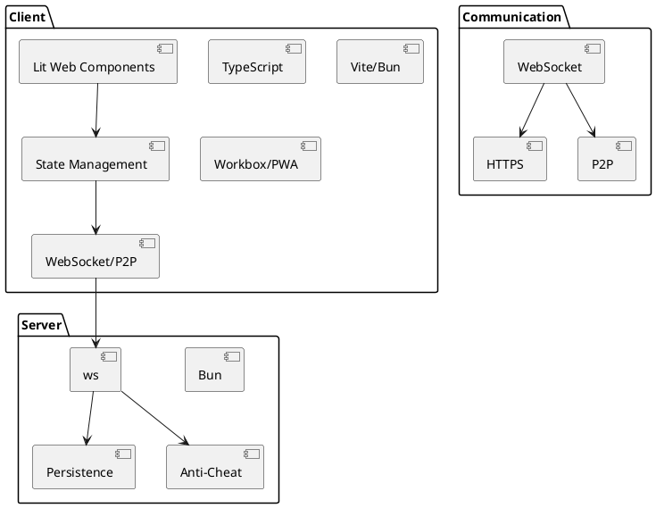

# UpDown Technology Stack & Libraries

**Date:** 2025-01-14  
**Status:** ✅ Implemented with Web4TSComponent Architecture

## Core Architecture
- **Framework**: Web4TSComponent v0.3.13.1 - Component-based, TypeScript-first architecture
- **Development Level**: CMM4 (Systematic, automated, quantitatively managed)
- **Language**: TypeScript (ES2020+) with full type safety
- **CLI System**: Auto-discovery with method chaining
- **Versioning**: Semantic versioning (X.Y.Z.W format)
- **Component Structure**: Layered architecture (layer2, layer3, layer4, layer5)

## Current Implementation (v0.1.0.0)

### UpDown.Cards Component
- **Purpose**: French-suited card deck system (52 cards)
- **Features**: Deck creation, Fisher-Yates shuffle, card dealing, deck management
- **CLI**: Auto-discovery commands (createDeck, shuffleDeck, dealCard, showDeck)
- **Architecture**: Web4TSComponent with TypeScript interfaces

### UpDown.Core Component
- **Purpose**: Core game logic and state management
- **Features**: Multi-player support (1-10 players), up/down/even guessing, scoring, elimination
- **CLI**: Auto-discovery commands (startGame, makeGuess, dealNextCard, showGameStatus)
- **Architecture**: Web4TSComponent with comprehensive game state management

### UpDown.Demo Component
- **Purpose**: Interactive demonstration system
- **Features**: Multiple demo scenarios, professional CLI presentation, component integration
- **CLI**: Auto-discovery commands (runDemo, showScenarios)
- **Architecture**: Web4TSComponent showcasing all system capabilities

## Planned Implementation

### Client (Future)
- **Framework**: Lit (Web Components) for declarative UI
- **State Management**: Web4TSComponent scenario-based API integration
- **Networking**: Native WebSocket API with Web4TSComponent scenarios
- **Build Tools**: Vite or Bun (Web4TSComponent compatible)
- **PWA Support**: Workbox or native browser APIs

### Server (Future)
- **Runtime**: Bun (TypeScript/JavaScript)
- **Framework**: Web4TSComponent-based server architecture
- **WebSocket**: ws (or native Bun support) with scenario exchange
- **Persistence**: SQLite, lowdb, or in-memory for MVP
- **Anti-Cheat**: Custom logic integrated with Web4TSComponent

### Communication (Future)
- **WebSocket**: Real-time scenario-based communication
- **HTTPS**: Initial setup/fallback
- **P2P**: simple-peer or WebRTC with scenario exchange

## Web4TSComponent Benefits

### Architecture Advantages
- **Component Isolation**: Each component is atomic and reusable
- **Type Safety**: Full TypeScript interfaces and error handling
- **Auto-Discovery**: Methods automatically become CLI commands
- **Professional CLI**: Auto-generated help and documentation
- **Version Management**: Semantic versioning with promotion workflow
- **Testing Integration**: Built-in test framework support

### Development Workflow
- **CMM4 Compliance**: Systematic, automated, quantitatively managed
- **Component Lifecycle**: dev → test → prod promotion workflow
- **Quality Assurance**: Automated testing and validation
- **Documentation**: Auto-generated professional documentation
- **Maintainability**: Clean, extensible architecture

## Justification
- **Web4TSComponent**: Provides CMM4-level development practices with component-based architecture
- **TypeScript-First**: Ensures type safety and maintainability
- **Auto-Discovery**: Reduces boilerplate and ensures consistency
- **Professional Quality**: Enterprise-grade development practices
- **Scalability**: Easy to add new components and features
- **Integration**: Seamless integration between components

## Technology Stack Diagram (PlantUML)

## Technology Stack Diagram (Draw.io)
- See `/docs/tech-stack.drawio` (to be created) for a visual diagram.

---

This file is the authoritative reference for the technology stack and libraries for each layer/component in UpDown. All future changes must be reflected here.
