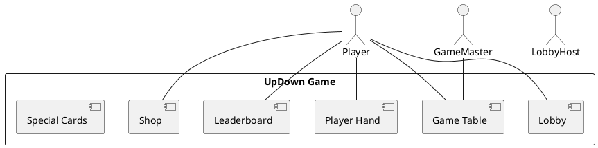

# Game Designer / Product Owner Log - Iteration 2 Task 1

**Date:** 2025-07-21

## Task 1: Define the High-Level Product Specification for the UpDown Game

- Describe the core gameplay loop (rounds, card play, player actions, win/loss conditions)
- Define user roles (player, game master, lobby host, etc.)
- List unique features (P2P, boosters, leaderboard, shop, anti-cheat, etc.)
- Summarize the main user experience and game flow

### High-Level Product Specification (Finalized 2025-07-21)

- The UpDown game is a multiplayer card game where players guess if the next card played by the game master will be higher, lower, or equal in value.
- Players join lobbies, can play special effect cards, and earn points for correct guesses and streaks.
- User roles include: Player, Game Master (GM), and Lobby Host. The GM is responsible for drawing and playing cards, while the Lobby Host manages lobby settings.
- Unique features: P2P communication for state sync, scenario-based API for state transfer, boosters and special cards, leaderboard, in-game shop, anti-cheat system, and offline/PWA support.
- The main user experience is a fast-paced, mobile-first, multiplayer game with social and competitive elements, supporting both online and offline play.
- The same class definitions are loaded on both frontend and backend, and state is synced in real time using scenario JSONs.
- The frontend is programmed declaratively using web components (e.g., web4-router, web4-route), where tag attributes reflect model attributes and are included in scenarios for sync.
- The scenario sync architecture requires that all class constructors are parameterless. Instances must be created without prior knowledge of constructor signatures. Initialization with state should be done via an init function that takes a scenario. Scenarios are JSON strings (with a dedicated type) containing the class reference and state. This enables components to move or be recreated across peers in their state.
- The current code structure is not scalable. Each class should be in its own TypeScript file and organized for easy import in both server and client. Avoid duplicate definitions of Scenario (DRY principle). Scenario must be strictly typed (e.g., state: Model), not any.

#### Product Flow Diagram (PlantUML)

#### Product Flow Diagram (Draw.io)
- See `/docs/product-flow.drawio` (to be created) for a visual diagram.

## Artifacts

- [x] High-level product specification documented above
- [ ] Product Flow Diagram (Draw.io): `/docs/product-flow.drawio` (to be created)
- [ ] Initial code stubs for shared class definitions (to be created in `/src/shared/`)

## Next Step
- Solution Architect to outline the main architectural layers (client, server, communication)
