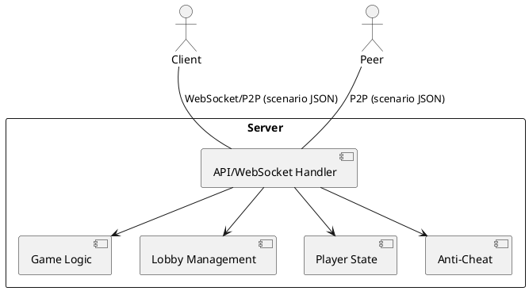

# Solution Architect Log - Iteration 2 Task 2

**Date:** 2025-07-21

## Task 2: Outline the Main Architectural Layers

- Create a high-level description of the main architectural layers:
  - Client (browser/mobile PWA)
  - Server (game logic, lobby management, API)
  - Communication (WebSocket, P2P, REST for setup)
- Include a simple diagram or text-based outline of the architecture
- Briefly describe the responsibilities of each layer
- Note: The core API will be extremely simple. Each class can serialize itself into a "scenario"—a JSON file containing a reference to the class and an encrypted state JSON with the serialized model attributes. By loading a class, creating a default instance, and injecting its decrypted state as the model, state can be transferred between peers in the P2P system. This scenario-based API is the only required API, sending scenarios over WebSockets or HTTPS between peers.

### High-Level Architecture Outline (Draft)

- **Client Layer:**
  - Runs in browser/mobile as a PWA
  - Handles UI, user input, local state, and offline support
  - Communicates with server and peers via WebSocket/P2P
  - Uses declarative web components (e.g., web4-router, web4-route) reflecting model attributes as tag attributes
- **Server Layer:**
  - Manages game logic, lobby, player state, and anti-cheat
  - Hosts API endpoints for scenario exchange and lobby management
  - Can act as a relay for P2P connections if needed
- **Communication Layer:**
  - Uses WebSocket for real-time updates and P2P for direct peer communication
  - All state is transferred as encrypted scenario JSONs

#### Architecture Diagram (PlantUML)



#### Architecture Diagram (Draw.io)
- See `/docs/architecture.drawio` (to be created) for a visual diagram.

```
[Client] <--WebSocket/P2P--> [Server/Other Clients]
```

## Artifacts

- [x] High-level architecture outline documented above
- [x] Architecture Diagram (PlantUML) included above
- [ ] Architecture Diagram (Draw.io): `/docs/architecture.drawio` (to be created)
- [ ] Initial code stubs for scenario-based API and class serialization (to be created in `/src/shared/`)

## Next Step
- Backend Developer/Architect to identify the main components/modules for the server

## Architectural Constraints

- All shared classes for scenario sync must have parameterless constructors and use an init function for state injection from a scenario. Scenarios are JSON strings (with a dedicated type) containing the class reference and state. This enables dynamic instantiation and state sync across peers.
- The codebase must avoid duplicate definitions of Scenario (DRY). Scenario must be strictly typed (e.g., state: Model), not any. Each class should be in its own file and organized for easy import in both server and client.

# Architect Log - Bun Project Structure Proposal

**Date:** 2025-07-21

## Task: Design a Scalable Bun Project Structure

- Propose a filesystem structure for a scalable Bun-based project supporting both server and client code, with shared models and strict typing.
- Include locations for:
  - Server entry point (e.g., src/server/index.ts)
  - Client entry point (e.g., src/client/index.ts)
  - Shared code (e.g., src/shared/)
  - Web components (e.g., src/client/components/)
  - Scenario and model types (e.g., src/shared/Scenario.ts)
  - Diagrams and docs (e.g., docs/)
  - Tests (e.g., tests/)
  - Configuration files (package.json, tsconfig.json, bunfig.toml)

## Proposed Structure

```
UpDown/
├── src/
│   ├── server/
│   │   └── index.ts
│   ├── client/
│   │   ├── index.ts
│   │   └── components/
│   │       └── web4-router.ts
│   └── shared/
│       ├── GameModel.ts
│       ├── Player.ts
│       ├── Lobby.ts
│       ├── Card.ts
│       └── Scenario.ts
├── tests/
├── docs/
├── package.json
├── tsconfig.json
├── bunfig.toml
└── README.md
```

## Next Step
- Create minimal package.json, tsconfig.json, and bunfig.toml files, and add server/client entry points as stubs.
