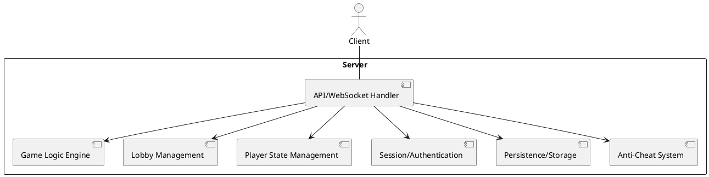

# Backend Developer / Architect Log - Iteration 2 Task 3

**Date:** 2025-07-21

## Task 3: Identify the Main Components/Modules for the Server

- List and briefly describe the main server-side modules:
  - **Game Logic Engine:** Handles the rules, round progression, and card evaluation for each game session.
  - **Lobby Management:** Manages creation, joining, and leaving of lobbies, as well as lobby settings and player assignments.
  - **Player State Management:** Tracks player data, scores, streaks, and in-game assets (e.g., boosters, cards).
  - **Session/Authentication:** Manages user sessions, authentication, and reconnections.
  - **API/WebSocket Handler:** Handles incoming and outgoing scenario messages, relays state between peers, and manages WebSocket/P2P connections.
  - **Persistence/Storage:** (If applicable) Stores persistent data such as user profiles, leaderboards, and shop inventory.
  - **Anti-Cheat System:** Monitors for suspicious activity, enforces fair play, and bans cheaters.
- High-level interaction: The API/WebSocket handler is the main entry point, routing scenario messages to the appropriate modules. Game logic and player state modules interact closely, while lobby management coordinates player flow. Persistence and anti-cheat modules support the core gameplay loop.

#### Server Architecture Diagram (PlantUML)

#### Server Architecture Diagram (Draw.io)
- See `/docs/server-architecture.drawio` (to be created) for a visual diagram.

## Next Step
- Frontend Developer/Architect to identify the main components/modules for the client
